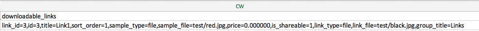
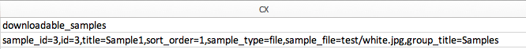

# Import downloadable products

The flow for importing downloadable products is the same as for [Bundle Products](data-transfer-bundle-products.md) or [Configurable Products](data-transfer-configurable-products.md). The difference is that a downloadable product has [downloadable links](../catalog/product-create-downloadable.md) and [downloadable samples](../catalog/product-create-downloadable.md) with its images.

The default root directory for downloadable links and samples is `<Magento-root-folder>/pub/media/import`. If the remote storage module is enabled, the default root directory for downloadable links and samples is the `<remote-storage-root-folder>/media/import` directory.

The CSV file has separate columns for `downloadable_links` and `downloadable_samples`.

- **Downloadable link images** — In the following example, downloadable link images (`red.jpg` and `black.jpg`) are in the `<Magento-root-folder>/pub/media/import/test` folder. If remote storage is enabled, these images are in the `<remote-storage-root-folder>/media/import/test` folder.

  {width="600" zoomable="yes"}

- **Downloadable sample images** — In the following example, the downloadable sample image (`white.jpg`) is in the `<Magento-root-folder>/pub/media/import/test` folder. If remote storage is enabled, this image is in the `<remote-storage-root-folder>/media/import/test` folder.

  {width="400" zoomable="yes"}

For more information about enabling and managing the remote storage module, see [Configure remote storage](https://experienceleague.adobe.com/docs/commerce-operations/configuration-guide/storage/remote-storage/remote-storage.html) in the _Configuration guide_.
