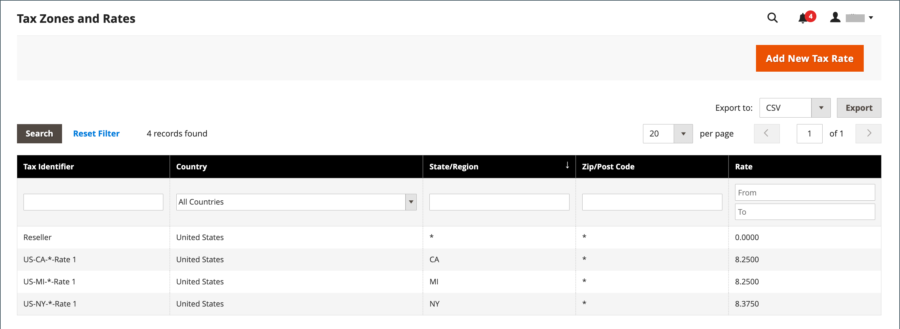

# Update tax rate data

If you conduct business in several states and ship a large quantity of product, entering tax rates manually can be very time consuming. It is faster and more efficient to download tax rates by ZIP code and import them into Commerce. The following example shows how to import a set of state-specific tax rates downloaded from a trusted source. Avalara provides [tax rate tables](https://www.avalara.com/taxrates/en/download-tax-tables.html), that you can download at no charge, for every ZIP code in the United States.

>[!NOTE]
>
>If you are interested in automating your sales and use tax compliance and reporting, you can find Commerce-trusted options on the [Commerce Partners](https://solutionpartners.adobe.com/s/directory/?solution=commerce) site.

## Step 1: Export the Commerce tax rate data

1. On the _Admin_ sidebar, go to **[!UICONTROL System]** > _[!UICONTROL Data Transfer]_ > **[!UICONTROL Import/Export Tax Rates]**.

1. Click **[!UICONTROL Export Tax Rates]**.

1. Look for the file in the download location for your web browser.

1. Save and open the file in a spreadsheet.

   This example uses [!DNL OpenOffice Calc].

   The exported Commerce tax rate data includes the following columns:
   - Code
   - Country
   - State
   - Zip/Post Code
   - Rate
   - Range From
   - Range To
   - A column for each store view

   {width="500" zoomable="yes"}

1. Open the new tax rate data in a second instance of the spreadsheet, so you can see them side by side.

1. In the new tax rate data, take note of any additional tax rate data that you might need to set up in your store before the data is imported.

   For example, the tax rate data for California also includes:

   - `TaxRegionName`
   - `CombinedRate`
   - `StateRate`
   - `CountyRate`
   - `CityRate`
   - `SpecialRate`

   If you need to import additional [tax zones and rates](../stores-purchase/tax-zones-rates.md), you must first define them from the Admin of your store and update the [tax rules](../stores-purchase/tax-rules.md) as needed. Then, export the data and open the file in a text editor so it can be used for reference. However, to keep this example simple, we import only the standard tax rate columns.

## Step 2: Prepare the import data

You have two spreadsheets open, side by side. One contains the Commerce export file structure, and the other contains the new tax rate data that you want to import.

1. To create a place to work in the spreadsheet with the new tax rate data, insert as many blank columns at the far right as needed to add data from the Commerce export file. Use cut-and-paste to add the data and then rearrange the columns so they match the order of the Commerce export data file.

1. Rename the column headers to match the Commerce export data.

1. Delete any columns that have no data.

   Otherwise, the structure of the import file should match the original Commerce export data.

1. Before saving the file, scroll down and make sure that the tax rate columns contain only numeric data.

   Any text found in a tax rate column prevents the data from being imported.

1. Save the prepared data as a .CSV file.

   When prompted, verify that a comma is used as a Field delimiter and double quotes as the Text delimiter. Then click **[!UICONTROL OK]**.

## Step 3: Import the tax rates

1. On the _Admin_ sidebar, go to **[!UICONTROL System]** > _[!UICONTROL Data Transfer]_ > **[!UICONTROL Import/Export Tax Rates]**.

1. Click **[!UICONTROL Choose File]** and choose the CSV tax rate file that you prepared to import.

1. Click **[!UICONTROL Import Tax Rates]**.

   It might take several minutes to import the data. When the process is complete, the `The tax rate has been imported` message appears. If you receive an error message, correct the problem in the data and try again.

1. On the _Admin_ sidebar, go to **[!UICONTROL Stores]** > _[!UICONTROL Taxes]_ > **[!UICONTROL Tax Zones and Rates]**.

   The imported rates appear in the list.

1. Use the page controls to view the new tax rates.

   {width="600" zoomable="yes"}

1. Run some test transactions in your store with customers from different ZIP codes to make sure that the new tax rates work correctly.
