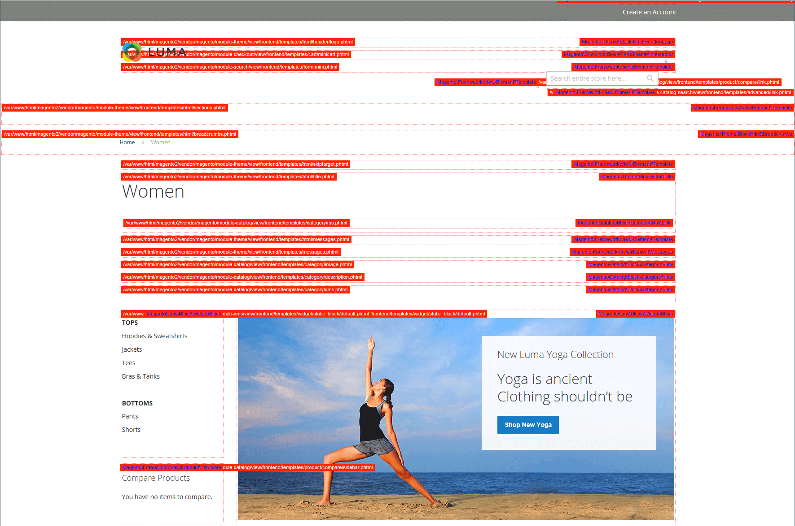
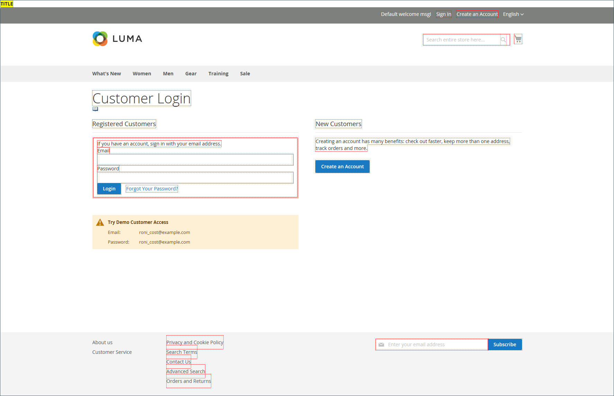
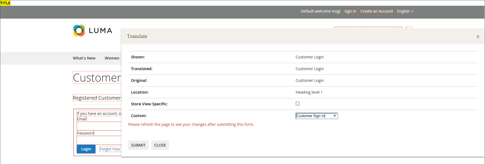
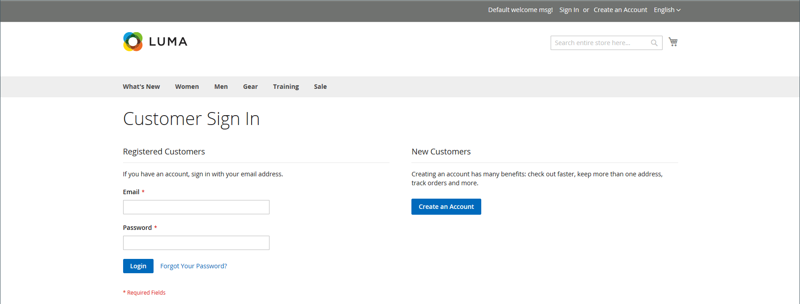

# Developer tools

Use the advanced developer tools to determine the compilation mode during frontend development, create an allowlist of IP addresses, and display template path hints. There is also tooling to easily make spot changes to text in the interface of the storefront and Admin.

- [Action Logs](action-log.md)  (Adobe Commerce only)
- [Frontend Development Workflow](#frontend-development-workflow)
- [Using Static File Signatures](#static-file-signatures)
- [Resource file Optimization](#optimizing-resource-files)
- [Developer Client Restrictions](#client-restrictions)
- [Template Path Hints](#template-path-hints)
- [Translate Inline](#translate-inline)

## Operation modes

Your Adobe Commerce or Magento Open Source instance can be deployed to run in either _production_ or _developer mode_. The tools and configuration settings that are designed specifically for developers can be accessed only while the store is running in _developer mode_.

The operation mode can be changed only from the command line of the server by a user with appropriate permissions. See [Set the operation mode](https://experienceleague.adobe.com/docs/commerce-operations/configuration-guide/cli/set-mode.html) in the _Configuration Guide_ for more information.

Most topics in the merchant documentation apply to a Commerce instance that is running in production mode. However, the following configuration settings and tools can be used only when the installation is running in developer mode.

## Frontend development workflow

The Frontend Development Workflow type determines if Less compilation takes place on the client- or server side during development. Less is an extension of CSS that has additional features and conventions, and that produces streamlined code. Client-side Less compilation is recommended for theme development. Server-side compilation is the default mode. The development workflow options are not available for stores in production mode.
See [Client-side LESS compilation vs. server-side](https://developer.adobe.com/commerce/frontend-core/guide/css/quickstart/compilation-mode/){:target="_blank"} in the Commerce developer documentation.

>[!NOTE]
>
>The frontend development workflow configuration is available in [Developer mode](../systems/developer-tools.md#operation-modes) only.

{width="600" zoomable="yes"}

1. On the _Admin_ sidebar, go to **[!UICONTROL Stores]** > _[!UICONTROL Settings]_ > **[!UICONTROL Configuration]**.

1. In the left panel, expand **[!UICONTROL Advanced]** and choose **[!UICONTROL Developer]**.

1. Expand  the **[!UICONTROL Front-end Development Workflow]** section.

1. Set **[!UICONTROL Workflow Type]** to one of the following:

    - `Client side less compilation` - Compilation takes place in the browser using the native `less.js` library.
    - `Server side less compilation` - Compilation takes place on the server using the Less PHP library. This is the default mode for production.

1. When complete, click **[!UICONTROL Save Config]**.

## Static file signatures

Adding a digital signature to the URL of static files makes it possible for browsers to detect when a newer version of the file is available. Static files that can be tracked with digital signatures include JavaScript, CSS, images, and fonts. The signature is appended to the path directly after the base URL. If a file's signature differs from what is stored in the browser's cache, then the newer version of the file is used.

See [Static content signing](https://experienceleague.adobe.com/docs/commerce-operations/configuration-guide/cache/static-content-signing.html){:target="_blank"} in the Commerce developer documentation.

>[!NOTE]
>
>The Static File Settings configuration is available only when working in [developer mode](../systems/developer-tools.md#operation-modes).

{width="600" zoomable="yes"}

For a detailed list of the configuration settings, see [_Static File Settings_](../configuration-reference/advanced/developer.md) in the _Configuration Reference_.

**_To enable signed static files:_**

1. On the _Admin_ sidebar, go to **[!UICONTROL Stores]** > _[!UICONTROL Settings]_ > **[!UICONTROL Configuration]**.

1. In the left panel, expand **[!UICONTROL Advanced]** and choose **[!UICONTROL Developer]**.

1. Expand  the **[!UICONTROL Static Files Settings]** section.

1. Set **[!UICONTROL Sign Static Files]** to `Yes`.

1. When complete, click **[!UICONTROL Save Config]**.

## Resource file optimization

The time it takes to load resource files can be reduced by merging and bundling files, and by minimizing code.

- Merging combines separate files of the same type into a single file.
- Bundling is a technique that groups separate files in order to reduce the number of HTTP requests that are required to load a page.
- Minification removes spaces, line breaks, and comments, but does not affect the functionality of the code. Because minimized files cannot be edited, the process should be applied only when you are ready to go into production.

By default, Adobe Commerce and Magento Open Source do not merge, bundle, or minimize files, and the project developer should determine which file optimization methods should be used.

See [Performance best practices](https://experienceleague.adobe.com/docs/commerce-operations/performance-best-practices/overview.html) for more information.

>[!NOTE]
>
>CSS and JavaScript files can be optimized in [Developer Mode](../systems/developer-tools.md#operation-modes) only.

| File type       | Supported operations |
| --------------- | -------------------- |
| CSS Files       | `MergeMinify` |
| JavaScript Files | `MergeBundleMinify` |
| Template Files  | `Minify` |

{style="table-layout:auto"}

**_To optimize resource files:_**

1. On the _Admin_ sidebar, go to **[!UICONTROL Stores]** > _[!UICONTROL Settings]_ > **[!UICONTROL Configuration]**.

1. In the left panel, expand **[!UICONTROL Advanced]** and choose **[!UICONTROL Developer]**.

1. To optimize CSS files, expand  the **[!UICONTROL CSS Settings]** section and do the following:

   - Set **[!UICONTROL Merge CSS Files]** to `Yes`.
   - Set **[!UICONTROL Minify CSS Files]** to `Yes`.

   {width="600" zoomable="yes"}
   
   [_CSS Settings_](../configuration-reference/advanced/developer.md)

1. To optimize JavaScript files, expand  the **[!UICONTROL JavaScript Settings]** section and do the following:

   - Set **[!UICONTROL Merge JavaScript Files]** to `Yes`.
   - Set **[!UICONTROL Minify JavaScript Files]** to `Yes`.

   {width="600" zoomable="yes"}

1. To minify PHTML template files, expand  the **[!UICONTROL Template Settings]** section and set **[!UICONTROL Minify Html]** to `Yes`.

   {width="600" zoomable="yes"}

1. When complete, click **[!UICONTROL Save Config]**.

## Client restrictions

Before using a tool such as [template path hints](#template-path-hints), make sure to add your IP address to the Developer Client Restrictions  allowlist to avoid disrupting the shopping experience of customers in the store. If you don't know your IP address, you can search for it online.

>[!NOTE]
>
>Developer Client Restrictions can be set in [Developer Mode](../systems/developer-tools.md#operation-modes) only.

For technical information, see [Custom VCL for allowing requests](https://experienceleague.adobe.com/docs/commerce-cloud-service/user-guide/cdn/custom-vcl-snippets/fastly-vcl-allowlist.html) in the _Commerce on Cloud Infrastructure Guide_.

**_To add your IP address to the allowlist:_**

1. On the _Admin_ sidebar, go to **[!UICONTROL Stores]** > _[!UICONTROL Settings]_ > **[!UICONTROL Configuration]**.

1. In the left panel, expand **[!UICONTROL Advanced]** and choose **[!UICONTROL Developer]**.

1. Expand  the **[!UICONTROL Developer Client Restrictions]** section.

   {width="600" zoomable="yes"}

1. For **[!UICONTROL Allow IPs]**, enter your IP address.

   If access is needed from multiple IP addresses, separate each with a comma.

1. When complete, click **[!UICONTROL Save Config]**.

1. When prompted, refresh any invalid caches.

## Template path hints

Template path hints are a diagnostic tool that adds notation with the path to each template that is used on the page. Template path hints can be enabled for either the storefront or the Admin.

>[!NOTE]
>
>Template Path Hints can be edited in [developer mode](../systems/developer-tools.md#operation-modes) only.

See [Locate templates, layouts, and styles](https://developer.adobe.com/commerce/frontend-core/guide/themes/debug/){:target="_blank"} in the Commerce developer documentation.

{width="700" zoomable="yes"}

### Step 1: Add your IP address to the allowlist

Before using template path hints, add your IP address to the [allowlist](#client-restrictions) to avoid interference with customers who are shopping in the store. When you are finished, make sure to clear the Commerce cache to remove all hints from the store.

{width="600" zoomable="yes"}

### Step 2: Enable template path hints

1. On the _Admin_ sidebar, go to **[!UICONTROL Stores]** > _[!UICONTROL Settings]_ > **[!UICONTROL Configuration]**.

1. In the left panel, expand **[!UICONTROL Advanced]** and choose **[!UICONTROL Developer]**.

1. Expand  the **[!UICONTROL Debug]** section and do the following:

   {width="600" zoomable="yes"}

   - To activate template path hints for the store, set **[!UICONTROL Enabled Template Path Hints for Storefront]** to `Yes`.

   - To enable template path hints for the store only when the URL includes the `templatehints` parameter, set **Enable Hints for Storefront with URL Parameter** to `Yes`. Then set value for the parameter if needed. The default value is `magento`, but you can use a custom value. For example, if you change the value to `lorem`, you would use `mymagento.com?templatehints=lorem` to display template hints.

   - To activate template path hints for the Admin, set **[!UICONTROL Enabled Template Path Hints for Admin]** to `Yes`.

   - To include the names of blocks, set **[!UICONTROL Add Block Class Type to Hints]** to `Yes`.

1. When complete, click **[!UICONTROL Save Config]**.

### Step 3: Clear the cache

1. On the _Admin_ sidebar, go to **[!UICONTROL System]** > _[!UICONTROL Tools]_ > **[!UICONTROL Cache Management]**.

1. In the upper-right corner, click **[!UICONTROL Flush Magento Cache]**.

## Translate inline

You can use the Translate Inline tool in [developer mode](../systems/developer-tools.md#operation-modes) to touch up text in the interface to reflect your voice and brand. When the Translate Inline mode is activated, any text on the page that can be edited is outlined in red. It is easy to edit field labels, messages, and other text that appears throughout the storefront and Admin. For example, many themes use terminology such as _My Account_, _My Wishlist_, and _My Dashboard_, to help customers find their way around. However, you might prefer to simply use the words _Account_, _Wishlist_, and _Dashboard_.

>[!NOTE]
>
>The Translate Inline tool is available only when working in [developer mode](../systems/developer-tools.md#operation-modes).

See [Translations overview](https://developer.adobe.com/commerce/frontend-core/guide/translations/) in the Commerce developer documentation.

{width="700" zoomable="yes"}

If your store is available in multiple languages, you can make fine adjustments to the translated text for the locale. On the server, interface text is maintained in a separate CSV file for each output block, and is organized by locale. As an alternate approach, rather than use the _Translate Inline_ tool, you can also edit the CSV files directly on the server. Translation files are stored in `app/code/Magento/<module_name>/i18n/<language_locale>.csv`.

>[!NOTE]
>
>To use the Translate Inline tool, your browser must allow pop-ups.

### Step 1: Disable output caches

1. On the _Admin_ sidebar, go to **[!UICONTROL System]** > _[!UICONTROL Tools]_ > **[!UICONTROL Cache Management]**.

1. Select the following checkboxes:

   - `Blocks HTML output`
   - `Page Cache`
   - `Translations`

1. Set the **[!UICONTROL Actions]** control to `Disable` and click **[!UICONTROL Submit]**.

### Step 2: Enable the Translate Inline tool

1. On the _Admin_ sidebar, go to **[!UICONTROL Stores]** > _[!UICONTROL Settings]_ > **[!UICONTROL Configuration]**.

1. To work with a specific store view, set the **[!UICONTROL Store View]** to be updated.

1. In the left panel, expand **[!UICONTROL Advanced]** and choose **[!UICONTROL Developer]**.

1. Expand  the **[!UICONTROL Translate Inline]** section.

   Clear the **[!UICONTROL Use Website]** checkbox as needed to modify these settings.

   The _[!UICONTROL Enabled for Admin]_ option is not available when editing a specific store view.

   {width="600" zoomable="yes"}

1. Set **[!UICONTROL Enabled for Storefront]** to `Yes`.

1. When complete, click **[!UICONTROL Save Config]**.

1. When prompted, refresh the invalid caches, but leave the disabled caches as they are for now.

### Step 3: Update the Text

1. Open your storefront in a browser and go to the page that you want to edit.

   If necessary, use the language chooser to change the store view. Each string of text that can be translated is outlined in red. When you hover over any text box, a book icon (  ) appears.

1. Click the book icon to open the _Translate_ window and do the following:

   - If the change is for the specific store view, select the **[!UICONTROL Store View Specific]** checkbox.

   - Enter the new **[!UICONTROL Custom]** text.

1. When complete, click **[!UICONTROL Submit]**.

   {width="700" zoomable="yes"}

1. To see your changes in the store, refresh the browser.

1. Repeat this process for any elements in the store to be changed.

### Step 4: Restore the original settings

1. Return to the Admin of your store.

1. On the _Admin_ sidebar, go to **[!UICONTROL Stores]** > _[!UICONTROL Settings]_ > **[!UICONTROL Configuration]**.

1. Set **[!UICONTROL Store View]** to the specific view that was edited.

1. In the left panel, expand **[!UICONTROL Advanced]** and choose **[!UICONTROL Developer]**.

1. Expand  the **[!UICONTROL Translate Inline]** section.

1. Set **[!UICONTROL Enabled for Frontend]** to `No`.

1. When complete, click **[!UICONTROL Save Config]**.

1. On the _Admin_ sidebar, go to **[!UICONTROL System]** > _[!UICONTROL Tools]_ > **[!UICONTROL Cache Management]**.

1. Select the checkbox of the following output caches that were previously disabled:

   - `Blocks HTML output`
   - `Page Cache`
   - `Translations`

1. Set the **[!UICONTROL Actions]** control to `Enable` and click **[!UICONTROL Submit]**.

1. When prompted, refresh any invalid caches.

### Step 5: Verify the changes in your store

Go to your storefront and examine each page that was updated to make sure that the changes are correct. In this example, `Customer Login` was changed to `Customer Sign In`. If changes were made to a specific view, use the Language Chooser to switch to the correct view.

{width="700" zoomable="yes"}
