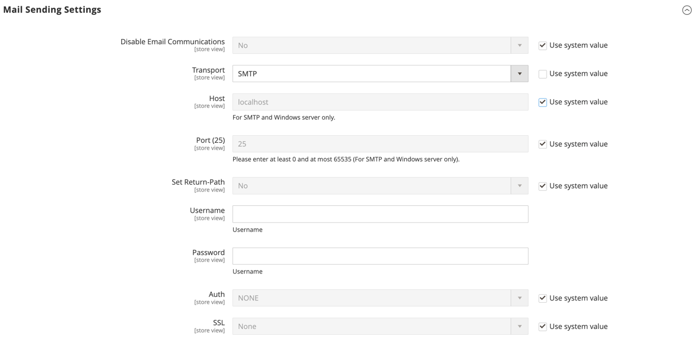

# Configure email communications

The _Mail Sending Settings_ give you the ability to route returned email or replies to email to a specific address. If your store is running on an SMTP or Windows server, you can verify the host and port settings.

>[!IMPORTANT]
>
>**Security Notice** All merchants should immediately set their mail sending configuration to protect against a recently identified potential remote code execution exploit. Until this issue is resolved, it is highly recommended that you avoid using [!DNL Sendmail] for email communications. In the _[!UICONTROL Mail Sending Settings]_, make sure that _[!UICONTROL Set Return Path]_ is set to `No`.

For a detailed list of the configuration settings, see [_[!UICONTROL Mail Sending Settings]_](../configuration-reference/advanced/system.md) in the _Configuration Reference_.

## Configure email communications

1. On the _Admin_ sidebar, go to **[!UICONTROL Stores]** > _[!UICONTROL Settings]_ > **[!UICONTROL Configuration]**.

1. In the left panel, expand **[!UICONTROL Advanced]** and choose **[!UICONTROL System]**.

1. Expand  the **[!UICONTROL Mail Sending Settings]** section and do the following:

   {width="600" zoomable="yes"}

   - If necessary, set **[!UICONTROL Disable Email Communications]** to `No`.

   - For **[!UICONTROL Transport]**, choose the transport type for email communications from the store: `Sendmail` or `SMTP`

   - If running on an SMTP or Windows server, verify the following settings:

      - **[!UICONTROL Host]** - `localhost` or other

      - **[!UICONTROL Port (25)]** - `25` or other

   - For **[!UICONTROL Set Return Path]**, choose one of the following options:

      - `No` - (Recommended security measure) Routes returned email to the default store email address.
      - `Yes` - Routes returned email to the default store email address.
      - `Specified` - Routes returned email to the email address specified in **[!UICONTROL Return Path Email]**.

   - If running on an SMTP server, configure the connection:

      - **[!UICONTROL Username]** - Enter the login user name for the SMTP server.
      - **[!UICONTROL Password]** - Enter the password for the SMTP server login.
      - **[!UICONTROL Auth]** - Choose the authentication type for the SMTP server connection: `NONE` , `PLAIN`, or `LOGIN`
      - **[!UICONTROL SSL]** - Choose the verification type for the server security certificate: `SSL` or `TLS`

      {width="600" zoomable="yes"}

1. In the left panel, expand **[!UICONTROL Sales]** and choose **[!UICONTROL Sales Emails]**.

1. Expand  the **[!UICONTROL General Settings]** section.

1. Set **[!UICONTROL Asynchronous sending]** to `Enable`.

   {width="600" zoomable="yes"}

   For a detailed list of the configuration settings, see [_General Settings_](../configuration-reference/sales/sales-emails.md) in the _Configuration Reference_.

1. When complete, click **[!UICONTROL Save Config]**.
