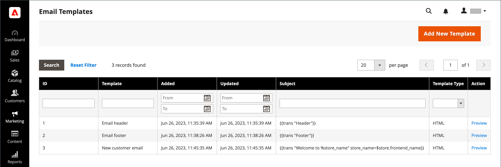

# Customize email templates

Commerce includes a default email template for the body section of each message that is sent by the system. The template for the body content is combined with the header and footer templates to create the complete message. The content is formatted with HTML and CSS, and can be easily edited, and customized by adding [variables](variables-predefined.md) and [widgets](../content-design/widgets.md). Email templates can be customized for each website, store, or store view. If using custom templates, make sure to update the [system configuration](email-templates.md#configure-email-templates) to ensure that the correct template is used.

{width="500" zoomable="yes"}

The default templates include your logo and store information, and can be used without further customization. However as a best practice, you should view each template, and make any necessary changes before sending them to customers.

- [Header template](email-template-custom.md#header-template)
- [Footer template](email-template-custom.md#footer-template)
- [Message templates](email-template-custom.md#message-templates)

{width="700" zoomable="yes"}

## Template information

| Field | Description |
| ----- | ----------- |
| [!UICONTROL Template Name] | The name of your custom template. |
| [!UICONTROL Insert Variable] | Inserts a  variable into the template at the cursor location. |
| [!UICONTROL Template Subject] | The Template Subject appears in the Subject column, and can be used to sort and filter the templates in the list. |
| [!UICONTROL Template Content] | The content of the template in HTML. |
| [!UICONTROL Template Styles] | Any CSS style declarations that are needed to format the template can be entered in the _[!UICONTROL Template Styles]_ box. |

{style="table-layout:auto"}

## Header template

After completing the [configuration](email-templates.md#configure-email-templates), the email header template includes your logo that is linked to your store. If you have a basic knowledge of HTML, you can easily use [predefined variables](variables-predefined.md) to add store contact information to the header.

### Step 1. Load the default template

1. On the _Admin_ sidebar, go to **[!UICONTROL Marketing]** > _[!UICONTROL Communications]_ > **[!UICONTROL Email Templates]**.

1. Click **[!UICONTROL Add New Template]**.

1. In the **[!UICONTROL Load default template]** section, click the **[!UICONTROL Template]** selector and choose `Magento_Email` > `Header`.

   {width="600" zoomable="yes"}

1. Click **[!UICONTROL Load Template]**.

   The HTML code and variables from the template appear in the form.

### Step 2. Customize the template

1. Enter the **[!UICONTROL Template Name]** for your custom header.

1. Enter a **[!UICONTROL Template Subject]** to help organize the templates.

   In the grid, the list of templates can be sorted and filtered by the _[!UICONTROL Subject]_ column.

   {width="600" zoomable="yes"}

1. In the **[!UICONTROL Template Content]** box, modify the HTML as needed.

   >[!NOTE]
   >
   >When working in the template code, be careful not to overwrite anything that is enclosed in double braces.

1. To insert a [variable](variables-reference.md), position the cursor in the code where you want to place the variable and click **[!UICONTROL Insert Variable]**.

1. Choose the variable that you want to insert.

   {width="600" zoomable="yes"}

   When a variable is selected, a [markup tag](markup-tags.md) for the variable is inserted in the code.

   Although the Store Email Address variables are the ones most often included in the header, you can enter the code for any system or [custom variable](variables-custom.md) directly into the template.

1. If you need to make any CSS declarations, enter the styles in the **[!UICONTROL Template Styles]** box.

1. When you are ready to review your work, click **[!UICONTROL Preview Template]**.
   
   Make any needed changes to the template.

1. When complete, click **[!UICONTROL Save Template]**.

   Your custom header now appears in the list of available email templates.

### Step 3. Update the configuration

1. On the _Admin_ sidebar, go to **[!UICONTROL Content]** > _[!UICONTROL Design]_ > **[!UICONTROL Configuration]**.

1. In the grid, find the store view that you want to configure and click **[!UICONTROL Edit]** in the _[!UICONTROL Action]_ column.

1. Scroll down and expand  the **[!UICONTROL Transactional Emails]** section.

1. Choose the **[!UICONTROL Header Template]** that is used as the default for email notifications.

1. When complete, click **[!UICONTROL Save Config]**.

{width="600" zoomable="yes"}

## Footer template

The email template footer contains the closing and signature line of the email message. You can change the closing to fit your style, and add additional information, such as the company name and address below your name.

### Step 1. Load the default template

1. On the _Admin_ sidebar, go to **[!UICONTROL Marketing]** > _[!UICONTROL Communications]_ > **[!UICONTROL Email Templates]**.

1. Click **[!UICONTROL Add New Template]**.

1. In the **[!UICONTROL Load default template]** section, click the **[!UICONTROL Template]** selector and choose `Magento_Email` > `Footer`.

1. Click **[!UICONTROL Load Template]**.

   The HTML code and variables from the template appear in the form.

### Step 2. Customize and preview the template

1. Enter the **[!UICONTROL Template Name]** for your custom footer.

1. Enter a **[!UICONTROL Template Subject]** to help organize the templates.

   In the grid, the templates can be sorted and filtered by the _[!UICONTROL Subject]_ column.

   {width="600" zoomable="yes"}

1. In the **[!UICONTROL Template Content]** box, modify the HTML as needed.

   >[!NOTE]
   >
   >When working in the template code, be careful not to overwrite anything that is enclosed in double braces.

1. To insert a [variable](variables-reference.md), position the cursor in the code where you want to place the variable and click **[!UICONTROL Insert Variable]**.

1. Choose the variable that you want to insert.

   When a variable is selected, a [markup tag](markup-tags.md) for the variable is inserted in the code.

   Although the Store Contact variables are the ones most often included in the footer, you can enter the code for any system or [custom variable](variables-custom.md) directly into the template.

1. If you need to make any CSS declarations, enter the styles in the **[!UICONTROL Template Styles]** box.

### Step 3. Update the configuration

1. On the _Admin_ sidebar, go to **[!UICONTROL Content]** > _[!UICONTROL Design]_ > **[!UICONTROL Configuration]**.

1. In the grid, find the store view that you want to configure and click **[!UICONTROL Edit]** in the _[!UICONTROL Action]_ column.

1. Scroll down and expand  the **[!UICONTROL Transactional Emails]** section.

1. Choose the **[!UICONTROL Footer Template]** that is used as the default footer in email notifications.

1. When complete, click **[!UICONTROL Save Config]**.

{width="600" zoomable="yes"}

## Message templates

The process of customizing the body of each message is the same as for customizing the header or footer. The only difference is the message template for each activity or event that triggers a notification. You can use the templates as they are, or customize them to match your voice and brand. In addition to the template text, there is a wide selection of allowed [predefined](variables-predefined.md) variables and [custom](variables-custom.md) variables that you can create and incorporate into the template.

### Step 1. Load the default template

1. On the _Admin_ sidebar, go to **[!UICONTROL Marketing]** > _[!UICONTROL Communications]_ > **[!UICONTROL Email Templates]**.

1. Click **[!UICONTROL Add New Template]**.

   {width="600" zoomable="yes"}

1. Do the following:

   - Under **[!UICONTROL Load default template]**, choose the **[!UICONTROL Template]** that you want to customize.

   - Click **[!UICONTROL Load Template]**.

### Step 2. Customize the template

1. For **[!UICONTROL Template Name]**, enter a name for your custom template.

1. If needed, change the **[!UICONTROL Template Subject]**.

   This is the first line of the message, which is the salutation by default. You can leave it as is, or you can enter something more descriptive.

1. Take note of the **[!UICONTROL Currently Used For]** path to the template, which is the path used to update the configuration.

   {width="600" zoomable="yes"}

1. In the **[!UICONTROL Template Content]** box, modify the HTML as needed.

   The content consists of a combination of HTML tags, CSS directives, variables, and text.

   >[!NOTE]
   >
   >When working in the template code, be careful not to accidentally type over the code that is enclosed in double braces.

1. To insert a variable, position the cursor in the code where you want the variable to appear.

   The selection of variables varies by template and includes allowed [predefined](variables-predefined.md) and [custom](variables-custom.md) variables, if available.

1. Click **[!UICONTROL Insert Variable]** and choose the variable that you want to insert.

   A command to insert the variable is enclosed in curly braces and added to the code at the cursor location. For example:

   `customVar code=my_custom_variable`

1. To make CSS declarations, enter the styles in **[!UICONTROL Template Styles]**.

   {width="600" zoomable="yes"}

   >[!NOTE]
   >
   >Custom styles are applied to the email only if `{{template config_path="design/email/header_template"}}` is present in the _[!UICONTROL Template Styles]_. To use custom CSS without a default header template, you must provide them here within the `<style>` HTML tag.

### Step 3. Update the configuration

The _[!UICONTROL Currently Used For]_ breadcrumb trail shows where the template is used. In this example, the template configuration is on the _[!UICONTROL Customer Configuration]_ page, in the _[!UICONTROL Create New Account Options]_ section, and in the _[!UICONTROL Default Welcome Email]_ field.

- Page - [!UICONTROL Customer Configuration]
- Section - [!UICONTROL Create New Account Options]
- Field - [!UICONTROL Default Welcome Email]

1. In the **[!UICONTROL Currently Used For]** breadcrumb trail, click the link to open the template configuration page.

   {width="600" zoomable="yes"}

1. Expand  the section, and find the field for the email template that you customized.

1. Clear the **[!UICONTROL Use system value]** checkbox and click the name of your custom template.

   {width="600" zoomable="yes"}

1. When complete, click **[!UICONTROL Save Config]**.

1. In the message at the top of the workspace, click **[!UICONTROL Cache Management]** and clear any invalid cache.

### Step 4. Preview and save the template

1. When you are ready to review your work, click **[!UICONTROL Preview Template]**.

1. Update the template as needed.

1. When complete, click **[!UICONTROL Save Template]**.

   Your custom template is now available in the list of email templates.
