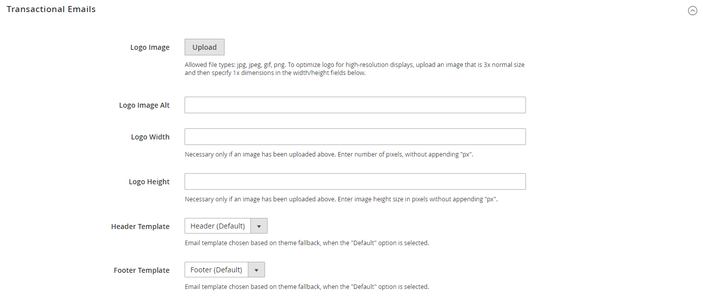

# Email templates

Email templates define the layout, content, and formatting of automated messages sent from your store. They are called transactional emails because each one is associated with a specific type of transaction, or event.

Commerce includes a set of responsive email templates that are triggered by various events that take place during the operation of your store. Each template is optimized for any screen size, and can be viewed from the desktop, as well as on tablets and mobile devices. There are various prepared email templates related to customer activities, sales, product alerts, admin actions, and system messages that you can [customize](email-template-custom.md) to reflect your brand.

Commerce emails can be rendered by HTML and plain text email clients. There might be some variation between clients in the way email are rendered.

## Prepare your email logo

Logos can be saved as any of the following file types. Logos with transparent backgrounds can be saved as either .GIF or .PNG files.

- JPG/JPEG
- GIF
- PNG

There are dimensions specified in the header template. However, to ensure that your logo renders well on high-resolution devices, the uploaded image should be three times this size. Typically, original logo artwork is created as a vector image, so it can be scaled up without losing resolution. The image can then be saved in one of the supported bitmap image formats.

<!-- <!-- zoom -->

To take advantage of the limited vertical space in the header, make sure to crop the image to eliminate any wasted space at the top or bottom. When editing the image, be careful to preserve the aspect ratio of the logo, so the height and width resize proportionally.

As a rule, you can make an image smaller than the original, but not larger without losing resolution. Taking a small image and scaling it up in a photo editor lowers the resolution of the image. For example, if the display dimensions of the logo are 168 pixels wide by 48 pixels high in the header template, the uploaded image should be 504 pixels wide by 144 pixels high.

| Logo Dimensions | 1 x (display size) | 3 x (image size) |
|----------|----|----|
| Width: | 168 px | 504 px |
| Height: | 48 px | 144 px |

{style="table-layout:auto"}

## Configure email templates

The configuration determines the logo that appears in the default header template, and any custom [header](email-template-custom.md#header-template) and [footer](email-template-custom.md#footer-template) templates that you want to use for transactional email messages sent from your stores.

<!-- zoom -->

For a detailed list of the configuration settings, see [_Transactional Emails_](../content-design/configuration.md) in the _Content and Design Guide_.

## Step 1. Upload Your Logo

1. On the _Admin_ sidebar, go to **[!UICONTROL Content]** > _[!UICONTROL Design]_ > **[!UICONTROL Configuration]**.

1. Find the store view that you want to configure and click **[!UICONTROL Edit]** in the _[!UICONTROL Action]_ column.

1. Under _[!UICONTROL Other Settings]_, expand  the **[!UICONTROL Transactional Emails]** section.

1. To upload your prepared **[!UICONTROL Logo Image]**, click **[!UICONTROL Upload]** and select the file from your system.

1. For **[!UICONTROL Logo Image Alt]**, enter alternate text to identify the image.

1. Enter the **[!UICONTROL Logo Width]** and **[!UICONTROL Logo Height]** in pixels.

   Enter each value as a number, without the `px` abbreviation. These values refer to the display dimensions of the logo in the header, and not to the actual size of the image.

## Step 2. Choose the header and footer templates

If you have custom header and footer templates for your store, or for different stores, you can specify which templates are used for each, according to the [scope](../getting-started/websites-stores-views.md#scope-settings) of the configuration. Otherwise, the default templates are used. To learn more, see [Customizing Email Templates](email-template-custom.md).

1. Choose the **[!UICONTROL Header Template]** to be used for all transactional email messages.

1. Choose the **[!UICONTROL Footer Template]** to be used for all transactional email messages.

1. When complete, click **[!UICONTROL Save Config]**.

## Email template list

The list of email templates is organized alphabetically by module.

### [!DNL Amazon_Payment]

|Template|Configuration path|
|--- |--- |
|`Hard-declined Authorization`| n/a |
|`Soft-declined Authorization`| n/a |

{style="table-layout:auto"}

### [!DNL Magento_Checkout]

|Template|Configuration path|
|--- |--- |
| `Payment Failed` | **Page:** [!UICONTROL Sales] > [[!UICONTROL Checkout]](../configuration-reference/sales/checkout.md) **Section:** [!UICONTROL Payment Failed Emails] **Field:** [!UICONTROL Payment Failed Template]|

{style="table-layout:auto"}

### [!DNL Magento_Company]

 (Available with B2B for Adobe Commerce only)

|Template|Configuration path|
|--- |--- |
| `Assign Company Admin` | **Page:** [!UICONTROL Customers] > [[!UICONTROL Company Configuration]](../configuration-reference/customers/company-configuration.md) **Section:** [!UICONTROL Customer-Related Emails] **Field:** [!UICONTROL Default 'Assign Company Admin' Email]|
| `Assign Company to Customer` | **Page:** [!UICONTROL Customers] > [Company Configuration](../configuration-reference/customers/company-configuration.md) **Section:** [!UICONTROL Customer-Related Emails]  **Field:** [!UICONTROL Default 'Assign Company to Customer' Email]|
| `Company Admin Changed to Member` | **Page:** [!UICONTROL Customers] > [[!UICONTROL Company Configuration]](../configuration-reference/customers/company-configuration.md) **Section:** [!UICONTROL Customer-Related Emails] **Field:** [!UICONTROL Default 'Company Admin Changed To Member' Email]|
| `Company Admin Set Inactive` | **Page:** [!UICONTROL Customers] > [[!UICONTROL Company Configuration]](../configuration-reference/customers/company-configuration.md) **Section:** [!UICONTROL Customer-Related Emails] **Field:** [!UICONTROL Default 'Customer Status Inactive' Email]|
| `Company Invite` | n/a |
| `Company Registration Request` | **Page:** [!UICONTROL Customers] > [[!UICONTROL Company Configuration]](../configuration-reference/customers/company-configuration.md) **Section:** [!UICONTROL Email Options - Company Registration] **Field:** [!UICONTROL Default Company Registration Email]|
| `Company Status Active1` | **Page:** [!UICONTROL Customers] > [[!UICONTROL Company Configuration]](../configuration-reference/customers/company-configuration.md) **Section:** [!UICONTROL Company Status Change] **Field:** [!UICONTROL Default 'Company Status Change To Active 1" Email]|
| `Company Status Active2` | **Page:** [!UICONTROL Customers] > [[!UICONTROL Company Configuration]](../configuration-reference/customers/company-configuration.md) **Section:** [!UICONTROL Company Status Change] **Field:** [!UICONTROL Default 'Company Status Change To Active 2" Email]|
| `Company Status Blocked` | **Page:** [!UICONTROL Customers] > [[!UICONTROL Company Configuration]](../configuration-reference/customers/company-configuration.md) **Section:** [!UICONTROL Company Status Change] **Field:** [!UICONTROL Default 'Company Status Change To Blocked" Email]|
| `Company Status Pending Approval` | **Page:** [!UICONTROL Customers] > [[!UICONTROL Company Configuration]](../configuration-reference/customers/company-configuration.md) **Section:** [!UICONTROL Company Status Change] **Field:** [!UICONTROL Default 'Company Status Change To Pending Approval" Email]|
| `Company Status Rejected` | **Page:** [!UICONTROL Customers] > [[!UICONTROL Company Configuration]](../configuration-reference/customers/company-configuration.md) **Section:** [!UICONTROL Company Status Change] **Field:** [!UICONTROL Default 'Company Status Change To Rejected" Email]|
| `Customer Status Active` | **Page:** [!UICONTROL Customers] > [[!UICONTROL Company Configuration]](../configuration-reference/customers/company-configuration.md) **Section:** [!UICONTROL Customer-Related Emails] **Field:** [!UICONTROL Default 'Customer Status Active' Email]|
| `Customer Status Inactive` | **Page:** [!UICONTROL Customers] > [[!UICONTROL Company Configuration]](../configuration-reference/customers/company-configuration.md) **Section:** [!UICONTROL Customer-Related Emails] **Field:** [!UICONTROL Default 'Company Admin Inactive' Email]|
| `Sales Representative Assigned to Company` | **Page:** [!UICONTROL Customers] > [[!UICONTROL Company Configuration]](../configuration-reference/customers/company-configuration.md) **Section:** [!UICONTROL Customer-Related Emails] **Field:** [!UICONTROL Default 'Sales Rep Assigned' Email]|

{style="table-layout:auto"}

### [!DNL Magento_CompanyCredit]

 (Available with B2B for Adobe Commerce only)

|Template|Configuration path|
|--- |--- |
| `Credit Limit Allocated` | **Page:** [!UICONTROL Customers] > [[!UICONTROL Company Configuration]](../configuration-reference/customers/company-configuration.md) **Section:** [!UICONTROL Company Credit] **Field:** [!UICONTROL Allocated Email Template]|
| `Credit Limit Updated` | **Page:** [!UICONTROL Customers] > [[!UICONTROL Company Configuration]](../configuration-reference/customers/company-configuration.md) **Section:** [!UICONTROL Company Credit] **Field:** [!UICONTROL Updated Email Template]|
| `Credit Reimbursed` | **Page:** [!UICONTROL Customers] > [[!UICONTROL Company Configuration]](../configuration-reference/customers/company-configuration.md) **Section:** [!UICONTROL Company Credit] **Field:** [!UICONTROL Reimbursed Email Template]|
| `Order Refunded to Company Credit` |**Page:** [!UICONTROL Customers] > [[!UICONTROL Company Configuration]](../configuration-reference/customers/company-configuration.md) **Section:** [!UICONTROL Company Credit] **Field:** [!UICONTROL Refunded Email Template]|
| `Order Reverted to Company Credit` | **Page:** [!UICONTROL Customers] > [[!UICONTROL Company Configuration]](../configuration-reference/customers/company-configuration.md) **Section:** [!UICONTROL Company Credit] **Field:** [!UICONTROL Reverted Email Template]|

{style="table-layout:auto"}

### [!DNL Magento_Contact]

|Template|Configuration path|
|--- |--- |
| `Contact Form` | **Page:** [!UICONTROL General] > [[!UICONTROL Contacts]](../configuration-reference/general/contacts.md) **Section:** [!UICONTROL Email Options] **Field:** [!UICONTROL Email Template] |

{style="table-layout:auto"}

### [!UICONTROL Magento_Customer]

|Template|Configuration path|
|--- |--- |
| `Change Email` |  **Page:** [!UICONTROL Customers] > [[!UICONTROL Customer Configuration]](../configuration-reference/customers/customer-configuration.md) **Section:** [!UICONTROL Account Information Options ] **Field:** [!UICONTROL Change Email Template]|
| Change Email and Password | **Page:** [!UICONTROL Customers] > [[!UICONTROL Customer Configuration]](../configuration-reference/customers/customer-configuration.md) **Section:** [!UICONTROL Account Information Options ] **Field:** [!UICONTROL Change Email and Password Template]|
| `Forgot Password` | **Page:** [!UICONTROL Customers] > [[!UICONTROL Customer Configuration]](../configuration-reference/customers/customer-configuration.md) **Section:** [!UICONTROL Password Options] **Field:** Forgot Email Template|
| `New Account` | **Page:** [!UICONTROL Customers] > [[!UICONTROL Customer Configuration]](../configuration-reference/customers/customer-configuration.md) **Section:** [!UICONTROL Create New Account Options] **Field:** Default Welcome Email|
| `New Account (Magento/luma)` | **Page:** [!UICONTROL Customers] > [[!UICONTROL Customer Configuration]](../configuration-reference/customers/customer-configuration.md) **Section:** [!UICONTROL Create New Account Options] **Field:** Default Welcome Email |
| `New Account Confirmation Key` | **Page:** [!UICONTROL Customers] > [[!UICONTROL Customer Configuration]](../configuration-reference/customers/customer-configuration.md) **Section:** [!UICONTROL Create New Account Options] **Field:** Confirmation Link Email |
| `New Account Confirmed` | **Page:** [!UICONTROL Customers] > [[!UICONTROL Customer Configuration]](../configuration-reference/customers/customer-configuration.md) **Section:** [!UICONTROL Create New Account Options] **Field:** Welcome Email |
| `New Account Without Password` | **Page:** [!UICONTROL Customers] > [[!UICONTROL Customer Configuration]](../configuration-reference/customers/customer-configuration.md) **Section:** [!UICONTROL Create New Account Options] **Field:** Default Welcome Email Without Password |
| `Remind Password` | **Page:** [!UICONTROL Customers] > [[!UICONTROL Customer Configuration]](../configuration-reference/customers/customer-configuration.md) **Section:** [!UICONTROL Password Options] **Field:** Remind Email Template |
| `Reset Password` | **Page:** [!UICONTROL Customers] > [[!UICONTROL Customer Configuration]](../configuration-reference/customers/customer-configuration.md) **Section:** [!UICONTROL Password Options]  **Field:** Reset Password Template |

{style="table-layout:auto"}

### [!DNL Magento_CustomerBalance]

 (Adobe Commerce only)

|Template|Configuration path|
|--- |--- |
| `Store Credit Update` | **Page:** [!UICONTROL Customers] > [[!UICONTROL Customer Configuration]](../configuration-reference/customers/customer-configuration.md) **Section:** [!UICONTROL Store Credit Options] **Field:** [!UICONTROL Store Credit Update Email Template] |

{style="table-layout:auto"}

### [!UICONTROL Magento_Directory]

|Template|Configuration path|
|--- |--- |
| `Currency Update Warnings` | **Page:** [!UICONTROL General] > [[!UICONTROL Currency Setup]](../configuration-reference/general/currency-setup.md) **Section:** [!UICONTROL Scheduled Import Settings] **Field:** [!UICONTROL Error Email Template] |

{style="table-layout:auto"}

### [!UICONTROL Magento_Email]

|Template|Configuration path|
|--- |--- |
| `Footer` | n/a |
| `Footer (Magento/luma)` | n/a |
| `Header` | n/a |

{style="table-layout:auto"}

### [!UICONTROL Magento_GiftCard]

 (Adobe Commerce only)

|Template|Configuration path|
|--- |--- |
| `Gift Card(s) Purchase` | **Page:** [!UICONTROL Sales] > [[!UICONTROL Gift Cards]](../catalog/product-gift-card-create.md) **Section:** [!UICONTROL Gift Card Email Settings] **Field:** [!UICONTROL Gift Card Notification Email Template] |

{style="table-layout:auto"}

### [!DNL Magento_GiftCardAccount]

|Template|Configuration path|
|--- |--- |
| `Gift Card Code/Balance` | **Page:** [!UICONTROL Sales] > [[!UICONTROL Gift Cards]](../catalog/product-gift-card-create.md) **Section:** [!UICONTROL Email Sent from Gift Card Account Management] **Field:** [!UICONTROL Gift Card Template] |

{style="table-layout:auto"}

### [!DNL Magento_GiftRegistry]

|Template|Configuration path|
|--- |--- |
| `New Registry` | **Page:** [!UICONTROL  Customers] > [[!UICONTROL  Gift Registry]](../configuration-reference/customers/gift-registry.md)  **Section:** [!UICONTROL Owner Notification] **Field:** [!UICONTROL Email Template] |
| `Registry Sharing` | **Page:** [!UICONTROL  Customers] > [[!UICONTROL  Gift Registry]](../configuration-reference/customers/gift-registry.md)  **Section:** [!UICONTROL Gift Registry Sharing] **Field:** [!UICONTROL Email Template] |
| `Registry Update` | **Page:** [!UICONTROL  Customers] > [[!UICONTROL  Gift Registry]](../configuration-reference/customers/gift-registry.md)  **Section:** [!UICONTROL Gift Registry Update] **Field:** [!UICONTROL Email Template] |

{style="table-layout:auto"}

### [!DNL Magento_InventoryInStorePickupSales]

|Template|Configuration path|
|--- |--- |
| `Order is Ready for Pickup` | **Page:** [!UICONTROL  Sales] > [[!UICONTROL  Sales Emails]](../configuration-reference/sales/sales-emails.md)  **Section:** [!UICONTROL Order Ready For Pickup in Store] **Field:** [!UICONTROL Order Ready For Pickup Email Template] |
| `Order is Ready for Pickup For Guest` | **Page:** [!UICONTROL  Sales] > [[!UICONTROL  Sales Emails]](../configuration-reference/sales/sales-emails.md)  **Section:** [!UICONTROL Order Ready For Pickup in Store] **Field:** [!UICONTROL Order Ready For Pickup Email Template for Guest]|

{style="table-layout:auto"}

### [!DNL Magento_Invitation]

|Template|Configuration path|
|--- |--- |
| `Customer Invitation` | **Page:** [!UICONTROL Customers] > [[!UICONTROL Invitation]](../configuration-reference/customers/invitations.md) **Section:** [!UICONTROL Email] **Field:** [!UICONTROL Customer Invitation Email Template] |

{style="table-layout:auto"}

### [!DNL Magento_NegotiableQuote]

 (Available with B2B for Adobe Commerce only)

|Template|Configuration path|
|--- |--- |
| `Declined Quote` | **Page:** [!UICONTROL  Sales] > [[!UICONTROL  Sales Emails]](../configuration-reference/sales/sales-emails.md)  **Section:** [!UICONTROL Quote] **Field:** [!UICONTROL Declined Quote Template (to Buyer)] |
| `Expiration Date Reset` | **Page:** [!UICONTROL  Sales] > [[!UICONTROL  Sales Emails]](../configuration-reference/sales/sales-emails.md)  **Section:** [!UICONTROL Quote] **Field:** [!UICONTROL Expiration Date Reset]| **Page:** [!UICONTROL Sales] > [[!UICONTROL  Sales Emails]](../configuration-reference/sales/sales-emails.md)  **Section:** [!UICONTROL Quote] **Field:** [!UICONTROL Order Ready For Pickup Email Template] |
| `Expiration Warning` | **Page:** [!UICONTROL  Sales] > [[!UICONTROL  Sales Emails]](../configuration-reference/sales/sales-emails.md)  **Section:** [!UICONTROL Quote] **Field:** [!UICONTROL Quote Expiration (in 48 hrs)] |
| `Expiration Warning1` | **Page:** [!UICONTROL  Sales] > [[!UICONTROL  Sales Emails]](../configuration-reference/sales/sales-emails.md)  **Section:** [!UICONTROL Quote] **Field:** [!UICONTROL Quote Expiration (in 24 hrs)] |
| `New Quote` | **Page:** [!UICONTROL  Sales] > [[!UICONTROL  Sales Emails]](../configuration-reference/sales/sales-emails.md)  **Section:** [!UICONTROL Quote] **Field:** [!UICONTROL New Quote Template (to Seller)] |
| `Updated Quote` | **Page:** [!UICONTROL  Sales] > [[!UICONTROL  Sales Emails]](../configuration-reference/sales/sales-emails.md)  **Section:** [!UICONTROL Quote] **Field:** [!UICONTROL Updated Quote Template (to Seller)] |

{style="table-layout:auto"}

### [!DNL Magento_Newsletter]

|Template|Configuration path|
|--- |--- |
| `Subscription Confirmation` | **Page:** [!UICONTROL Customers] > [[!UICONTROL Newsletter]](../configuration-reference/customers/newsletter.md) **Section:** [!UICONTROL  Subscription Options] **Field:** [!UICONTROL Confirmation Email Template] |
| `Subscription Success` | **Page:** [!UICONTROL Customers] > [[!UICONTROL Newsletter]](../configuration-reference/customers/newsletter.md) **Section:** [!UICONTROL  Subscription Options] **Field:** [!UICONTROL Success Email Template] |
| `Unsubscription Success` | **Page:** [!UICONTROL Customers] > [[!UICONTROL Newsletter]](../configuration-reference/customers/newsletter.md) **Section:** [!UICONTROL  Subscription Options] **Field:** [!UICONTROL Unsubscription Email Template] |

{style="table-layout:auto"}

### [!DNL Magento_ProductAlert]

|Template|Configuration path|
|--- |--- |
| `Cron Error Warning` | **Page:** [!UICONTROL Catalog] > [[!UICONTROL Catalog]](../configuration-reference/catalog/catalog.md) **Section:** [!UICONTROL Product Alerts Run Settings] **Field:** [!UICONTROL Error Email Template] |
| `Price Alert` | **Page:** [!UICONTROL Catalog] > [[!UICONTROL Catalog]](../configuration-reference/catalog/catalog.md) **Section:** [!UICONTROL Product Alerts] **Field:** [!UICONTROL Price Alert Email Template] |
| `Stock Alert` | **Page:** [!UICONTROL Catalog] > [[!UICONTROL Catalog]](../configuration-reference/catalog/catalog.md) **Section:** [!UICONTROL Product Alerts] **Field:** [!UICONTROL Stock Alert Email Template] |

{style="table-layout:auto"}

### [!DNL Magento_PurchaseOrder]

|Template|Configuration path|
|--- |--- |
|`Approved Purchase Order`|**Page:** [!UICONTROL  Sales] > [[!UICONTROL  Sales Emails]](../configuration-reference/sales/sales-emails.md)  **Section:** [!UICONTROL Purchase Order Approval] **Field:** [!UICONTROL Approved Purchase Order] |
|`Approved, requires payment`|**Page:** [!UICONTROL  Sales] > [[!UICONTROL  Sales Emails]](../configuration-reference/sales/sales-emails.md)  **Section:** [!UICONTROL Purchase Order Approval] **Field:** [!UICONTROL Approved, requires payment details (to Buyer)] |
|`Comment added to Purchase Order`|**Page:** [!UICONTROL  Sales] > [[!UICONTROL  Sales Emails]](../configuration-reference/sales/sales-emails.md)  **Section:** [!UICONTROL Purchase Order Approval] **Field:** [!UICONTROL Comment added to Purchase Order] |
|`Created and Auto-approved Purchase Order`|**Page:** [!UICONTROL  Sales] > [[!UICONTROL  Sales Emails]](../configuration-reference/sales/sales-emails.md)  **Section:** [!UICONTROL Purchase Order Approval] **Field:** [!UICONTROL Created and Automatically approved Purchase Order (to Buyer)] |
|`Created and automatically approved, requires payment details`|**Page:** [!UICONTROL  Sales] > [[!UICONTROL  Sales Emails]](../configuration-reference/sales/sales-emails.md)  **Section:** [!UICONTROL Purchase Order Approval] **Field:** [!UICONTROL Created and automatically approved, requires payment details (to Buyer)] |
|`Created and requires Approval Purchase Order`|**Page:** [!UICONTROL  Sales] > [[!UICONTROL  Sales Emails]](../configuration-reference/sales/sales-emails.md)  **Section:** [!UICONTROL Purchase Order Approval] **Field:** [!UICONTROL Created and requires Approval Purchase Order (to Buyer)] |
|`Error creating Order from Purchase Order`|**Page:** [!UICONTROL  Sales] > [[!UICONTROL  Sales Emails]](../configuration-reference/sales/sales-emails.md)  **Section:** [!UICONTROL Purchase Order Approval] **Field:** [!UICONTROL Error creating Order from Purchase Order (to Buyer)] |
|`Purchase Order requires Approval`|**Page:** [!UICONTROL  Sales] > [[!UICONTROL  Sales Emails]](../configuration-reference/sales/sales-emails.md)  **Section:** [!UICONTROL Purchase Order Approval] **Field:** [!UICONTROL Purchase Order requires Approval (to Approver)] |
|`Rejected Purchase Order`|**Page:** [!UICONTROL  Sales] > [[!UICONTROL  Sales Emails]](../configuration-reference/sales/sales-emails.md)  **Section:** [!UICONTROL Purchase Order Approval] **Field:** [!UICONTROL Rejected Purchase Order (to Buyer)] |

{style="table-layout:auto"}

### [!DNL Magento_Reminder]

 (Adobe Commerce only)

|Template|Configuration path|
|--- |--- |
| `Promotion Notification/Reminder` | **Page:** [!UICONTROL Customers] > [[!UICONTROL Promotions]](../configuration-reference/customers/promotions.md) **Section:** [!UICONTROL Automated Email Reminder Rules] **Field:** [!UICONTROL Reminder Email Sender]|

{style="table-layout:auto"}

### [!DNL Magento_Reward]

 (Adobe Commerce only)

|Template|Configuration path|
|--- |--- |
| `Balance Update` | **Page:** [!UICONTROL Customers] > [[!UICONTROL Reward Points]](../configuration-reference/customers/reward-points.md) **Section:** [!UICONTROL Email Notification Settings] **Field:** [!UICONTROL Balance Update Email] |
| `Points Expiry Warning` | **Page:** [!UICONTROL Customers] > [[!UICONTROL Reward Points]](../configuration-reference/customers/reward-points.md) **Section:** [!UICONTROL Email Notification Settings] **Field:** [!UICONTROL Reward Points Expiry Warning Email] |

{style="table-layout:auto"}

### [!DNL Magento_Rma]

 (Adobe Commerce only)

|Template|Configuration path|
|--- |--- |
| `New RMA` | **Page:** [!UICONTROL  Sales] > [[!UICONTROL  Sales Emails]](../configuration-reference/sales/sales-emails.md)  **Section:** [!UICONTROL  RMA] **Field:** [!UICONTROL RMA Email Template] |
| `New RMA for Guest` | **Page:** [!UICONTROL  Sales] > [[!UICONTROL  Sales Emails]](../configuration-reference/sales/sales-emails.md)  **Section:** [!UICONTROL  RMA] **Field:** [!UICONTROL RMA Email Template for Guest] |
| `RMA Admin Comments` | **Page:** [!UICONTROL  Sales] > [[!UICONTROL  Sales Emails]](../configuration-reference/sales/sales-emails.md)  **Section:** [!UICONTROL  RMA Admin Comments] **Field:** [!UICONTROL RMA Comment Email Template] |
| `RMA Admin Comments for Guest` | **Page:** [!UICONTROL  Sales] > [[!UICONTROL  Sales Emails]](../configuration-reference/sales/sales-emails.md)  **Section:** [!UICONTROL  RMA Admin Comments] **Field:** [!UICONTROL RMA Comment Email Template for Guest] |
| `RMA Authorization` | **Page:** [!UICONTROL  Sales] > [[!UICONTROL  Sales Emails]](../configuration-reference/sales/sales-emails.md)  **Section:** [!UICONTROL  RMA Authorization] **Field:** [!UICONTROL RMA Authorization Email Template] |
| `RMA Authorization for Guest` | **Page:** [!UICONTROL  Sales] > [[!UICONTROL  Sales Emails]](../configuration-reference/sales/sales-emails.md)  **Section:** [!UICONTROL  RMA Authorization] **Field:** [!UICONTROL RMA Authorization Email Template for Guest] |
| `RMA Customer Comments` | **Page:** [!UICONTROL  Sales] > [[!UICONTROL  Sales Emails]](../configuration-reference/sales/sales-emails.md)  **Section:** [!UICONTROL RMA Customer Comments] **Field:** [!DNL RMA Comment Email Template] |

{style="table-layout:auto"}

### [!DNL Magento_Sales]

|Template|Configuration path|
|--- |--- |
| `Credit Memo Update` | **Page:** [!UICONTROL  Sales] > [[!UICONTROL  Sales Emails]](../configuration-reference/sales/sales-emails.md) **Section:** [!UICONTROL Credit Memo Contents] **Field:** [!UICONTROL Credit Memo Comment Email Template] |
| `Credit Memo Update (Magento/luma)` | **Page:** [!UICONTROL  Sales] > [[!UICONTROL  Sales Emails]](../configuration-reference/sales/sales-emails.md) **Section:** [!UICONTROL Credit Memo Comments] **Field:** [!UICONTROL Credit Memo Comment Email Template] |
| `Credit Memo Update for Guest` | **Page:** [!UICONTROL  Sales] > [[!UICONTROL  Sales Emails]](../configuration-reference/sales/sales-emails.md) **Section:** [!UICONTROL Credit Memo Comments] **Field:** [!UICONTROL Credit Memo Comment Email Template for Guest] |
| `Credit Memo Update for Guest (Magento/luma)` | **Page:** [!UICONTROL  Sales] > [[!UICONTROL  Sales Emails]](../configuration-reference/sales/sales-emails.md) **Section:** [!UICONTROL Credit Memo Comments] **Field:** [!UICONTROL Credit Memo Comment Email Template for Guest] |
| `Invoice Update` | **Page:** [!UICONTROL  Sales] > [[!UICONTROL  Sales Emails]](../configuration-reference/../configuration-reference/sales/sales-emails.md) **Section:** [!UICONTROL Invoice Comments] **Field:** [!UICONTROL Invoice Comment Email Template] |
| `Invoice Update (Magento/luma)` | **Page:** [!UICONTROL  Sales] > [[!UICONTROL  Sales Emails]](../configuration-reference/sales/sales-emails.md) **Section:** [!UICONTROL Invoice Comments] **Field:** [!UICONTROL Invoice Comment Email Template] |
| `Invoice Update for Guest` | **Page:** [!UICONTROL  Sales] > [[!UICONTROL  Sales Emails]](../configuration-reference/sales/sales-emails.md) **Section:** [!UICONTROL Invoice Comments] **Field:** [!UICONTROL Invoice Comment Email Template for Guest] |
| `Invoice Update for Guest (Magento/luma)` | **Page:** [!UICONTROL  Sales] > [[!UICONTROL  Sales Emails]](../configuration-reference/sales/sales-emails.md) **Section:** [!UICONTROL Invoice Comments] **Field:** [!UICONTROL Invoice Comment Email Template for Guest] |
| `New Credit Memo` | **Page:** [!UICONTROL  Sales] > [[!UICONTROL  Sales Emails]](../configuration-reference/sales/sales-emails.md) **Section:** [!UICONTROL Credit Memo] **Field:** [!UICONTROL Credit Memo Email Template] |
| `New Credit Memo (Magento/luma)` | **Page:** [!UICONTROL  Sales] > [[!UICONTROL  Sales Emails]]../configuration-reference/sales/sales-emails.md) **Section:** [!UICONTROL Credit Memo] **Field:** [!UICONTROL Credit Memo Email Template] |
| `New Credit Memo for Guest` | **Page:** [!UICONTROL  Sales] > [[!UICONTROL  Sales Emails]](../configuration-reference/sales/sales-emails.md) **Section:** [!UICONTROL Credit Memo] **Field:** [!UICONTROL Credit Memo Email Template for Guest] |
| `New Credit Memo for Guest (Magento/luma)` | **Page:** [!UICONTROL  Sales] > [[!UICONTROL  Sales Emails]](../configuration-reference/sales/sales-emails.md) **Section:** [!UICONTROL Credit Memo] **Field:** [!UICONTROL Credit Memo Email Template for Guest] |
| `New Invoice` | **Page:** [!UICONTROL  Sales] > [[!UICONTROL  Sales Emails]](../configuration-reference/sales/sales-emails.md) **Section:** [!UICONTROL Invoice] **Field:** [!UICONTROL Invoice Email Template] |
| `New Invoice (Magento/luma)` | **Page:** [!UICONTROL  Sales] > [[!UICONTROL  Sales Emails]](../configuration-reference/sales/sales-emails.md) **Section:** [!UICONTROL Invoice] **Field:** [!UICONTROL Invoice Email Template] |
| `New Invoice for Guest` | **Page:** [!UICONTROL  Sales] > [[!UICONTROL  Sales Emails]](../configuration-reference/sales/sales-emails.md) **Section:** [!UICONTROL Invoice] **Field:** [!UICONTROL Invoice Email Template for Guest] |
| `New Invoice for Guest (Magento/luma)` | **Page:** [!UICONTROL  Sales] > [[!UICONTROL  Sales Emails]](../configuration-reference/sales/sales-emails.md) **Section:** [!UICONTROL Invoice] **Field:** [!UICONTROL Invoice Email Template for Guest] |
| `New Order` | **Page:** [!UICONTROL  Sales] > [[!UICONTROL  Sales Emails]](../configuration-reference/sales/sales-emails.md) **Section:** [!UICONTROL Order] **Field:** [!UICONTROL New Order Confirmation Template] |
| `New Order (Magento/luma)` | **Page:** [!UICONTROL  Sales] > [[!UICONTROL  Sales Emails]](../configuration-reference/sales/sales-emails.md) **Section:** [!UICONTROL Order] **Field:** [!UICONTROL New Order Confirmation Template] |
| `New Order for Guest` | **Page:** [!UICONTROL  Sales] > [[!UICONTROL  Sales Emails]](../configuration-reference/sales/sales-emails.md) **Section:** [!UICONTROL Order] **Field:** [!UICONTROL New Order Confirmation Template for Guest] |
| `New Order for Guest (Magento/luma)` | **Page:** [!UICONTROL  Sales] > [[!UICONTROL  Sales Emails]](../configuration-reference/sales/sales-emails.md) **Section:** [!UICONTROL Order] **Field:** [!UICONTROL New Order Confirmation Template for Guest] |
| `New Shipment` | **Page:** [!UICONTROL  Sales] > [[!UICONTROL  Sales Emails]](../configuration-reference/sales/sales-emails.md) **Section:** [!UICONTROL Shipment] **Field:** [!UICONTROL Shipment Email Template] |
| `New Shipment (Magento/luma)` | **Page:** [!UICONTROL  Sales] > [[!UICONTROL  Sales Emails]](../configuration-reference/sales/sales-emails.md) **Section:** [!UICONTROL Shipment] **Field:** [!UICONTROL Shipment Email Template] |
| `New Shipment for Guest` | **Page:** [!UICONTROL  Sales] > [[!UICONTROL  Sales Emails]](../configuration-reference/sales/sales-emails.md) **Section:** [!UICONTROL Shipment] **Field:** [!UICONTROL Shipment Email Template for Guest] |
| `New Shipment for Guest (Magento/luma)` | **Page:** [!UICONTROL  Sales] > [[!UICONTROL  Sales Emails]](../configuration-reference/sales/sales-emails.md) **Section:** [!UICONTROL Shipment] **Field:** [!UICONTROL Shipment Email Template for Guest] |
| `Order Update` | **Page:** [!UICONTROL  Sales] > [[!UICONTROL  Sales Emails]](../configuration-reference/sales/sales-emails.md) **Section:** [!UICONTROL Order Comments] **Field:** [!UICONTROL Order Comment Email Template] |
| `Order Update (Magento/luma)` | **Page:** [!UICONTROL  Sales] > [[!UICONTROL  Sales Emails]](../configuration-reference/sales/sales-emails.md) **Section:** [!UICONTROL Order Comments] **Field:** [!UICONTROL Order Comment Email Template] |
| `Order Update for Guest` | **Page:** [!UICONTROL  Sales] > [[!UICONTROL  Sales Emails]](../configuration-reference/sales/sales-emails.md) **Section:** [!UICONTROL Order Comments] **Field:** [!UICONTROL Order Comment Email Template for Guest] |
| `Order Update for Guest (Magento/luma)` | **Page:** [!UICONTROL  Sales] > [[!UICONTROL  Sales Emails]](../configuration-reference/sales/sales-emails.md) **Section:** [!UICONTROL Order Comments] **Field:** [!UICONTROL Order Comment Email Template for Guest] |
| `Shipment Update` | **Page:** [!UICONTROL  Sales] > [[!UICONTROL  Sales Emails]](../configuration-reference/sales/sales-emails.md) **Section:** [!UICONTROL Shipment Comments] **Field:** [!UICONTROL Shipment Comment Email Template] |
| `Shipment Update (Magento/luma)` | **Page:** [!UICONTROL  Sales] > [[!UICONTROL  Sales Emails]](../configuration-reference/sales/sales-emails.md) **Section:** [!UICONTROL Shipment Comments] **Field:** [!UICONTROL Shipment Comment Email Template] |
| `Shipment Update for Guest` | **Page:** [!UICONTROL  Sales] > [[!UICONTROL  Sales Emails]](../configuration-reference/sales/sales-emails.md) **Section:** [!UICONTROL Shipment Comments] **Field:** [!UICONTROL Shipment Comment Email Template for Guest] |
| `Shipment Update for Guest (Magento/luma)` | **Page:** [!UICONTROL  Sales] > [[!UICONTROL  Sales Emails]](../configuration-reference/sales/sales-emails.md) **Section:** [!UICONTROL Shipment Comments] **Field:** [!UICONTROL Shipment Comment Email Template for Guest] |

{style="table-layout:auto"}

### [!DNL Magento_ScheduledImportExport]

 (Adobe Commerce only)

|Template|Configuration path|
|--- |--- |
| `Export Failed` | **Page:** [!UICONTROL Advanced] > [[!UICONTROL System]](../configuration-reference/advanced/system.md) **Section:** [!UICONTROL Scheduled Import/Export File History Cleaning] **Field:** [!UICONTROL Export Failed Template] |
| `File History Clean Failed` | **Page:** [!UICONTROL Advanced] > [[!UICONTROL System]](../configuration-reference/advanced/system.md) **Section:** [!UICONTROL Scheduled Import/Export File History Cleaning] **Field:** [!UICONTROL Error Email Template] |
| `Import Failed` | **Page:** [!UICONTROL Advanced] > [[!UICONTROL System]](../configuration-reference/advanced/system.md) **Section:** [!UICONTROL Scheduled Import/Export File History Cleaning] **Field:** [!UICONTROL Import Failed Template] |

{style="table-layout:auto"}

### [!DNL Magento_SendFriend]

|Template|Configuration path|
|--- |--- |
| `Send Product Link to Friend` | **Page:** [!UICONTROL Catalog] > [[!UICONTROL Email to a Friend]](../configuration-reference/catalog/email-to-a-friend.md) **Section:** [!UICONTROL Email Templates] **Field:** [!UICONTROL Select Email Template] |

{style="table-layout:auto"}

### [!DNL Magento_Sitemap]

|Template|Configuration path|
|--- |--- |
| `Sitemap Generation Settings` | **Page:** [!UICONTROL Catalog] > [[!UICONTROL XML Sitemap]](../configuration-reference/catalog/xml-sitemap.md) **Section:** [!UICONTROL Generation Settings] **Field:** [!UICONTROL Error Email Template] |

{style="table-layout:auto"}

### [!DNL Magento_TwoFactorAuth]

|Template|Configuration path|
|--- |--- |
|`2FA Configuration Required by User`| n/a |
|`2FA Configuration Required for the Application`| n/a |

{style="table-layout:auto"}

### [!DNL Magento_User]

|Template|Configuration path|
|--- |--- |
| `Forgot Admin Password` | **Page:** [!UICONTROL Advanced] > [[!UICONTROL Admin]](../configuration-reference/advanced/admin.md) **Section:** [!UICONTROL Admin User Emails] **Field:** Forgot Password Email Template |
| `User Notification` | **Page:** [!UICONTROL Advanced] > [[!UICONTROL Admin]](../configuration-reference/advanced/admin.md) **Section:** [!UICONTROL Admin User Emails] **Field:** User Notification Template |
| `New User Notification` | **Page:** [!UICONTROL Advanced] > [[!UICONTROL Admin]](../configuration-reference/advanced**/admin.md) **Section:** [!UICONTROL Admin User Emails] **Field:** [!UICONTROL New User Notification Template] |

{style="table-layout:auto"}

### [!DNL Magento_Wishlist]

|Template|Configuration path|
|--- |--- |
| `Magento Wish List Sharing` | **Page:** [!UICONTROL Customers] > [[!UICONTROL Wish List]](../configuration-reference/customers/wishlist.md) **Section:** [!UICONTROL Share Options] **Field:** [!UICONTROL Email Template] |

{style="table-layout:auto"}
