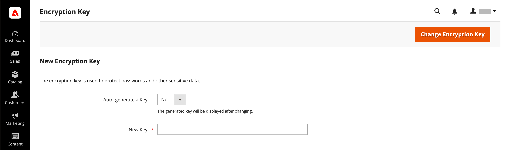

# Encryption key

>[!NOTE]
>
>If you have attempted to complete these steps and are having issues, see the [Troubleshooting Encryption Key Rotation: CVE-2024-34102](https://experienceleague.adobe.com/en/docs/commerce-knowledge-base/kb/troubleshooting/known-issues-patches-attached/troubleshooting-encryption-key-rotation-cve-2024-34102) Knowledge Base article.

Adobe Commerce and Magento Open Source use an encryption key to protect passwords and other sensitive data. An industry-standard [!DNL ChaCha20-Poly1305] algorithm is used with a 256-bit key to encrypt all data that requires encryption. This includes credit card data and integration (payment and shipping module) passwords. In addition, a strong Secure Hash Algorithm (SHA-256) is used to hash all data that does not require decryption.

During the initial installation, you are prompted to either let Commerce generate an encryption key, or enter one of your own. The encryption key tool allows you to change the key as needed. The encryption key should be changed regularly to improve security, and at any time the original key might be compromised.

For technical information, see [Advanced on-premises installation](https://experienceleague.adobe.com/docs/commerce-operations/installation-guide/advanced.html) in the _Installation Guide_ and [Data re-encryption](https://developer.adobe.com/commerce/php/development/security/data-encryption/) in the _PHP Developer Guide_.

>[!IMPORTANT]
>
>- Before following these instructions to change the encryption key, make sure that the following file is writable: `[your store]/app/etc/env.php`
>- The encryption key change feature in the Admin settings is deprecated and was removed in 2.4.8. You must use the CLI command described on this page to change your encryption key after upgrading to 2.4.8.

**To change an encryption key:**

The following instructions require access to a terminal.

1. Enable [maintenance mode](https://experienceleague.adobe.com/en/docs/commerce-operations/configuration-guide/setup/application-modes#maintenance-mode).
   
   ```bash
   bin/magento maintenance:enable
   ```

1. Disable cron jobs.

   _Cloud infrastructure projects:_

   ```bash
   ./vendor/bin/ece-tools cron:disable
   ```
   
   _On-premises projects_

   ```bash
   crontab -e
   ```

1. Change the encryption key using one of the following methods.

   +++CLI command

   Run the following CLI command and make sure that it completes with no errors. If you need to re-encrypt certain system config values or payment fields, please see this detailed guide on re-encryption [ReEncrypting System Configuration](reencrypting-custom-and-system-config-fields.md)

   ```bash
   bin/magento encryption:key:change
   ```

   +++

   +++Admin settings

   >[!IMPORTANT]
   >
   >This feature has been deprecated and was removed in 2.4.8. Adobe recommends changing encryption keys with the CLI.
   
   1. On the _Admin_ sidebar, go to **[!UICONTROL System]** > _[!UICONTROL Other Settings]_ > **[!UICONTROL Manage Encryption Key]**.

      {width="700" zoomable="yes"}

   1. Do one of the following:

      - To generate a new key, set **[!UICONTROL Auto-generate Key]** to `Yes`.
      - To use a different key, set **[!UICONTROL Auto-generate Key]** to `No`. Then in the **[!UICONTROL New Key]** field, enter or paste the key that you want to use.

   1. Click **[!UICONTROL Change Encryption Key]**.

      >[!NOTE]
      >
      >Keep a record of the new key in a secure location. It is required to decrypt the data, if any problems occur with your files.

   +++

1. Flush the cache.

   _Cloud infrastructure projects:_

   ```bash
   magento-cloud cc
   ```

   _On-premises projects:_
   
   ```bash
   bin/magento cache:flush
   ```

1. Enable cron jobs.

   _Cloud infrastructure projects:_

   ```bash
   ./vendor/bin/ece-tools cron:enable
   ```

   _On-premises projects:_

   ```bash
   crontab -e
   ```

1. Disable maintenance mode.

   ```bash
   bin/magento maintenance:disable
   ```
