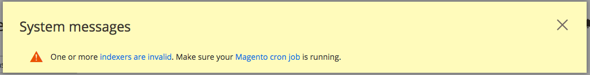
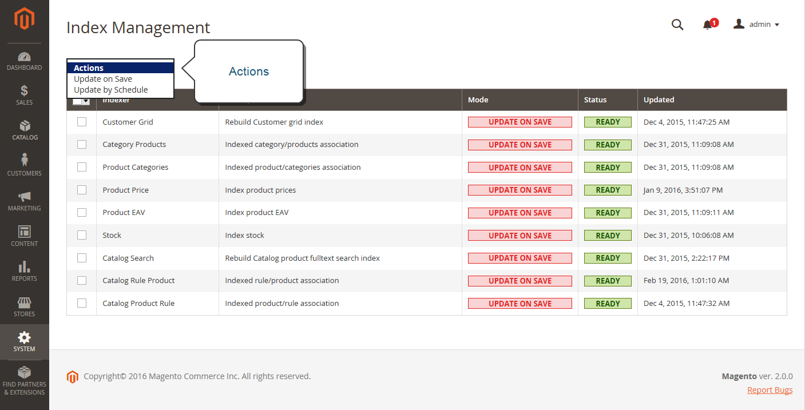

# Index management

Adobe Commerce and Magento Open Source reindex automatically whenever one or more items change. Actions that trigger reindexing include price changes, creating catalog or shopping cart price rules, adding new categories, and so on. To optimize performance, Commerce accumulates data into special tables using indexers. As the data changes, the indexed tables must be updated—or reindexed. Commerce reindexes as a background process, and your store remains accessible during the processes.

Reindexing data speeds up processing, and reduces the time the customer has to wait. For example, if you change the price of an item from $4.99 to $3.99, Commerce reindexes the data to show the price change in the store. Without indexing, Commerce would have to calculate the price of every product on the fly—taking into account shopping cart price rules, bundle pricing, discounts, tier pricing, and so on. Loading the price for a product might take longer than the customer is willing to wait.

The indexers can be set to either update on save or on schedule. All indexes can use either option, except Customer Grid which only supports on save. When indexing on save, Commerce starts a reindex on save actions. The Index Management page will update and flush the reindex message within a minute or two. When reindexing on a schedule, a reindex runs according to a schedule as a cron job. A system message appears if a [cron job](cron.md) is not available to update any indexers that become invalid. Your store remains accessible during reindex processes.

When you need to reindex, a notification appears at the top of the page. The index and message clears based on the reindex mode and potential actions you take. See [Indexing overview](https://developer.adobe.com/commerce/php/development/components/indexing/){:target="_blank"} in the developer documentation.

<!-- zoom -->

<!-- zoom -->

- Index Management has a slightly different presentation for flat product catalogs.
- To avoid problems when multiple Admin users update objects that trigger automatic reindexing, we recommend that you set all indexers to run on schedule as [cron jobs](cron.md). Otherwise, every time an object is saved, any objects with interdependencies might cause a deadlock. Symptoms of a deadlock include high CPU usage and MySQL errors. As a best practice, we recommend that you use scheduled indexing.
-  (Adobe Commerce only) By default, admin actions, such as reindexing, are logged by the system and can be viewed in the [Action Logs Report](action-log-report.md). Action logging can be configured in the [Admin Actions Logging](action-log.md) in your store's advanced admin settings.

## Best practices for reindexing

Reindexing and caching have different purposes in Commerce. Indexes track database information for increased search performance, faster data retrieval for storefronts, and more. [Caches](cache-management.md) save loaded data, images, formats, and the like for increased performance loading and accessing the storefront.

- Typically, you want to reindex when updating data in Commerce.
- If you have a large store or multiple stores, you may want to set indexers like category and products to scheduled cron jobs due to potential reindex looping. You may want to set the reindex on a schedule during non-peak hours.
- When reindexing, you do not need to also perform a flush cache.
- For fresh Commerce installations, you need to flush the cache and reindex.
- Flushing caches and reindexing does not flush your computer's web browser cache. We recommend also flushing the browser cache after completing updates to your storefront.

## Change the index mode

>[!IMPORTANT]
>
>For stores that use [B2B for Adobe Commerce](https://experienceleague.adobe.com/docs/commerce-admin/b2b/introduction.html) and have set Elasticsearch as the fulltext (`catalogsearch_fulltext`) indexer: The fulltext index must be rerun after any bulk permissions change or when the 'permissions' indexer is in 'Scheduled' mode.

1. On the _Admin_ sidebar, go to **System** > _Tools_ > **Index Management**.

1. Select the checkbox for each indexer that you want to change.

1. Set **Actions** to one of the following:

   - `Update on Save`
   - `Update by Schedule`
   - `Invalidate index`

   >[!IMPORTANT]
   >
   >Customer Grid can only be reindexed using `Update on Save`. This index does **not** support `Update by Schedule`.

1. Click **Submit** to apply the change to each selected indexer.

   **Index Management columns**

   | Column | Description |
   | ------ | ----------- |
   | Indexer | The name of the indexer. |
   | Description | A description of the indexer. |
   | Mode | Indicates the current update mode for each indexer. Options:  **Update on Save** - The index is set to update whenever an entity change is saved. These entities include products, categories, and customers. When the save action completes, a series of steps begin catching the changes and updating the index. The Index Management page updates and flushes the reindex message within a minute or two.  **Update on Schedule** - The index is set to update on schedule according to a [cron job](cron.md). The cron job includes the schedule interval for reindexing, writing updates to the index when run.
   | Schedule Status | Displays the schedule status updates. |
   | Status | Displays one of the following:  **Ready** — The index is up-to-date.  **Scheduled** - Reindexing is scheduled to take place.  **Running** - Reindexing is currently running.  **Reindex Required** - A change has been made that requires reindexing, but the indexers cannot be updated automatically. Check to see if [cron](cron.md) is available and configured correctly. |
   | Updated | Indicates the date and time an index was last updated. |

   {style="table-layout:auto"}

## Reindex using the command line

Commerce provides additional reindex options using the command line. These options may require developer support to complete. For complete details and command options, see [Reindex](https://experienceleague.adobe.com/docs/commerce-operations/configuration-guide/cli/manage-indexers.html#reindex){:target="_blank"} in the _Configuration Guide_. The _PHP Developer Guide_ also includes an [Indexing section](https://developer.adobe.com/commerce/php/development/components/indexing/){:target="_blank"}.

## Index trigger events

## Reindexing triggers

| Index Type | Reindexing Event |
| ---------- | ---------------- |
| Product Prices | Add customer group Change configuration settings
| Flat catalog product data | Add store Add store group Add, edit, or delete attribute (for searching and filtering) |
| Flat catalog category data | Add store Add store group Add, edit, or delete attribute (for searching and filtering) |
| Catalog category/product index | Add, edit, or delete products (single, mass, and import) Change product-to-category relations Add, edit, or delete categories Add or delete stores Delete store groups Delete websites |
| Catalog search index | Add, edit, or delete products (single, mass, and import) Add or delete stores Delete store groups Delete websites
| Stock status index | Change inventory configuration settings. |
| Category permissions index | Add store, add store group, add or delete or update attribute (for searching and filtering) |

{style="table-layout:auto"}

>[!IMPORTANT]
>
>Use of a flat catalog is no longer recommended as a best practice. Continued use of this feature is known to cause performance degradation and other indexing issues. See [Use Flat Catalog Product](../catalog/catalog-flat.md) for more information.

## Index actions and controls

| Action | Result | Controls |
| ------ | ------ | ----------
| Creating a new store, new customer group, or any action listed in `Actions that Cause a Full Reindex` | Full reindex | Full reindexing is performed on the schedule determined by your Adobe Commerce or Magento Open Source cron job. |
| Bulk loading of items (Commerce import/export, Direct SQL query, and any other method that directly adds, changes, or deletes data) | Partial reindex (only changed items are reindexed) | At the frequency determined by your Commerce cron job. |
| Changing scope (for example, from global to website) | Partial reindex (only changed items are reindexed) | At the frequency determined by your Commerce cron job. |

{style="table-layout:auto"}

## Events that trigger full reindexing

| Indexer | Event |
| ------- | ----- |
| Catalog Category Flat Indexer | Create a new web store Create a new web store view Create, or delete an attribute that is any of the following: -  Searchable or visible in advanced search -  Filterable -  Filterable in search -  Used for sorting Change an existing attribute to be any of the preceding. Enable flat category storefront options |
| Catalog Product Flat Indexer | Create a new web store Create a new web store view Create, or delete an attribute that is any of the following: -  Searchable or visible in advanced search - Filterable - Filterable in search - Used for sorting  Change an existing attribute to be any of the preceding. Enable flat category storefront options |
| Stock status indexer | When the following _Catalog Inventory options_ change in the system configuration: `Stock Options` - Display Out of Stock Products `Product Stock Options` - Manage Stock |
| Price Indexer | Adding a new customer group. When any of the following Catalog Inventory options change in the system configuration: `Stock Options` -  Display Out of Stock Products `Product Stock Options` - Manage Stock `Price` - Catalog Price Scope |
| Category or Product Indexer | Create or delete a store view Delete a store Delete a website |

{style="table-layout:auto"}
