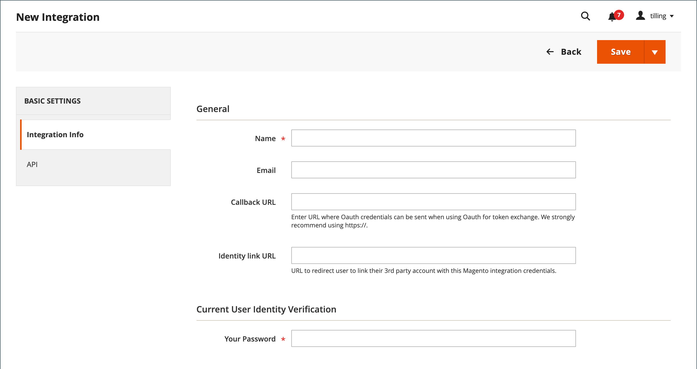
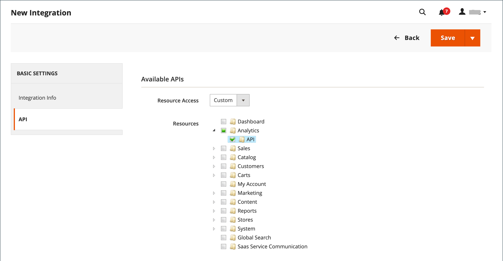

# Third-party integrations

Establishes the location of [OAuth](https://developer.adobe.com/commerce/webapi/get-started/authentication/gs-authentication-oauth/){:target="_blank"} credentials and redirect URL for third-party integrations, and identifies the available API resources that are needed for the integration.

<!-- zoom -->

## Onboarding workflow

1. **Authorize the integration** - Go to the **System** > _Extensions_ > **Integrations** screen, find the relevant integration, and authorize.
1. **Verify and establish login** - When prompted, accept the access requested. If redirected to a third-party, log in to the system, or create a new account. After a successful login, you return to the integration page.
1. **Receive confirmation of authorized integration** - The system sends notification that the integration has been authorized successfully. After setting up an integration and receiving the credentials, it is no longer necessary to make calls to access or request tokens.

## Add a new integration

1. On the _Admin_ sidebar, go to **System** > _Extensions_ > **Integrations**.

1. Enter the following Integration Info:

   - Enter the **Name** of the integration and the contact **Email** address.

   - Enter the **Callback URL** where OAuth credentials can be sent when using OAuth for token exchange. We strongly recommend using `https://`.

   - Enter the **Identity Link URL** to redirect the users to a third-party account with these Adobe Commerce or Magento Open Source integration credentials.

   - When prompted, enter **Your Password** to confirm your identity.

   <!-- zoom -->

1. In the left panel, choose **API** and do the following:

   - Set **Resource Access** to one of the following:

      - `All`
      - `Custom`

   - For custom access, select the checkbox of each resource that is needed.

      <!-- zoom -->

1. When complete, click **Save**.

## Activate an integration

By default, a saved integration appears on the grid with an _Inactive_ status. To activate it, complete the following steps:

1. On the _Admin_ sidebar, go to **System** > _Extensions_ > **Integrations**.

1. Find the newly created integration and click the **Activate** link.

1. In the upper-right corner, click **Allow**.

   This displays the Integration Tokens for Extensions. Copy this information to a secure, encrypted location for use with your integration.

   <!-- zoom -->

1. In the upper-right corner, click **Done**.

## Reauthorize an integration

To generate a new Integration Access Token and Access Token Secret, re-authorized the integration from the Admin Panel.

1. On the _Admin_ sidebar, go to **System** > _Extensions_ > **Integrations**.

1. Find the integration with the **Active** status.

1. In _Activate_ column, click the **Reauthorize**.

1. Click **Reauthorize** to approve access to the API resources.

1. Save the new integration tokens for extensions and click **Done**.

## Change the API guest access security setting

By default, the system does not permit anonymous guest access to CMS, catalog, and other store resources. If you need to change the setting, do the following:

1. On the _Admin_ sidebar, go to **Stores** > _Settings_ > **Configuration**.

1. In the left panel, expand **Services** and choose **Magento Web API**.

1. Expand  the **Web API Security Setting** section.

   <!-- zoom -->

1. Set **Allow Anonymous Guest Access** to `Yes`.

1. When complete, click **Save Config**.

See [Restricting access to anonymous web APIs](https://developer.adobe.com/commerce/webapi/rest/use-rest/anonymous-api-security/){:target="_blank"} in the developer documentation.

## Delete an integration

1. On the _Admin_ sidebar, go to **System** > _Extensions_ > **Integrations**.

1. Find the existing integration and click the icon (  ) in the **Delete** column.

1. To confirm your action, click **OK**.
