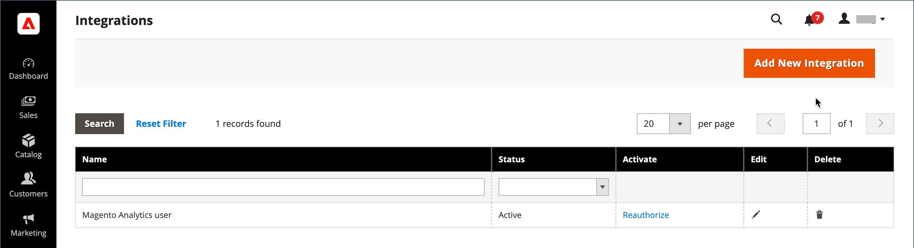

# Integrations

Defining an integration in the Commerce Admin establishes the location of OAuth credentials and redirect URL for third-party integrations, and identifies the available API resources that are needed for the integration. For more detailed information about the integration registration process, see [OAuth-based authentication](https://developer.adobe.com/commerce/webapi/get-started/authentication/gs-authentication-oauth/) in the Commerce developer documentation.

{width="700" zoomable="yes"}

## Onboarding workflow

1. **Authorize the integration** - Go to the **[!UICONTROL System]** > _[!UICONTROL Extensions]_ > **[!UICONTROL Integrations]** page, find the relevant integration, and authorize.
1. **Verify and establish login** - When prompted, accept the access requested. If redirected to a third-party, log in to the system, or create an account. After a successful login, you return to the integration page.
1. **Receive confirmation of authorized integration** - The system sends notification that the integration has been authorized successfully. After setting up an integration and receiving the credentials, it is no longer necessary to make calls to access or request tokens.

## Add an integration

1. On the _Admin_ sidebar, go to **[!UICONTROL System]** > _[!UICONTROL Extensions]_ > **[!UICONTROL Integrations]**.

   {width="600" zoomable="yes"}

1. Enter the following integration information:

   - Enter the **[!UICONTROL Name]** of the integration and the contact **[!UICONTROL Email]** address.

   - Enter the **[!UICONTROL Callback URL]** where OAuth credentials can be sent when using OAuth for token exchange. Using `https://` is strongly recommended.

   - Enter the **[!UICONTROL Identity Link URL]** to redirect the users to a third-party account with these Adobe Commerce or Magento Open Source integration credentials.

   >[!NOTE]
   >
   > The `Integration not secure` warning label is displayed near each integration name on the [!UICONTROL Integrations] grid as a reminder, until HTTPS URLs are saved into [!UICONTROL Callback URL] and [!UICONTROL Identity Link URL] fields.

   - When prompted, enter your password to confirm your identity.

1. In the left panel, choose **[!UICONTROL API]** and do the following:

   - Set **[!UICONTROL Resource Access]** to one of the following:

      - `All`
      - `Custom`

   - For custom access, select the checkbox of each resource that is needed.

      {width="600" zoomable="yes"}

1. When complete, click **[!UICONTROL Save]**.

## Activate an integration

By default, a saved integration appears on the grid with an `Inactive` status. To activate it, complete the following steps:

1. On the _Admin_ sidebar, go to **[!UICONTROL System]** > _[!UICONTROL Extensions]_ > **[!UICONTROL Integrations]**.

1. Find the newly created integration and click the **[!UICONTROL Activate]** link.

1. In the upper-right corner, click **[!UICONTROL Allow]**.

   This action displays the Integration Tokens for Extensions. Copy this information to a secure, encrypted location for use with your integration.

   {width="600" zoomable="yes"}

1. In the upper-right corner, click **[!UICONTROL Done]**.

## Reauthorize an integration

To generate a new Integration Access Token and Access Token Secret, reauthorized the integration from the Admin:

1. On the _Admin_ sidebar, go to **[!UICONTROL System]** > _[!UICONTROL Extensions]_ > **[!UICONTROL Integrations]**.

1. Find the integration with the **[!UICONTROL Active]** status.

1. In _[!UICONTROL Activate]_ column, click the **[!UICONTROL Reauthorize]**.

1. Click **[!UICONTROL Reauthorize]** to approve access to the API resources.

1. Save the new integration tokens for extensions and click **[!UICONTROL Done]**.

## Change the API guest access security setting

By default, the system does not permit anonymous guest access to CMS, catalog, and other store resources. If you must change the setting, do the following:

1. On the _Admin_ sidebar, go to **[!UICONTROL Stores]** > _[!UICONTROL Settings]_ > **[!UICONTROL Configuration]**.

1. In the left panel, expand **[!UICONTROL Services]** and choose **[!UICONTROL Magento Web API]**.

1. Expand  the **[!UICONTROL Web API Security Setting]** section.

   {width="600" zoomable="yes"}

1. Set **[!UICONTROL Allow Anonymous Guest Access]** to `Yes`.

1. When complete, click **[!UICONTROL Save Config]**.

For additional information, see [Restricting access to anonymous web APIs](https://developer.adobe.com/commerce/webapi/rest/use-rest/anonymous-api-security/) in the Commerce developer documentation.

## Delete an integration

1. On the _Admin_ sidebar, go to **[!UICONTROL System]** > _[!UICONTROL Extensions]_ > **[!UICONTROL Integrations]**.

1. Find the existing integration and click the icon (  ) in the **[!UICONTROL Delete]** column.

1. To confirm your action, click **[!UICONTROL OK]**.
