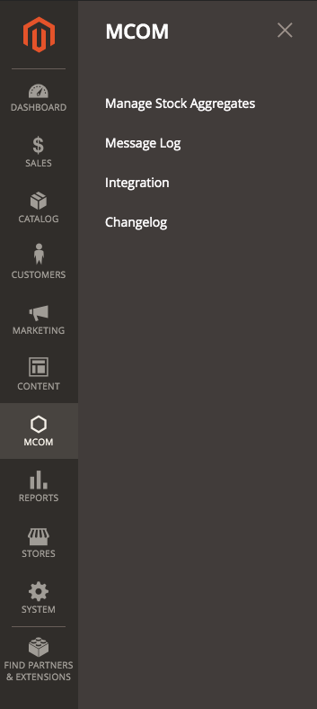
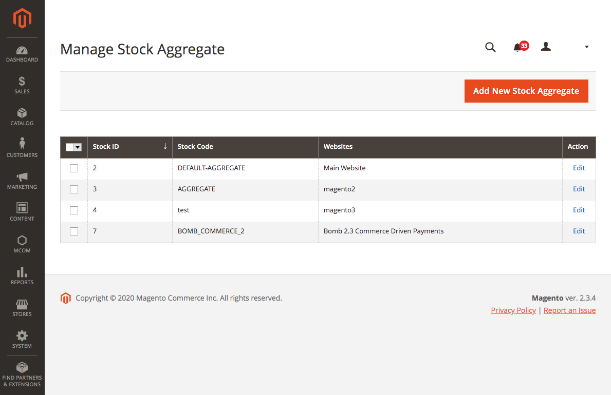
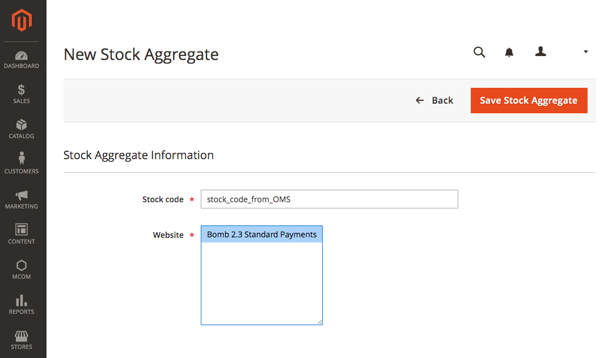
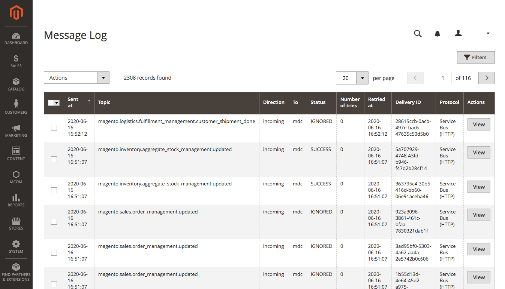
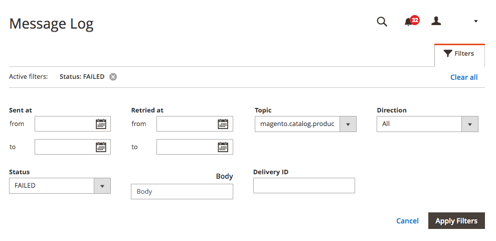
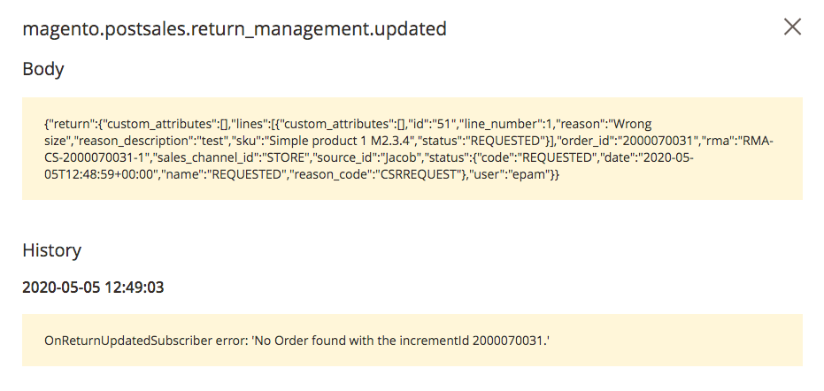
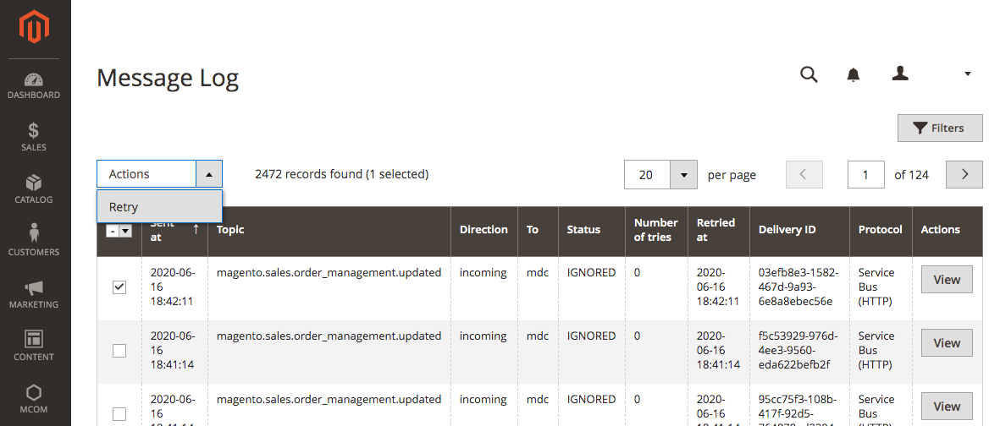
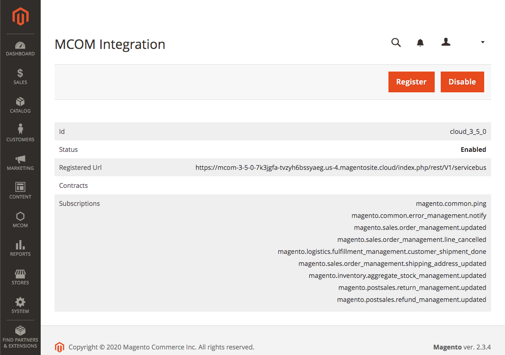
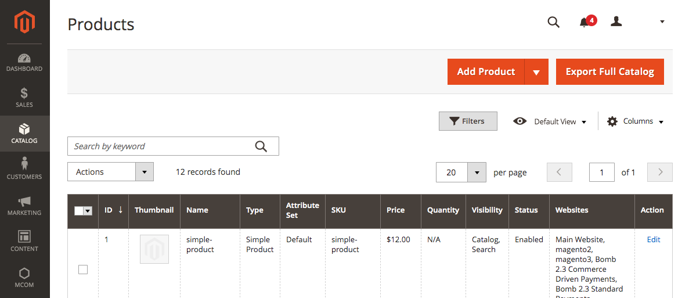

# Order Management System for Adobe Commerce

{{ee-feature}}

Learn how to manage your stock aggregates and the Order Management integration, available if you use the Order Management System (OMS) Connector with Adobe Commerce, as well as view both the message log and changelog.

## [!UICONTROL MCOM] menu

If you use the Order Management System (OMS) with Adobe Commerce, an **[!UICONTROL MCOM]** option is available in the left menu of the Admin.

With this MCOM option, you can manage stock aggregates and integrations, and access both the message log and changelog.

**_To display the MCOM menu:_**

On the _Admin_ sidebar, choose **[!UICONTROL MCOM]**.

<!-- zoom -->

## Manage stock aggregates

Manage Stock Aggregates provides information about existing stock aggregates, and allows you to add new stock aggregates or edit or delete existing ones.

<!-- zoom -->

You [create sources](https://omsdocs.magento.com/features-processes/stock-sourcing/inventory/) and [aggregates](https://omsdocs.magento.com/features-processes/stock-sourcing/inventory/#configure-stock-aggregates) in the Order Management System (OMS) Admin. Then you assign which websites are associated with each aggregate via Manage Stock Aggregates in the Adobe Commerce Admin.

### Add a stock aggregate

1. On the _Admin_ sidebar, go to **[!UICONTROL MCOM]** > **[!UICONTROL Manage Stock Aggregates]**.
1. Click **[!UICONTROL Add New Stock Aggregate]**.
1. Enter a **[!UICONTROL Stock code]** (name) for this stock aggregate.

   >[!NOTE]
   >
   >The stock code that you enter should match the [stock aggregate code](https://omsdocs.magento.com/features-processes/stock-sourcing/inventory/) in the OMS.

1. Choose a **[!UICONTROL Website]** from the populated list.
1. When complete, click **[!UICONTROL Save Stock Aggregate]**.

   <!-- zoom -->

### Edit or delete a stock aggregate

1. On the _Admin_ sidebar, go to **[!UICONTROL MCOM]** > **[!UICONTROL Manage Stock Aggregates]**.
1. In the _[!UICONTROL Action]_ column, click **[!UICONTROL Edit]** for an existing stock aggregate.
1. To edit the stock aggregate, revise the **[!UICONTROL Stock code]** or **[!UICONTROL Website]** information and click **[!UICONTROL Save Stock Aggregate]**.
1. To delete the stock aggregate, click **[!UICONTROL Delete]** and then click **[!UICONTROL OK]** in the confirmation dialog that appears.

## Message log

Message Log enables you to view message processing logs, message history, and full error traces for the Connector.

<!-- zoom -->

### Enable message performance logs

1. Log into the Adobe Commerce Admin.
1. On the _Admin_ sidebar, go to **[!UICONTROL Stores]** > _[!UICONTROL Settings]_ > **[!UICONTROL Configuration]**.
1. In the left panel, expand **[!UICONTROL MCOM Connector]** and choose **[!UICONTROL Configuration]**.
1. Scroll down to the _[!UICONTROL Performance Monitor]_ section and enable desired [!DNL New Relic] or Logger Output options.
1. Click **[!UICONTROL Save Config]**.

See the [Message performance section](https://omsdocs.magento.com/integration/connector/view-logs/#message-performance) of the Views logs topic in the Order Management System (OMS) documentation for more information about what metrics are available out-of-the-box, an example log file, and more.

### View message processing logs

1. On the _Admin_ sidebar, go to **[!UICONTROL MCOM]** > **[!UICONTROL Message Log]**.
1. Click **[!UICONTROL Filters]** and add any search criteria you want to employ, such as Topic (message) and direction (ingoing or outgoing).
1. Click **[!UICONTROL Apply Filters]** to see your query results.

   <!-- zoom -->

1. Click **[!UICONTROL View]** for the message that you want to view.

   The Details view for that message appears, including information about the message body and other related history.

1. If the message was processed with an error, you can click within the _[!UICONTROL History]_ section to see a full error trace.

   <!-- zoom -->

Information about fatal errors is in the `apache/nginx` error log (the [same place logs are located](https://devdocs.magento.com/cloud/project/log-locations.html#application-logs) for the Connector-less Adobe Commerce installation).

If you are working in Developer mode, all errors are visible on your screen.

### Retry a topic (message)

You can retry a failed topic (message) in Message Log.

1. On the _Admin_ sidebar, go to **[!UICONTROL MCOM]** > **[!UICONTROL Message Log]**.
1. To determine whether a topic was successful, see the _[!UICONTROL Status]_ column.

   Successful topics show a `SUCCESS` status.

1. In the leftmost column, select the checkbox for the topic you want to retry.
1. Click **[!UICONTROL Actions]** and select **[!UICONTROL Retry]**.

   The topic (message) is resubmitted.

   <!-- zoom -->

## Integration

Integration enables you to add or disable the Order Management System (OMS) integration for Adobe Commerce and view details of the integration.

### Register the integration

1. On the _Admin_ sidebar, go to **[!UICONTROL MCOM]** > **[!UICONTROL Integration]**.
1. Click **[!UICONTROL Register]** to register the MCOM (also known as OMS) integration.

### Disable or enable the integration

1. On the _Admin_ sidebar, go to **[!UICONTROL MCOM]** > **[!UICONTROL Integration]**.
1. Check the status of the integration in the _[!UICONTROL Status]_ row---either `Enabled` or `Disabled`.
   * To enable a disabled integration, click **[!UICONTROL Enable]**. A confirmation message appears to inform you the integration has been enabled.
   * To disable an enabled integration, click **[!UICONTROL Disable]**. A confirmation message appears to inform you the integration has been disabled.

   <!-- zoom -->

## Changelog

On the _Admin_ sidebar, go to **[!UICONTROL MCOM]** > **[!UICONTROL Changelog]**. You are immediately redirected to the Adobe Commerce version 2.2 Connector changelog. Change the version number in the URL to `2.3` to access the 2.3 Connector changelog.

## Export full catalog

You can manually request a full catalog export from Adobe Commerce. This feature queues all products from the catalog for export to the Order Management System (OMS).

Outside of manually exporting the full catalog, products are added to this queue after a new product is created, an existing product is updated, or after a bulk update to product attributes.

When requested, these outgoing messages are exported to a .csv file in chunks of 5,000.

**_To export the full catalog:_**

1. On the _Admin_ sidebar, go to **[!UICONTROL Catalog]** > **[!UICONTROL Products]**.
1. Click **[!UICONTROL Export Full Catalog]**.

   <!-- zoom -->

1. Click **[!UICONTROL OK]** in the confirmation dialog.

   A progress bar appears to show the status of the requested catalog export. When the export is complete, a confirmation message appears to confirm the action.

To manually export the catalog from the command line, see the [Export full catalog section](https://omsdocs.magento.com/integration/connector/setup-tutorial/#export-full-catalog) of the OMS Connector documentation.
