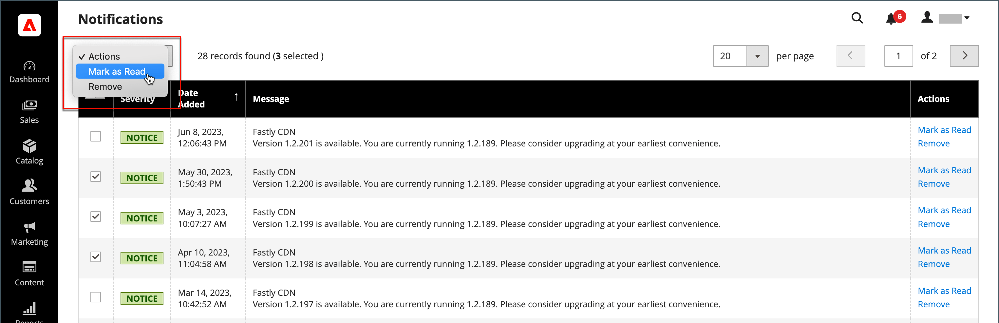

# System notifications

The _Notifications_ page lists all messages ranked by severity, with the most recent at the top. The Action commands can be used to mark individual messages as read, view more detailed information, or to remove the message from the inbox.

1. Do one of the following to open the _[!UICONTROL Notifications]_ page:

   - Click the _Notification_ icon in the header. If there are one or more new messages displayed, click **[!UICONTROL See All]**.

   - On the _Admin_ sidebar, go to **[!UICONTROL System]** > _[!UICONTROL Other Settings]_ > **[!UICONTROL Notifications]**.

1. In the **[!UICONTROL Action]** column, do any of the following:

   - For more information, click **[!UICONTROL Read Details]** to open the linked page in a new window.

   - To keep the message in your inbox, click **[!UICONTROL Mark As Read]**.

      <!-- zoom -->

   - To delete the message, click **[!UICONTROL Remove]**.

1. To apply an action to multiple messages, do one of the following:

   - Select the checkbox in the first column for each message to be managed.
   - To select multiple messages, set the **[!UICONTROL Mass Actions]** control as needed.

1. Set the **[!UICONTROL Actions]** control to one of the following:

   - `Mark as Read`
   - `Remove`

1. Click **[!UICONTROL Submit]** to complete the process.