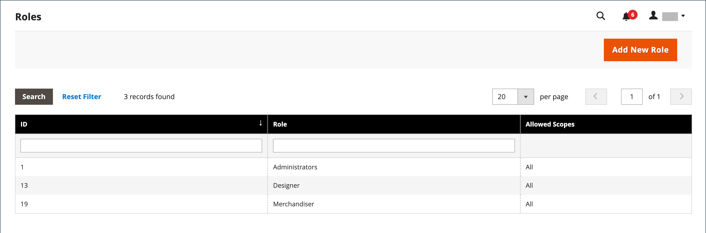
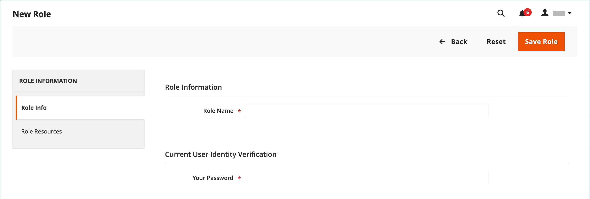
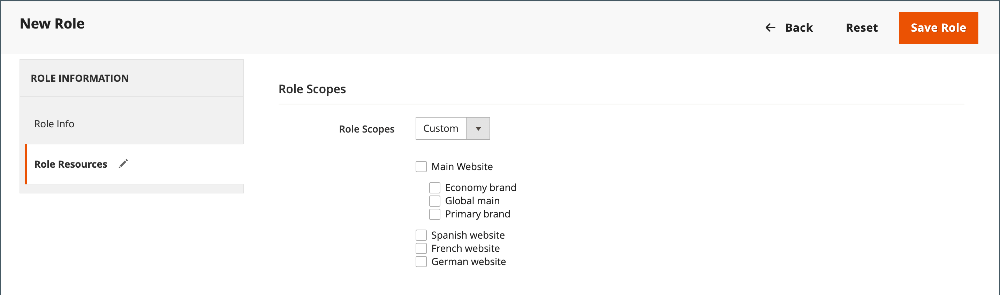
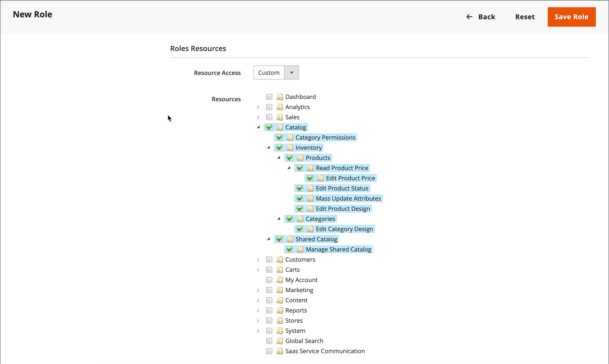
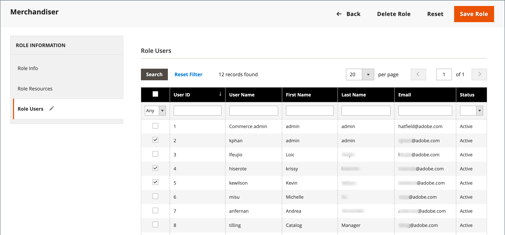

# User roles

To give someone restricted access to the Admin, the first step is to create a role that has the appropriate level of permissions. After the role is saved, you can add new users and assign the restricted role to grant them limited access to the Admin.

{width="600" zoomable="yes"}

## Define a role

1. On the _Admin_ sidebar, go to **[!UICONTROL System]** > _[!UICONTROL Permissions]_ > **[!UICONTROL User Roles]**.

1. In the upper-right corner, click **[!UICONTROL Add New Role]**.

1. Complete the steps to define the role:

### Step 1: Add the role name

1. Under _[!UICONTROL Role Information]_, enter a descriptive **[!UICONTROL Role Name]**.

1. Under _[!UICONTROL Current User Identity Verification]_, enter your password.

   {width="600" zoomable="yes"}

### Step 2: Assign resources

>[!IMPORTANT]
>
>When assigning resources, be sure to disable access to the Permissions tool if you are limiting access for a given role. Otherwise, users are able to modify their own permissions.

1. Set **[!UICONTROL Role Scopes]** to one of the following:

   - `All`
   - `Custom`

   If set to `Custom` for a multisite installation, select the checkbox of the website and store where the role is to be used.

   {width="600" zoomable="yes"}

   >[!NOTE]
   >
   >Users with a `Custom` role scope are not able to create websites and categories, assign products to categories, or edit products at _[!UICONTROL All Store Views]_ scope when they are assigned to restricted stores. These users also cannot perform other _global_ actions that affect scopes where they do not have access.

1. Under _[!UICONTROL Roles Resources]_, set **[!UICONTROL Resource Access]** to `Custom`.

1. In the **[!UICONTROL Resource]** tree structure, select the checkbox of each Admin capability that the role can access.

   To create an Admin role with access to tax settings, choose both the Sales/Tax and System/Tax resources. If setting up a website for a region that differs from your default [shipping point of origin](../stores-purchase/shipping-settings.md#point-of-origin), you must allow access to the System/Shipping resources for the role. The shipping settings determine the store tax rate that is used for catalog prices.

   {width="600" zoomable="yes"}

   The list of available permissions may include additional options for bundled and installed extensions. By selecting the top-most permission for each feature, you assign all permissions available for the user.

   >[!NOTE]
   >
   >An Admin user must have **[!UICONTROL Sales / Archive]** permissions for their role scope to see the _[!UICONTROL Invoices]_, _[!UICONTROL Credit Memos]_, and _[!UICONTROL Shipments]_ order [tabs](../stores-purchase/order-processing.md).

1. When complete, click **[!UICONTROL Save Role]**.

   The role now appears in the grid and can be assigned to user accounts.

## Assign a role to users

1. From the _[!UICONTROL Roles]_ grid, open the record in edit mode.

1. Under _[!UICONTROL Current User Identity Verification]_, enter your user account password.

1. In the left panel, choose **[!UICONTROL Role Users]**.

   The _[!UICONTROL Role Users]_ option appears only after a new role is saved.

   {width="600" zoomable="yes"}

1. To search for a specific user record, do the following:

   - Enter the value in the search filter at the top of a column and press **Enter**.

   - When you are ready to return to the full list, click **[!UICONTROL Reset Filter]**.

1. Select the checkbox of any users to be assigned to the role.

1. Click **[!UICONTROL Save Role]**.

## Edit a role

1. On the _Admin_ sidebar, go to **[!UICONTROL System]** > _[!UICONTROL Permissions]_ > **[!UICONTROL User Roles]**.

1. Locate the role using filters above the grid and click the role name.

1. Make needed changes.

   Review the steps for creating a user role for information about the role settings.

1. When prompted, enter your password to confirm your identity.

1. Click the **[!UICONTROL Save Role]**.

## Delete a role

1. On the _Admin_ sidebar, go to **[!UICONTROL System]** > _[!UICONTROL Permissions]_ > **[!UICONTROL User Roles]**.

1. Locate the role using filters above the grid and open in edit mode.

1. In the upper-right corner, click **[!UICONTROL Delete Role]**.

1. To confirm the action, click **[!UICONTROL OK]**.

## User roles demo

Watch this video to learn about managing user roles:

>[!VIDEO](https://video.tv.adobe.com/v/343654?quality=12)

## Role resources

Access to the following resources can be assigned to a custom role. See the linked page to learn more about the capabilities that are associated with each resource.

 - Adobe Commerce only

 - Available with B2B for Adobe Commerce only

| Resource |   |   |
| --- | --- | --- |
|[`Dashboard`](../getting-started/admin-dashboard.md)|||
|[`Sales`](../stores-purchase/sales-menu.md)|[`Operations`](../stores-purchase/orders.md)||
||[`Quotes`](../b2b/quotes.md)   [`Orders`](../stores-purchase/orders.md) [`Invoices`](../stores-purchase/invoices.md) [`Shipments`](../stores-purchase/shipments.md) [`Credit Memos`](../stores-purchase/credit-memos.md) [`Billing Agreements`](../stores-purchase/paypal-billing-agreements.md) [`Returns`](../stores-purchase/returns.md)  [`Transactions`](../stores-purchase/transactions.md)|
||[`Archive`](action-log-archive.md)![Adobe Commerce]||
||[`Shopping Cart Management`](../stores-purchase/cart.md)||
|[`Catalog`](../catalog/catalog-menu.md)|[`Category Permissions`](../catalog/categories.md) ||
||[`Inventory`](../inventory-management/introduction.md)|[`Products`](../catalog/products-list.md) [`Categories`](../catalog/categories.md)|
||[`Shared Catalog`](../b2b/catalog-shared-create.md)  |[`Manage Shared Catalog`](../b2b/catalog-shared-manage.md)|
|[`Customers`](../customers/guide-overview.md) | [`All Customers`](../customers/customers-all.md) [`Now Online`](../customers/now-online.md) [`Customer Groups`](../customers/customer-groups.md) [`Segments`](../customers/customer-segments.md) ||
||[`Login as Customer`](../customers/login-as-customer.md)|`Allow Login as Customer Button` `View Login as Customer Log` |
||[`Companies`](../b2b/account-companies.md)  | [`Manage Companies`](../b2b/account-company-manage.md)  `Add New Company`  `Delete Company`  `Reimburse Balance` |
|[`Carts`](../stores-purchase/shopping-assisted-cart-manage.md)|[`Manage carts`](../stores-purchase/shopping-assisted-cart-manage.md)||
|[`My Account`](../customers/account-dashboard-my-account.md)|||
|[`Marketing`](../merchandising-promotions/marketing-menu.md)|[`Promotions`](../merchandising-promotions/marketing-menu.md#uicontrol-promotions)|[`Catalog Price Rule`](../merchandising-promotions/price-rules-catalog.md)  [`Cart Price Rules`](../merchandising-promotions/price-rules-cart.md)  [`Related Products Rules`](../merchandising-promotions/product-related-rules.md) [`Gift Card Accounts`](../stores-purchase/product-gift-card-accounts.md) |
||[`Private Sales`](../merchandising-promotions/events-private-sales.md) |[`Events`](../merchandising-promotions/event-create.md)  [`Invitations`](../merchandising-promotions/invitations.md) |
||`Communications`|[`Email Templates`](email-templates.md)  [`Newsletter Template`](../merchandising-promotions/newsletter-template.md)  [`Newsletter Queue`](../merchandising-promotions/newsletter-queue.md)  [`Newsletter Subscribers`](../merchandising-promotions/newsletter-subscribers.md)  [`Email Reminders`](../merchandising-promotions/email-reminder-rules.md) |
||`Sales Channel`|[`Amazon Sales Channel`](https://experienceleague.adobe.com/docs/commerce-channels/amazon/overview.html)|
||[`SEO & Search`](../merchandising-promotions/marketing-menu.md#uicontrol-seo--search)|[`Search Terms`](../catalog/search-terms.md)  [`Search Synonyms`](../catalog/search-terms.md#search-synonyms)  [`URL Rewrites`](../merchandising-promotions/url-rewrite-custom.md)  [`Site Map`](../merchandising-promotions/sitemap-xml.md)|
||[`User Content`](../merchandising-promotions/product-reviews-moderate.md) | [`All Reviews`](../merchandising-promotions/product-reviews.md)  [`Pending Reviews`](../merchandising-promotions/product-reviews-moderate.md)   ||
|[`Content`](../content-design/content-menu.md) | [`Elements`](../content-design/content-menu.md#uicontrol-elements)) | [`Pages`](../content-design/pages.md) [`Hierarchy`](../content-design/page-hierarchy.md)  [`Blocks`](../content-design/blocks.md) [`Dynamic Blocks`](../content-design/dynamic-blocks.md)  [`Widgets`](../content-design/widgets.md) [`Media Gallery`](../content-design/media-gallery.md)||
||[`Design`](../content-design/introduction.md#design) | [`Themes`](../content-design/themes.md) [`Schedule`](../content-design/schedule.md)||
||[Content Staging](../content-design/content-staging.md)  ||
|[`Reports`](../getting-started/reports-menu.md) | [`Marketing`](../getting-started/marketing-reports.md)|`Shopping Cart` [`Search Terms`](../catalog/search-terms.md#search-terms-report) `Newsletter Problem Reports`||
||[`Reviews`](../getting-started/review-reports.md) ||
||[`Sales`](../getting-started/sales-reports.md)||
||`System Insights` |[`Site-Wide Analysis Tool`](https://experienceleague.adobe.com/docs/commerce-operations/tools/site-wide-analysis-tool/access.html)|
||[`Customers`](../getting-started/customer-reports.md) [`Products`](../getting-started/product-reports.md) [`Private Sales`](../getting-started/private-sales-reports.md)  [`Statistics`](../getting-started/reports-menu.md#uicontrol-statistics) [`Business Intelligence`](../getting-started/business-intelligence.md)||
|[`Stores`](../stores-purchase/stores.md) | [`Settings`](../stores-purchase/stores-menu.md) | [`All Stores`](../stores-purchase/stores.md) [`Configuration`](../configuration-reference/guide-overview.md) [`Terms and Conditions`](../stores-purchase/terms-and-conditions.md) [`Order Status`](../stores-purchase/order-status.md)||
||[`Inventory`](../inventory-management/sources-stocks.md)|[`Sources`](../inventory-management/sources-manage.md) [`Stocks`](../inventory-management/stocks-manage.md)||
||[`Taxes`](../stores-purchase/taxes.md)|||
||[`Currency`](../stores-purchase/currency.md)|[`Currency Rates`](../stores-purchase/currency-update.md) [`Currency Symbols`](../stores-purchase/currency-configuration.md#step-5-customize-currency-symbols-optional)||
||[`Attributes`](../catalog/product-attributes.md)|[`Product`](../catalog/attribute-product-create.md) [`Update Attributes`](../catalog/attribute-product-create.md) [`Attribute Set`](../catalog/attribute-sets.md) [`Ratings`](../merchandising-promotions/product-reviews.md#create-custom-ratings)|
||[`Other Settings`](../stores-purchase/stores-menu.md)|[`Customer Groups`](../customers/customer-groups.md)|
|[`System`](system-menu.md) | [`Data Transfer`](data-transfer.md) | [`Import`](data-import.md) [`Export`](data-export.md) [`Import/Export Tax Rates`](data-transfer-tax-rates.md) [`Import History`](data-import.md#import-history)||
||[`Magento Connect`](../getting-started/commerce-marketplace.md) | `Connect Manager` `Package Extensions`||
||[`Tools`](system-menu.md#tools) | [`Cache Management`](cache-management.md) [`Backups`](backups.md) [`Index Management`](index-management.md) [`Change Indexer Mode`](index-management.md) ||
||[`Permissions`](permissions.md) | [`All Users`](permissions-users-all.md) [`Locked Users`](permissions-users-all.md#locked-users) [`User Roles`](permissions-user-roles.md)|
|[`Action Log`](action-log.md)| [`Report`](action-log.md) [`Archive`](action-log-archive.md)|
||[`Other Settings`](system-menu.md)|[`Notifications`](notifications.md) [`Custom Variables`](variables-custom.md) [`Manage Encryption Key`](encryption-key.md)||
|[`Global Search`](../getting-started/admin-workspace.md#workspace-search)|||

{style="table-layout:auto"}
