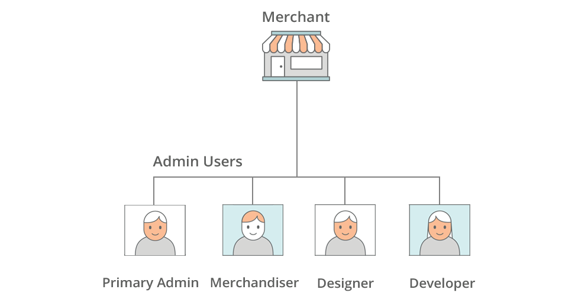
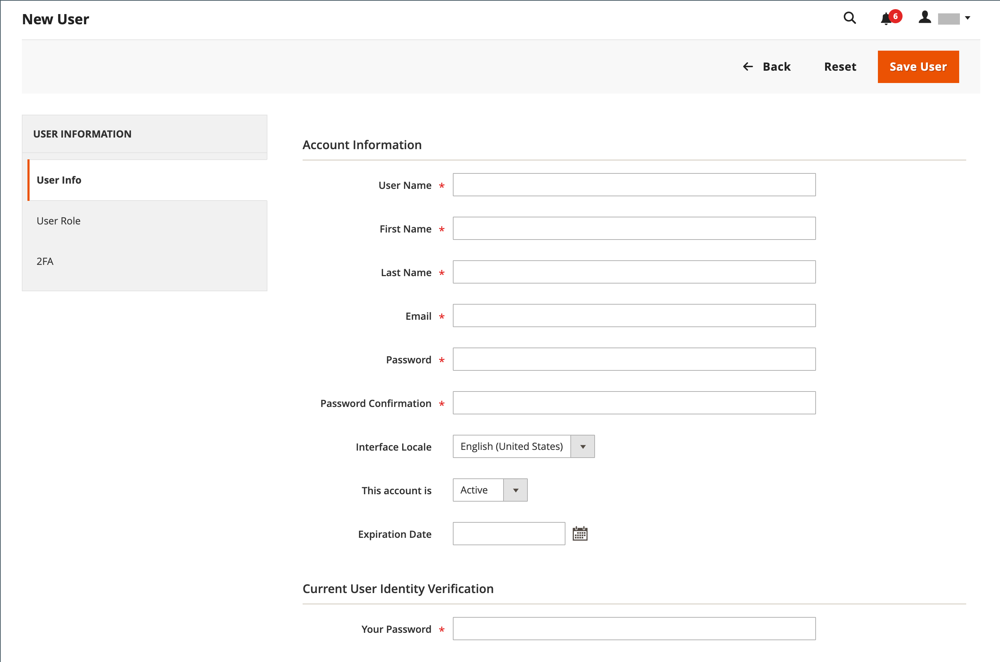
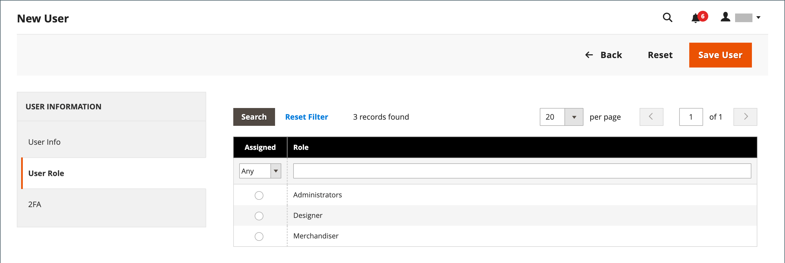
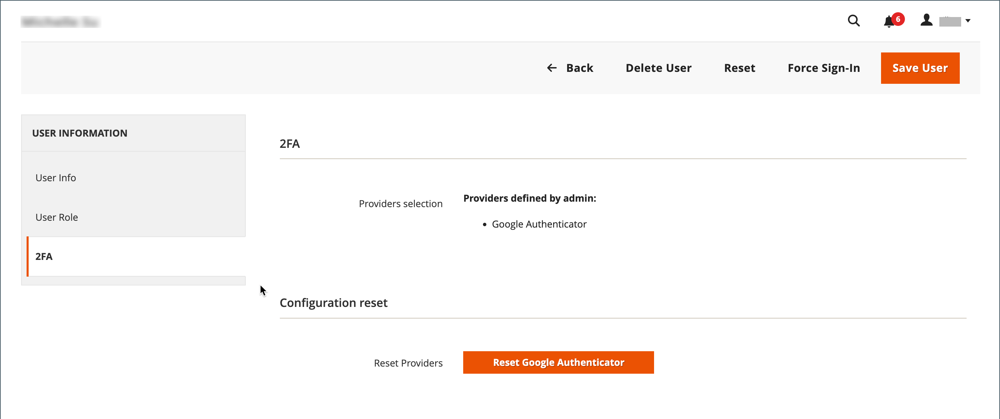
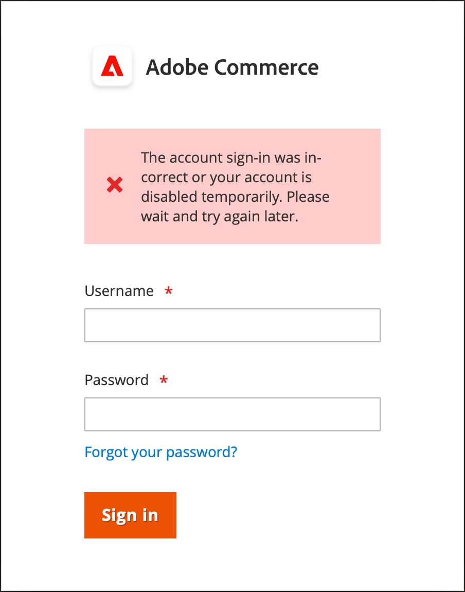
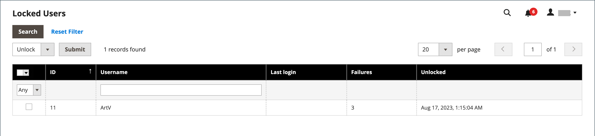

# Manage Admin user accounts

When your store is first installed, a default Admin account is created with login credentials that gives you full administrative access. As a best practice, you should create another user account with full Administrator access. That way, you can use one account for your everyday Administrative activities and reserve the other as a "Super Admin" account. This can be helpful if you forget your regular credentials, or they somehow become unusable.

If there are others on your team or service providers who need access, you can create a separate user account for each and assign restricted access based on their business need to know. To limit the websites or stores that users can access in the Admin, you must first [create a role](permissions-user-roles.md) with limited scope and only the necessary resources selected. Then, you can assign the role to a specific user account. Admin users who are assigned to a restricted role can see and change data only for websites or stores that are associated with the role, but cannot change any global settings or data.

>[!NOTE]
>
>Adobe Commerce merchants who have an Adobe ID and want a streamlined login to Adobe Commerce and Adobe Business products can integrate Commerce authentication with the Adobe IMS authentication workflow. After this integration is enabled for your Commerce store, each Admin user must use their Adobe credentials — not their Commerce credentials — to log in. See [Adobe Identity Management Service (IMS) Integration Overview](https://experienceleague.adobe.com/docs/commerce-admin/start/admin/ims/adobe-ims-integration-overview.html).

For users or roles that are temporary, you can also set an expiration date for the user account.

<!--  update this to a better info-graphic <!-- zoom -->

## Create a user

1. On the _Admin_ sidebar, go to **[!UICONTROL System]** > _[!UICONTROL Permissions]_ > **[!UICONTROL All Users]**.

1. In the upper-right corner, click **[!UICONTROL Add New User]**.

   To edit an existing user, click a user name in the grid. You can modify the _[!UICONTROL User Info]_ and _[!UICONTROL User Role]_ sections as needed.

1. In the _[!UICONTROL Account Information]_ section, do the following:

   <!-- zoom -->

   - Enter the **[!UICONTROL User Name]** for account.

      The user name should be easy to remember. It is not case-sensitive. For example, if the user name is `John`, they can also log in as `john`.

   - Complete the following information:

      - **[!UICONTROL First Name]**
      - **[!UICONTROL Last Name]**
      - **[!UICONTROL Email address]**

      Each user account must have a unique email address.

   - Enter a **[!UICONTROL Password]** for the account.

      >[!NOTE]
      >
      >An Admin password must be seven or more characters long and include both letters and numbers. For additional password options, see [Configuring Admin Security](security-admin.md).

   - For **[!UICONTROL Password Confirmation]**, reenter the password to make sure it was entered correctly.

   - If your store has multiple languages, set **[!UICONTROL Interface Locale]** to the language to be used for the Admin interface.

1. Set **[!UICONTROL This Account is]** to `Active`.

1. Click the calendar icon to set the **[!UICONTROL Expiration Date]** for the user account.

   Defining an expiration date is helpful when a user or role is temporary. After the expiration date, the user account status changes to `Inactive` and can be updated, if needed.

1. Under _[!UICONTROL Current User Identity Verification]_, enter your user account password.

>[!IMPORTANT]
>
>With the _[!UICONTROL Account Information]_ section complete, you can save the user. The new user is displayed in the _[!UICONTROL Users]_ grid, but the user name cannot log in until a role is assigned.

## Assign a user role

1. In the left panel, click **[!UICONTROL User Role]**.

   The grid lists all the existing user roles. For a new store, _[!UICONTROL Administrators]_ is the only role available.

   <!-- zoom -->

1. In the _[!UICONTROL Assigned]_ column, select a user role.

   You can [view existing or define additional user roles](permissions-user-roles.md). After a role is defined, you must edit the user account to assign the new role.

## Verify or reset 2FA providers

1. In the left panel, click **[!UICONTROL 2FA]**.

   <!-- zoom -->

1. Verify the 2FA solutions that are available to _Admin_ users and advise each user to install the solutions they want to use before they sign in.

   Authentication by only one 2FA solution is required to sign in to the _Admin_.

1. If the user needs to reinstall the 2FA solution, you can reset the current 2FA configuration.

   This requires the user to repeat the setup process before they can sign in again. For example, the user might have a new smart phone and needs to reinstall Google Authenticator. To clear the user's current 2FA setup, click **[!UICONTROL Reset (Provider)]** for each solution that you want to clear. When prompted, click **[!UICONTROL OK]** to confirm.

   The user receives an email with a link to [configure 2FA](security-two-factor-authentication.md). The link can be used only once. If the user tries to sign in multiple times, a new link is sent after each attempt.

1. Click **[!UICONTROL Save User]**.

1. When prompted, enter your password to confirm your identity, and again click **[!UICONTROL Save User]**.

   The _[!UICONTROL Users]_ grid opens and lists all users.

## Delete an Admin user

1. On the _Admin_ sidebar, go to **[!UICONTROL System]** > _[!UICONTROL Permissions]_ > **[!UICONTROL All Users]**.

1. Locate the user account using filters above the grid and click the user name.

1. When prompted, enter your password to confirm your identity.

1. In the upper-right corner, click **[!UICONTROL Delete User]**.

1. To confirm the action, click **[!UICONTROL OK]**.

## Forgotten password and reset emails

The Admin email template configuration determines the emails that are sent when users forget and reset their passwords. This configuration specifies the store contact that appears as the sender of the message and how long the password recovery link remains valid.

**_To configure the Admin email templates:_**

1. On the _Admin_ sidebar, go to **[!UICONTROL Stores]** > _[!UICONTROL Setting]_ > **[!UICONTROL Configuration]**.

1. In the left side panel, expand **[!UICONTROL Advanced]** and choose **[!UICONTROL Admin]**.

1. Expand  the **[!UICONTROL Admin User Emails]** section.

   <!-- zoom -->

1. Set **[!UICONTROL Forgot Password Email Template]** to the template that is sent when an Admin user forgets their passwords.

1. Set **[!UICONTROL Forgot and Reset Email Sender]** to the store contact that appears as the sender of the message.

1. Set **[!UICONTROL User Notification Template]** to the email template that is used as the default for admin notifications.

1. When complete, click **[!UICONTROL Save Config]**.

## Locked users

For the security of your business, user accounts are locked by default after six failed attempts to [log in](../getting-started/admin-signin.md) to the Admin. Any user account that is currently locked appears in the Locked Users grid. An account can be unlocked by any other user with full Administrator permissions.

Additional password security measures can be implemented in the [Advanced Admin](../configuration-reference/advanced/admin.md) configuration. See [Admin Security](security-admin.md).

<!-- zoom -->

**_To unlock an Admin account:_**

1. On the _Admin_ sidebar, go to **[!UICONTROL System]** > _[!UICONTROL Permissions]_ > **[!UICONTROL Locked Users]**.

1. In the grid, select the checkbox of the locked account.

   <!-- zoom -->

1. In the upper-left corner, set **[!UICONTROL Actions]** to `Unlock`.

1. Click **[!UICONTROL Submit]** to unlock the account.
