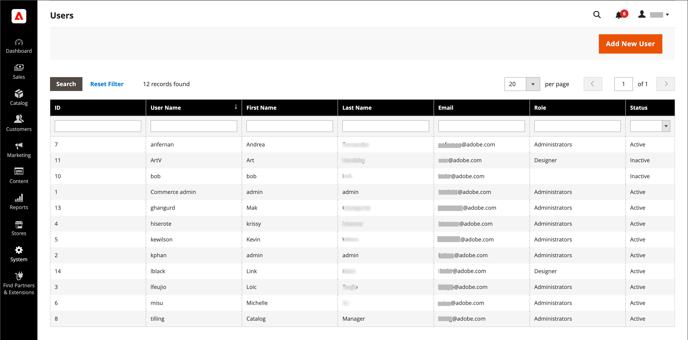

# Admin permissions

Adobe Commerce and Magento Open Source use roles and permissions to create different levels of access to the Admin. When your store is first set up, you receive a set of login credentials for the Administrator role that has full permissions. However, you can restrict the level of permissions on a "need to know" basis for other people who work on your site. For example, a member of design team can be given access to only the content design tools, but not to areas with customer and order information.

In addition, you can further restrict Admin access to only a specific site, or set of sites and their associated data. If you have multiple brands or business units with separate stores on the same Commerce installation, you can provide Admin access to each business unit but hide and protect their data from other Admin users.

When an Admin user's access is restricted to a specific website or store, those where they are not authorized are either not visible or appear grayed out. Only the sales and other data for permitted websites and stores is displayed for the user.

-  (Adobe Commerce only) By default, the system automatically logs (records) all actions performed by a user when they apply changes to a store. Admin actions can be reviewed in the [Action Logs Report](action-log-report.md). Configure logging in [Admin Actions Logging](action-log.md) in your store's advanced admin settings.

<!-- zoom -->
