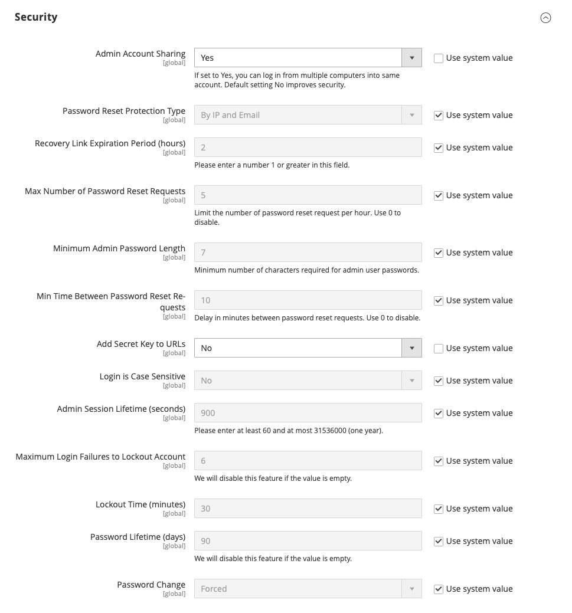

# Configure Admin security

We recommend that you take a multifaceted approach to protect the security of your store. You can begin by using a [custom Admin URL](../stores-purchase/store-urls.md#use-a-custom-admin-url) that is not easy to guess, rather than the obvious "Admin" or "Backend." By default, passwords that are used to [log in](../getting-started/admin-signin.md) to the Admin must be seven or more characters long and include both letters and numbers. You can configure the minimum password length requirement to enhance security based on your organization's needs. As a [best practice](https://experienceleague.adobe.com/docs/commerce-operations/implementation-playbook/best-practices/launch/security-best-practices.html), use only strong Admin passwords that include a combination of letters, numbers, and symbols. Adobe Commerce and Magento Open Source do not allow the reuse of the last four passwords assigned to the account.

The Admin security configuration gives you the ability to:

- Add a secret key to URLs
- Require passwords to be case-sensitive
- Configure the minimum password length requirement
- Limit the length of Admin sessions
- Limit the lifetime of passwords
- Limit the number of login attempts that can be made before the Admin user account is [locked](permissions-users-all.md#locked-users).

For increased security, you can configure the length of keyboard inactivity before the current session expires, and require the user name and password to be case-sensitive.

In addition to the security settings in this section, [two-factor authentication](security-two-factor-authentication.md) (2FA) is required to verify users' identity with a one-time password that is generated by an app or device. You are prompted to set up 2FA the first time you sign in to the Admin. For additional security, the Admin login can also be configured to require a [CAPTCHA](security-captcha.md).

>[!NOTE]
>
>Stores that have enabled [!DNL Adobe Identity Management Services] (IMS) authentication have native Adobe Commerce and Magento Open Source 2FA disabled. Admin users who are logged into their Commerce instance with their Adobe credentials do not need to reauthenticate for many Admin tasks. Authentication is handled by Adobe IMS when the Admin user logs into their current session. See [[!DNL Adobe Identity Management Service] (IMS) Integration Overview](../getting-started/adobe-ims-integration-overview.md).

For technical information, see [Security overview](https://developer.adobe.com/commerce/php/architecture/basics/security/){:target="_blank"} in the developer documentation.

{width="600" zoomable="yes"}

## Configure Admin security

1. On the _Admin_ sidebar, go to **[!UICONTROL Stores]** > _[!UICONTROL Settings]_ > **[!UICONTROL Configuration]**.

1. In the left panel under _[!UICONTROL Advanced]_, choose **[!UICONTROL Admin]**.

1. Expand  the **[!UICONTROL Security]** section.

1. To prevent Admin users from logging in from the same account on different devices, set **[!UICONTROL Admin Account Sharing]** to `No`.

1. To determine the method that is used to manage password reset requests, set **[!UICONTROL Password Reset Protection Type]** to one of the following:

   - `By IP and Email` — The password can be reset online after a response is received from the notification is sent to the email address associated with the Admin account.
   - `By IP` — The password can be reset online without additional confirmation.
   - `By Email` — The password can be reset only by responding by email to the notification that is sent to the email address associated with the Admin account.
   - `None` — The password can be reset only by the store administrator.

1. Set login security options:

   - For **[!UICONTROL Recovery Link Expiration Period (hours)]**, enter the number of hours a password recovery link remains valid.

   - To determine the maximum number of password requests that can be submitted per hour, enter the number for **[!UICONTROL Max Number of Password Reset Requests]**.

   - For **[!UICONTROL Min Time Between Password Reset Requests]**, enter the minimum number of minutes that must pass between password reset requests.

   - To append a secret key to the Admin URL as a precaution against exploits, set **[!UICONTROL Add Secret Key to URLs]** to `Yes`. This setting is enabled by default.

   - To require that the use of upper- and lowercase characters in any login credentials entered match what is stored in the system, set **[!UICONTROL Login is Case Sensitive]** to `Yes`.

   - To determine the length of an Admin session before it times out, enter the duration of the session in seconds for **[!UICONTROL Admin Session Lifetime (seconds)]** field. The value must be 60 seconds or greater.

   - For **[!UICONTROL Maximum Login Failures to Lockout Account]**, enter the number of times a user can try to log in to the Admin before the account is locked. By default, six attempts are allowed. Leave the field empty for unlimited login attempts.

   - For **[!UICONTROL Lockout Time (minutes)]**, enter the number of minutes that an Admin account is locked when the maximum number of attempts is met.

1. Set password options:

   - For **[!UICONTROL Minimum Admin Password Length]**, enter the minimum number of characters required for Admin passwords. The default value is 7, and the minimum allowed value is 7.

     >[!WARNING]
     >
     >Changing this value from the default can introduce backward compatibility issues with existing services. This setting affects Admin password changes, new Admin user creation from both the Admin interface and CLI, and password reset operations from the Admin.

   - To limit the lifetime of Admin passwords, enter the number of days a password is valid for **[!UICONTROL Password Lifetime (days)]**. For an unlimited lifetime, leave the field blank.

   - Set **[!UICONTROL Password Change]** to one of the following:

     - `Forced` — Requires that Admin users change their passwords after the account setup.
     - `Recommended` — Recommends that Admin users change their passwords after the account setup.

1. When complete, click **[!UICONTROL Save Config]**.

## Admin password requirements

By default, an Admin password must be seven or more characters long and include both letters and numbers. You can use the **[!UICONTROL Minimum Admin Password Length]** setting to configure the minimum password length requirement to meet your organization's security standards. However, increasing this value may affect compatibility with existing services and integrations.
