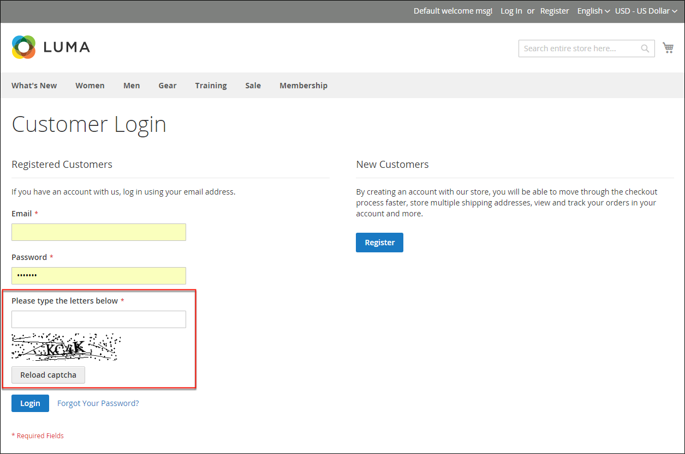
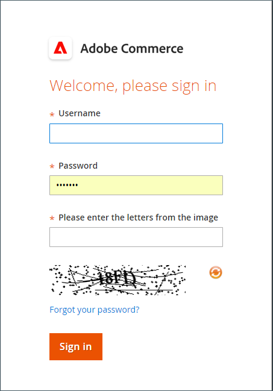
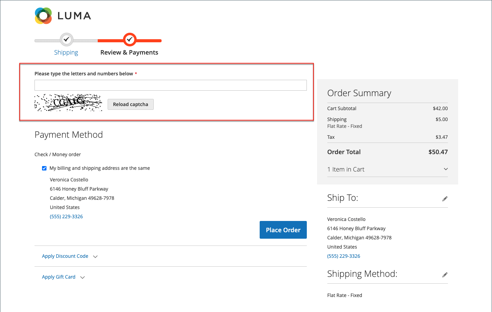

# CAPTCHA

A CAPTCHA is a visual device that ensures that a human being, rather than a computer (or "bot"), is interacting with the site. CAPTCHA is an acronym for _Completely Automated Public Turing test to tell Computers and Humans Apart_. It can be used for both Admin access and various storefront actions initiated by registered customers. Adobe Commerce and Magento Open Source support the standard CAPTCHA that is described in this topic and [Google reCAPTCHA](security-google-recaptcha.md).

You can reload the CAPTCHA as many times as is necessary by clicking the Reload icon in the upper-right corner of the image. The CAPTCHA is fully configurable and can be set appear every time, or only after a defined number of failed login attempts.

{width="700" zoomable="yes"}

## Configure CAPTCHA for the Admin

For an extra level of security, you can add a CAPTCHA to the Admin Sign In and Forgot Password page. Admin users can reload the displayed CAPTCHA by clicking the _Reload_  icon in the upper-right corner of the image. The number of reloads is unlimited.

{width="300"}

1. On the _Admin_ sidebar, go to **[!UICONTROL Stores]** > _[!UICONTROL Settings]_ > **[!UICONTROL Configuration]**.

1. In the left panel, expand **[!UICONTROL Advanced]** and choose **[!UICONTROL Admin]**.

1. In the upper-right corner, set **[!UICONTROL Store View]** to `Default`.

   If the [scope](../getting-started/websites-stores-views.md#scope-settings) of your Commerce installation includes multiple websites, choose the websites where you want the CAPTCHA configuration to apply.

1. Expand  the **[!UICONTROL CAPTCHA]** section.

1. Set **[!UICONTROL Enable CAPTCHA in Admin]** to `Yes`. Then complete the remaining options as follows:

    {width="600" zoomable="yes"}

   - Enter the name of the **[!UICONTROL Font]** to be used for CAPTCHA symbols (default: `LinLibertine`).

      To add your own font, the font file must reside in the same directory as your Commerce installation and must be declared in the `config.xml` file of the Captcha module at `app/code/Magento/Captcha/etc`.

   - Select any of the following **[!UICONTROL Forms]** where the CAPTCHA is to be used. To choose multiple forms, hold down the Ctrl key (PC) or Command key (Mac).

      - `Admin Login`
      - `Admin Forgot Password`

   - Set **[!UICONTROL Displaying Modes]** to one of the following:

      - `Always` — CAPTCHA is always required to log in to the Admin.
      - `After number of attempts to login` — This option applies only to the Admin Login form. When selected, the _[!UICONTROL Number of Unsuccessful Attempts to Login]_ field appears. Enter the number of login attempts that you want to allow. A value of 0 (zero) is similar to setting Displaying Mode to `Always`.

      To track the number of unsuccessful login attempts, each attempt to log in under one email address and from one IP-address is counted. The maximum number of login attempts allowed from the same IP-address is 1,000. This limitation applies only when CAPTCHA is enabled.

   - For **[!UICONTROL Number of Unsuccessful Attempts to Login]**, enter the number of times the administrator can try to log in before the CAPTCHA appears. If set to zero (`0`), CAPTCHA is always required.

   - For **[!UICONTROL CAPTCHA Timeout (minutes)]**, enter the number of minutes before the CAPTCHA expires. When the CAPTCHA expires, the administrator must reload the page.

   - Enter the **[!UICONTROL Number of Symbols]** to appear in the CAPTCHA. Up to eight (`8`) symbols can be used. For a variable number of symbols that changes with each CAPTCHA, enter a range (such as `5-8`).

   - For **[!UICONTROL Symbols Used in CAPTCHA]**, enter the letters (a-z and A-Z) and numbers (0-9) that you want to appear randomly in the CAPTCHA. Symbols that are hard to distinguish from other symbols, such as `i`, `l`, or `1`, are not included in the default set of CAPTCHA symbols.

   - Set **[!UICONTROL Case Sensitive]** to `Yes` if you want to require administrators to enter the characters in upper or lowercase exactly as shown in the CAPTCHA.

1. When complete, click **[!UICONTROL Save Config]**.

## Configure CAPTCHA for the storefront

Customers can be required to enter a CAPTCHA each time they log in to their accounts, or after several unsuccessful attempts to log in. In addition, numerous forms used throughout the storefront can be configured to require verification by CAPTCHA.

{width="700" zoomable="yes"}

1. On the _Admin_ sidebar, go to **[!UICONTROL Stores]** > _[!UICONTROL Settings]_ > **[!UICONTROL Configuration]**.

1. In the left panel, expand **[!UICONTROL Customers]** and choose **[!UICONTROL Customer Configuration]**.

1. Expand  the **[!UICONTROL CAPTCHA]** section.

{width="600" zoomable="yes"}

1. Set **[!UICONTROL Enable CAPTCHA on Storefront]** to `Yes`. Then complete the remaining options as follows:

   - Enter the name of the **[!UICONTROL Font]** to be used for the CAPTCHA symbols (default: `LinLibertine`).

      To add your own font, the font file must reside in the same directory as your Commerce installation and must be declared in the `config.xml` file of the CAPTCHA module.

   - Select any of the following **[!UICONTROL Forms]** where the CAPTCHA is to be used. To choose multiple forms, hold down the Ctrl key (PC) or Command key (Mac).

      - `Applying coupon code`
      - `Checkout/Placing Order`
      - `Create user`
      - `Login`
      - `Forgot password`
      - `Contact Us`
      - `Change password`
      - `Share Wishlist Form`
      - `Payflow Pro` (see [security patch](https://experienceleague.adobe.com/docs/commerce-knowledge-base/kb/troubleshooting/payments/paypal-payflow-pro-active-carding-activity.html) _Knowledge Base_ article)
      - `Send to Friend Form`  (Magento Open Source only)
      - `Add Gift Card Code`  (Adobe Commerce only)
      - `Create company`  (Available with Adobe Commerce B2B only)

   - Set **[!UICONTROL Displaying Mode]** to one of the following:

      - `Always` — CAPTCHA is always required to access the selected forms.
      - `After number of attempts to login` — Enter the number of login attempts before the CAPTCHA appears. A value of 0 (zero) is similar to "Always." When selected, the number of unsuccessful login attempts appears. This option does not apply to the Forgot Password form, which if enabled, always display the CAPTCHA.

   - For **[!UICONTROL Number of Unsuccessful Attempts to Login]**, enter the number of times a customer can log in unsuccessfully before the CAPTCHA appears. If set to zero (`0`), CAPTCHA is always used.

   - For **[!UICONTROL CAPTCHA Timeout (minutes)]**, enter the number of minutes before the CAPTCHA expires. When the CAPTCHA expires, the customer must reload the page to generate a new CAPTCHA.

   - Enter the **[!UICONTROL Number of Symbols]** to appear in the CAPTCHA. Up to eight (`8`) symbols can be used. For a variable number of symbols that changes with each CAPTCHA, enter a range (such as `5-8`).

   - For **[!UICONTROL Symbols Used in CAPTCHA]**, enter the letters (a-z and A-Z) and numbers (0-9) that you want to appear randomly in the CAPTCHA. The default set of characters does not include similar symbols such as `I` or `1`. For best results, use symbols that users can readily identify.

   - Set **[!UICONTROL Case Sensitive]** to `Yes` if you want to require customers to enter the characters in upper- or lowercase exactly as shown in the CAPTCHA.

1. When complete, click **[!UICONTROL Save Config]**.
