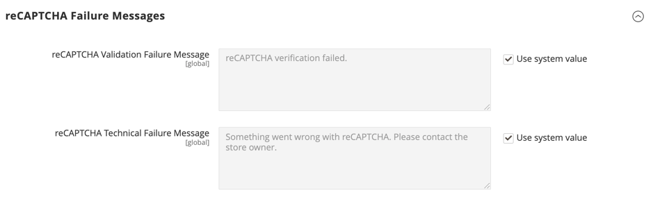

# Google reCAPTCHA

[Google reCAPTCHA](https://developers.google.com/recaptcha) ensures that a human being, rather than a computer (or "bot"), is interacting with your website. Unlike the standard Adobe Commerce and Magento Open Source [CAPTCHA](security-captcha.md), Google reCAPTCHA provides enhanced security with a selection of different display options and methods. Additional website traffic information is available in the dashboard of your Google reCAPTCHA account.

Google reCAPTCHA is configured separately for the Admin and storefront.

- For the Admin, Google reCAPTCHA can be used on the [Sign In](../getting-started/admin-signin.md) page and when a user requests a password reset. If the standard Commerce [CAPTCHA](security-captcha.md) is also enabled, Google reCAPTCHA can be used at the same time without any problem.

- For the storefront, Google reCAPTCHA can be used to sign in to a [customer account](../customers/customer-sign-in.md), send a message from the [Contact Us](../getting-started/store-details.md#contact-us-form) page, and in numerous other storefront locations.

   {width="700" zoomable="yes"}

Google reCAPTCHA can be implemented in several ways:

- _reCAPTCHA v3 Invisible_ — Uses an algorithm to rate user interactions and determines the likelihood that the user is human based on a score.

- _reCAPTCHA v2 Invisible_ — Performs background verification without user interaction. Users and customers are automatically verified, but might be required to select specific images to complete a challenge.

- _reCAPTCHA v2 ("I am not a robot")_ — Validates requests with the _"I'm not a robot"_ checkbox.

>[!IMPORTANT]
>
>Before Google reCAPTCHA can be configured, ensure that your `PHP.ini` file includes the following setting: `allow_url_fopen = 1`. This may require developer assistance. See [Required PHP Settings](https://experienceleague.adobe.com/docs/commerce-operations/installation-guide/prerequisites/php-settings.html){:target="_blank"} in the Installation Guide.

## Step 1: Generate Google reCAPTCHA keys

Google reCAPTCHA requires a pair of API keys to enable. You can get these keys free of charge through the reCAPTCHA site. Before generating the keys, you must know the type of reCAPTCHA that you want to use.

1. Open the Google reCAPTCHA page and log in to your account.

1. For **[!UICONTROL Label]**, enter a name to identify the keys for internal reference.

   You need one set of keys for each reCAPTCHA type that is used in your Adobe Commerce or Magento Open Source installation. For example: `Commerce Invisible`

1. For **[!UICONTROL reCAPTCHA type]**, choose the method that you want to use.

   - _reCAPTCHA v3 Invisible_
   - _reCAPTCHA v2 Invisible_
   - _reCAPTCHA v2 ("I am not a robot")_

1. For **[!UICONTROL Domain]**, enter your store's domain. For example: mystore.com

   If you have multiple stores with different domains, enter each domain on a separate line.

   - Add your store domain and any subdomains.
   - You can add `localhost`, other local VM domains, and staging domains as needed for testing.

1. Select the checkbox to **[!UICONTROL Accept the reCAPTCHA Terms of Service]**.

1. (Optional) Select the **[!UICONTROL Send alerts to owners]** checkbox to send notification if Google detects issues or suspicious traffic.

1. Click **[!UICONTROL Submit]** to complete registration and receive keys.

   >[!IMPORTANT]
   >
   >Not all keys are applicable for all types of reCAPTCHA, and misapplying them could lead to unexpected behavior. For example, Google reCAPTCHA keys generated for reCAPTCHA v2 "I'm not a robot" do not work with _reCAPTCHA v2 Invisible_ and could block functionality where reCAPTCHA is enabled.

## Step 2: Configure Google reCAPTCHA for the Admin

1. Sign in to your Admin account.

1. On the Admin sidebar, go to **[!UICONTROL Stores]** > _[!UICONTROL Settings]_ > **[!UICONTROL Configuration]**.

1. In the upper-right corner, set **[!UICONTROL Store View]** to `Default Config`.

1. In the left panel, expand **[!UICONTROL Security]** and click **[!UICONTROL Google reCAPTCHA Admin Panel]**.

   >[!NOTE]
   >
   >Clear the **[!UICONTROL Use system value]** checkbox for each field that you want to configure.

1. To use _[!DNL reCAPTCHA v2 ("I am not a robot")]_, expand the **[!UICONTROL reCAPTCHA v2 ("I am not a robot")]** section and do the following:

   - For **[!UICONTROL Google API Website Key]**, enter the website key that was created for this reCAPTCHA type when you registered your Google reCAPTCHA account.

   - For **[!UICONTROL Google API Secret Key]**, enter the secret key that is associated with your Google reCAPTCHA account.

   - For **[!UICONTROL Size]**, choose the size of the Google reCAPTCHA box that you want to appear. Options: `Normal (default)` / `Compact`

   - For **[!UICONTROL Theme]**, choose the theme that you want to use to style the Google reCAPTCHA box. Options: `Light Theme (default)` / `Dark Theme`

   - For **[!UICONTROL Language Code]**, enter the two-character code to specify the [language that is used for Google reCAPTCHA text and messaging](https://developers.google.com/recaptcha/docs/language).

   {width="600" zoomable="yes"}

1. To use _[!DNL reCAPTCHA v2 Invisible]_, expand the **[!UICONTROL reCAPTCHA v2 Invisible]** section and do the following:

   - For **[!UICONTROL Google API Website Key]**, enter the website key that was created for this reCAPTCHA type when you registered your Google reCAPTCHA account.

   - For **[!UICONTROL Google API Secret Key]**, enter the secret key that is associated with your Google reCAPTCHA account.

   - For **[!UICONTROL Invisible Badge Position]**, choose the badge position to be used on each page. Options: `Inline` / `Bottom Right` / `Bottom Left`

   - For **[!UICONTROL Theme]**, choose the theme to be used to style the Google reCAPTCHA box. Options: `Light Theme (default)` / `Dark Theme`

   - For **[!UICONTROL Language Code]**, enter a two-character code that specifies the [language that is used for Google reCAPTCHA text and messaging](https://developers.google.com/recaptcha/docs/language).

   {width="600" zoomable="yes"}

1. To use _[!DNL reCAPTCHA v3 Invisible]_, expand the **[!UICONTROL reCAPTCHA v3 Invisible]** section and do the following:

   - For **[!UICONTROL Google API Website Key]**, enter the website key that was created for this reCAPTCHA type when you registered your Google reCAPTCHA account.

   - For **[!UICONTROL Google API Secret Key]**, enter the secret key that is associated with your Google reCAPTCHA account.

   - Enter the **[!UICONTROL Minimum Score Threshold]** to identify when a user interaction is flagged as a potential risk; where 1.0 is a typical user interaction, and 0.0 is likely a bot. Default: `0.5`

   - For **[!UICONTROL Invisible Badge Position]**, choose the position to be used on each page. Options: `Inline` / `Bottom Right` / `Bottom Left`

   - For **[!UICONTROL Theme]**, choose the theme to be used to style the Google reCAPTCHA box. Options: `Light Theme (default)` / `Dark Theme`

   - For **[!UICONTROL Language Code]**, enter a two-character code that specifies the [language that is used for Google reCAPTCHA text and messaging](https://developers.google.com/recaptcha/docs/language).

   {width="600" zoomable="yes"}

1. Expand **[!UICONTROL reCAPTCHA Validation Failure Messages]** and enter the messages that appear in the Admin if validation fails or is unable cannot be completed.

   {width="600" zoomable="yes"}

1. Expand the **[!UICONTROL Admin Panel]** section and configure the following as needed:

   - Set **[!UICONTROL Enable for Login]** to the reCAPTCHA type that you want to use for the Admin Sign In page.

   - Set **[!UICONTROL Enable for Forgot Password]** to the reCAPTCHA type that you want to use for password reset requests.

   {width="600" zoomable="yes"}

## Step 3: Configure Google reCAPTCHA for the storefront

1. In the left panel under _[!UICONTROL Security]_, choose **[!UICONTROL Google reCAPTCHA Storefront]**.

1. Complete the section for each reCAPTCHA type that you want to use in the storefront.

   See the information in _Step 2: Configure Google reCAPTCHA for the Admin_ for details about the options for each reCAPTCHA type.

1. Expand **[!UICONTROL reCAPTCHA Validation Failure Messages]** and enter the messages that appear in the storefront if validation fails or is unable cannot be completed.

1. Expand the **[!UICONTROL Storefront]** section.

   >[!NOTE]
   >
   >Clear the **[!UICONTROL Use system value]** checkbox for each field that you want to configure.

1. Set each storefront location field to the type of reCAPTCHA that you have configured to use.

   - [!UICONTROL Enable for Customer Login]
   - [!UICONTROL Enable for Forgot Password]
   - [!UICONTROL Enable for Create New Customer Account]
   - [!UICONTROL Enable for Edit Customer Account]
   - [!UICONTROL Enable for Create New Company Account]  (Available with B2B for Adobe Commerce only)
   - [!UICONTROL Enable for Contact Us]
   - [!UICONTROL Enable for Product Review]
   - [!UICONTROL Enable for Newsletter Subscription]
   - [!UICONTROL Enable for Gift Card]  (Adobe Commerce only)
   - [!UICONTROL Enable for Invitation Create Account]
   - [!UICONTROL Enable for Send To Friend]
   - [!UICONTROL Enable for Checkout/Placing Order]
   - [!UICONTROL Enable for Wishlist Sharing]
   - [!UICONTROL Enable for Coupon Codes]
   - [!UICONTROL Enable for PayPal PayflowPro payment form]

   {width="600" zoomable="yes"}

## Step 4: Save the configuration

1. When configuration settings are complete, click **[!UICONTROL Save Config]**.

1. In the message at the top of the workspace, click **[!UICONTROL Cache Management]** and refresh each invalid cache.
