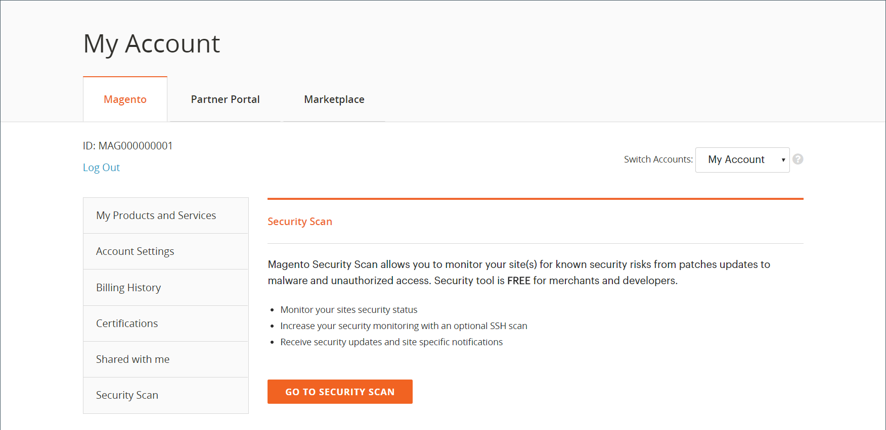
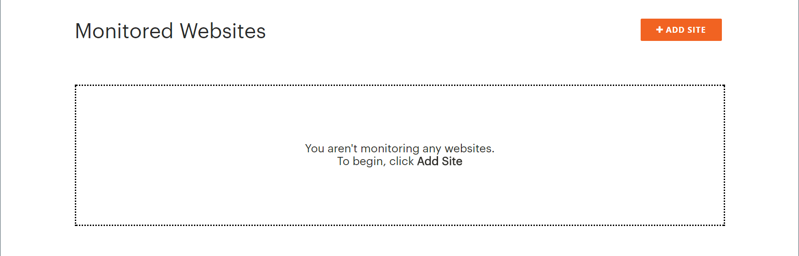
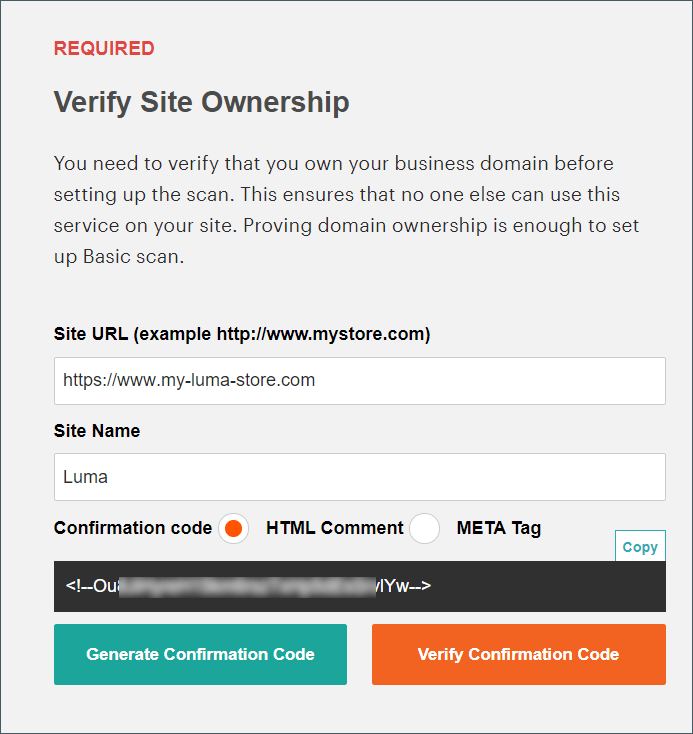
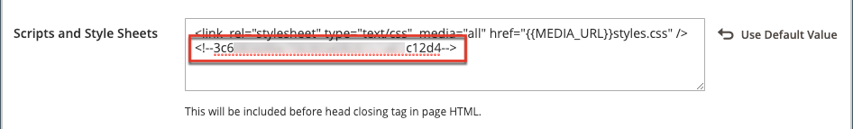
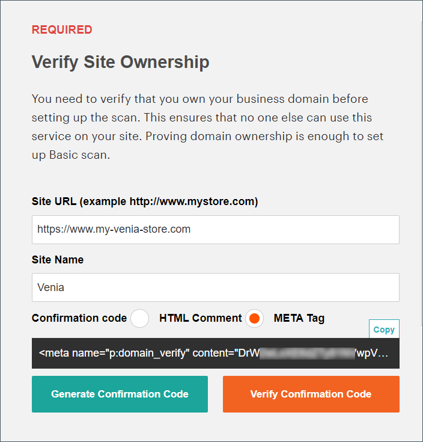
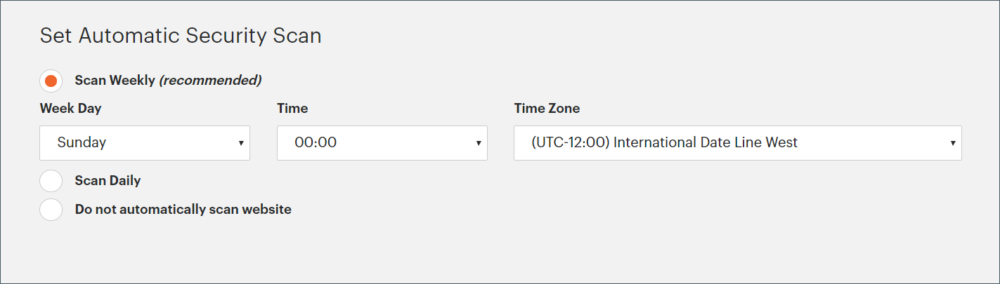
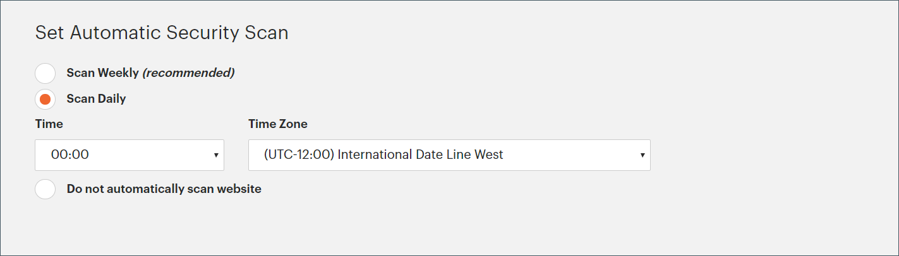
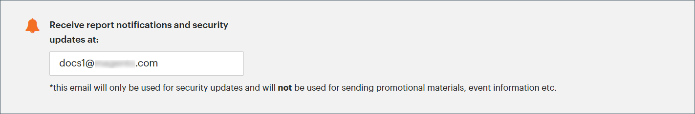

# Security scan

Monitor your Adobe Commerce and Magento Open Source sites for security risks and malware, and receive security updates and notifications.

- Gain insight into the real-time security status of your store.
- Receive suggestions based on best practices to help resolve issues.
- Schedule a security scan to run weekly, daily, or on demand.
- Run over 21,000 security tests to help identify potential malware.
- Access historical security reports that track and monitor the progress of your sites.
- Access the scan report that shows successful and failed checks, with any recommended actions.

The Security Scan Tool is available for free from the dashboard of your [Commerce/Magento account](../getting-started/commerce-account-create.md). For technical information, see [Setup the Security Scan Tool](https://experienceleague.adobe.com/en/docs/commerce-on-cloud/user-guide/launch/overview#set-up-the-security-scan-tool) in the _Commerce on Cloud Infrastructure Guide_.

{width="600" zoomable="yes"}

## Run a security scan

1. From the Commerce home page, sign in to your [Commerce/Magento account](../getting-started/commerce-account-create.md).

1. Review and accept the terms for using the Security Scan Tool.

   1. In the left panel, choose **[!UICONTROL Security Scan]**.
   1. Click **[!UICONTROL Go to Security Scan]**.
   1. Read the **[!UICONTROL Terms and Conditions]**.
   1. Click **[!UICONTROL Agree]** to continue.

1. On the _[!UICONTROL Monitored Websites]_ page, click **[!UICONTROL +Add Site]**.

   If you have multiple sites with different domains, configure a separate scan for each domain.

   {width="600" zoomable="yes"}

1. To verify your ownership of the site domain by adding a confirmation code, do one of the following:

   **Commerce storefront**:

   1. Enter the **[!UICONTROL Site URL]** and **[!UICONTROL Site Name]**.
   1. Click **[!UICONTROL Generate Confirmation Code]**.
   1. Click **Copy** to copy your confirmation code to the clipboard.

      {width="400" zoomable="yes"}

   1. Log in to the Admin of your store as a user with full administrator privileges and do the following:

      1. In the _Admin_ sidebar, go to **[!UICONTROL Content]** > _[!UICONTROL Design]_ > **[!UICONTROL Configuration]**.
      1. Find your site in the list, and click **[!UICONTROL Edit]**.
      1. Expand  the **[!UICONTROL HTML Head]** section.
      1. Scroll down to **[!UICONTROL Scripts and Style Sheets]** and click in the text box at the end of any existing code. Paste the confirmation code into the text box.

         {width="600" zoomable="yes"}

      1. When complete, click **[!UICONTROL Save Configuration]**.

   **PWA storefront**:

   1. Enter the **[!UICONTROL Site URL]** and **[!UICONTROL Site Name]**.

   1. For **[!UICONTROL Confirmation Code]**, choose the `META Tag` option and then click **[!UICONTROL Generate Code]**.

   1. Click **[!UICONTROL Copy]** to copy the generated confirmation code META Tag to the clipboard.

      {width="400" zoomable="yes"}

   1. Go to the PWA Studio storefront project directory and do the following:

      1. Under the PWA Studio project directory, go to `packages > venia-concept > template.html`.
      1. Add the copied confirmation code (the generated META Tag) to the HTML head and save the changes.

         {width="600" zoomable="yes"}

      1. Go back to the PWA Studio CLI, and use yarn to install project dependencies and run the project build command.

         ```sh
         yarn install &&
         yarn build
         ```

      1. *In your Cloud project*, create a `pwa` folder and copy the content inside your storefront project's `dist` folder.

         ```sh
         mkdir pwa && cp -r <path to your storefront project>/dist/* pwa
         ```

      1. Use the Git CLI tool to stage, commit, and push these changes to your Cloud project.

         ```sh
         git add . &&
         git commit -m "Added storefront file bundles" &&
         git push origin
         ```

         After the build process completes, the changes will be deployed to your PWA store front.

1. Return to the _[!UICONTROL Security Scan]_ page in your Commerce account, and click **[!UICONTROL Verify Confirmation Code]** to establish ownership of the domain.

1. After a successful confirmation, configure the **[!UICONTROL Set Automatic Security Scan]** options for one of the following types:

   **Scan Weekly (recommended)**:

   Choose the **[!UICONTROL Week Day]**, **[!UICONTROL Time]**, and **[!UICONTROL Time Zone]** that the scan is to take place each week.
   
   By default, the scan is scheduled to begin each week at midnight Saturday, UTC, and continue through early Sunday.

   {width="500" zoomable="yes"}

   **Scan Daily**:

   Choose the **[!UICONTROL Time]**, and **[!UICONTROL Time Zone]** that the scan is to take place each day.
   
   By default, the scan is scheduled to begin each day at midnight, UTC.

   {width="500" zoomable="yes"}

1. Enter the **[!UICONTROL Email Address]** where you want to receive notifications of completed scans and security updates.

    {width="400" zoomable="yes"}

1. When complete, click **[!UICONTROL Submit]**.

    After the ownership of the domain is verified, the site appears in the Monitored Websites list of your Commerce account.

1. If you have multiple websites with different domains, repeat this process to set up a security scan for each.

## Manage scan results

The Security Scan Tool allows you to manage scan results directly from the report view. You can mark specific scan failures as false positives and exclude them from your risk score.

### Benefits of managing scan results

Managing scan results helps you maintain a more accurate security overview of your store by:

- Reducing false positives in your security reports
- Focusing attention on actual security issues that need attention
- Maintaining a clearer view of your store's true security status
- Eliminating the need to contact support for known false positives
- Saving time by self-managing scan results that you've already investigated

Common scenarios where you might want to mark a scan failure as a false positive include:

- When you've already applied a security patch that the scan tool hasn't detected.
- When a detected issue is not applicable to your specific store configuration.
- When you've implemented an alternative security measure that addresses the concern.
- When the scan result is based on a configuration that you've intentionally set for your business needs.

### Mark scan failures as false positives

1. From the _[!UICONTROL Monitored Websites]_ page, click **[!UICONTROL View Report]** for the site you want to manage.

1. In the report view, locate the failed scan you want to mark as a false positive.

1. Click **[!UICONTROL Ignore]** for the specific scan failure.

1. Click **[!UICONTROL Apply Changes]** to save your selection.

The ignored scan failure moves to the _[!UICONTROL Ignored Results]_ section and is excluded from your risk score.

### Unignore scan failures

1. In the report view, scroll to the _[!UICONTROL Ignored Results]_ section.

1. Click **[!UICONTROL Stop Ignoring]** for the scan failure you want to restore.

1. Click **[!UICONTROL Apply Changes]** to save your selection.

The scan failure moves back to the _[!UICONTROL Failed Scans]_ section and is included in your risk score.

### View ignored results

- Ignored results appear in a separate section of the report.
- The risk score is automatically updated to reflect only active scan failures.
- You can manage multiple scan failures at once by selecting multiple items before applying changes.
