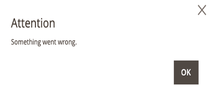

# Session management

[Session management](https://cheatsheetseries.owasp.org/cheatsheets/Session_Management_Cheat_Sheet.html) is as anti-denial of service (DoS) best practice for API security. A session represents the amount of time a visitor spends on your site and is not related to how long Admin users or customers are logged in to their accounts.

A session is a sequence of network HTTP request and response transactions associated with the same user. It is a way to associate a client (Admin) with their data when they access the server. Sessions provide the ability to establish variables, such as access rights and localization settings, which apply to every interaction a user has with a web application for the duration of the session.

## Session size

Use the following configuration settings to limit the maximum session size for Admin users and storefront visitors:

- **Max Session Size in Admin**—Limit the maximum sessions size in bytes. Use `0` to disable.
- **Max Session Size in Storefront**—Limit the maximum sessions size in bytes. Use `0` to disable.

>[!TIP]
>
>Both settings are measured in bytes and default to `256000` bytes (or 256KB).

**_To configure maximum session size:_**

1. On the _Admin_ sidebar, go to **Store**  > _Settings_ > **Configuration**.

1. In the left panel, expand **Advanced** and choose **System**.

1. Expand  the **Security** section to access the session settings.

   <!-- zoom -->

1. Enter new session size(s) in bytes.

   >[!WARNING]
   >
   >Setting the value too low can cause issues. If you set either of the options below the 256000 byte default, you will see a warning message. If you click **No**, the system changes the value to `256000`.

1. Click **Save Config**.

### Admin sessions

If you exceed the maximum session size, an error displays and the system logs the session size constraint to the `var/log` directory.



If you lose access to the Admin after setting the session size too low, use the CLI to reset the configuration:

```bash
bin/magento config:set system/security/max_session_size_admin 256000
```

### Storefront sessions

If you exceed the maximum session size, no error displays but the system logs the session size constraint to the `var/log` directory.

## Session validation

Adobe Commerce and Magento Open Source allow you to validate session variables as a protective measure against possible session fixation attacks or attempts to poison or hijack user sessions. The Session Validation Settings determine how session variables are validated during each store visit and if the session ID is included in the URL of the store.

For technical information, see [Use Redis for session storage](https://experienceleague.adobe.com/docs/commerce-operations/configuration-guide/cache/redis/redis-session.html){:target="_blank"} in the _Configuration Guide_.


The validation checks to see that visitors are who they say they are by comparing the value in the validation variables against the session data that is already stored in `$_SESSION` data for the user. Validation fails if the information is not transmitted as expected, and the corresponding variable is empty. Depending on the session validation settings, if a session variable fails the validation process, the client session immediately terminates.

Enabling all of the validation variables can help prevent attacks, but might also impact the performance of the server. By default, all session variable validation is disabled. We recommend that you experiment with the settings to find the best combination for your Adobe Commerce or Magento Open Source installation. Activating all of the validation variables might prove to be unduly restrictive, and could prevent access to customers who have Internet connections that pass through a proxy server or originate from behind a firewall. To learn more about session variables and their use, see the system administration documentation for your Linux system.

**_To configure the session validation:_**

1. On the _Admin_ sidebar, go to  **Stores** > _Settings_ > **Configuration**.

1. In the left panel, expand _General_ and choose **Web**.

1. Expand  the **Session Validation Settings** section.

1. Set each of the configuration options:

    - **Validate REMOTE_ADDR** — Set to `Yes` to verify that the IP address of a request matches what is stored in the `$_SESSION` variable.

    - **Validate HTTP_VIA** — Set to `Yes` to verify that the proxy address of an incoming request matches what is stored in the `$_SESSION` variable.

    - **Validate HTTP_X_FORWARDED_FOR** — Set to `Yes` to verify that the forwarded-for address of a request matches what is stored in the `$_SESSION` variable.

    - **Validate HTTP_USER_AGENT** — Set to `Yes` to verify that the browser or device that is used to access the store during a session matches what is stored in the `$_SESSION` variable.

1. When complete, click **Save Config**.

## Admin session lifetime

As a security measure, the _Admin_ is initially set to time out after 900 seconds (fifteen minutes) of keyboard inactivity. You can adjust the lifetime of the session to fit your work style.

**_To adjust Admin session lifetime:_**

1. On the _Admin_ sidebar, go to **Stores** > _Settings_ > **Configuration**.

1. Scroll down and expand **Advanced** in the left side panel.

1. Click **Admin**.

1. Expand  the _Security_ section.

1. For **Admin Session Lifetime (seconds)**, enter the number of seconds that a session remains active before it times out.

   <!-- zoom -->
   
   [_Security_](https://docs.magento.com/user-guide/configuration/advanced/admin.html)

1. When complete, click **Save Config**.
