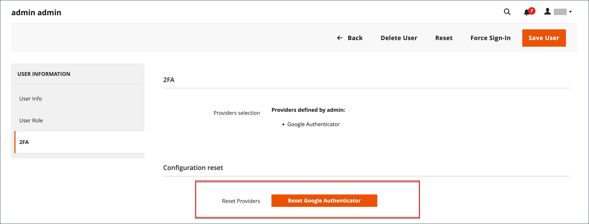

# Manage two-factor authentication

Users who are unable to sign in to the _Admin_ with two-factor authentication (2FA) can try to sync or troubleshoot the problem. You can also reset the authenticators associated with the account. When reset, the user must sign in again and reconfigure the required authenticators.

If you have trouble signing in with 2FA, consider the following:

- Some mobile apps include synchronization options. This option reconnects the app and server, and synchronizes the time settings on the device and server.
- Revoking a device or resetting an authenticator can help users connect.
- Clearing web cache and cookies for the Adobe Commerce or Magento Open Source installation can also help. Authenticators, like Google, use generated cookies to save access and duration. Clear the cookies for your specific browser and store domain.
- Blocking cookies prevents some authenticators, such as [!DNL Google Authenticator], from completing the verification process. Add a rule to your browser that allows cookies for your Adobe Commerce installation.

To reset authenticators from the command line and more advanced troubleshooting information, see [Two-Factor Authentication](https://developer.adobe.com/commerce/testing/functional-testing-framework/two-factor-authentication/) in the developer documentation.

**_To reset authenticators for a user account:_**

>[!NOTE]
>
>To reset 2FA providers for other users, you must be an _administrator_ with `All` permissions, or have `Custom` permissions for your role with [!UICONTROL System] > [!UICONTROL Permissions] > [!UICONTROL Two Factor Auth] and [!UICONTROL System] > [!UICONTROL Permissions] > [!UICONTROL All Users] selected. To learn more, see [User Roles](permissions-user-roles.md).

1. On the _Admin_ sidebar, go to **[!UICONTROL System]** > _[!UICONTROL Permissions]_ > **[!UICONTROL All Users]**.

1. Select the user and open the account in edit mode.

1. Scroll down to the _[!UICONTROL Current User Identity Verification]_ section and enter your password.

1. In the left panel, click **[!UICONTROL 2FA]**.

1. In the _[!UICONTROL Configuration reset]_ section, click **[!UICONTROL Reset]** and **[!UICONTROL OK]** to confirm.

   {width="600" zoomable="yes"}

   If the user wants to restore the required 2FA methods to their account, they must reconfigure each from the _Sign On_ page.

1. When complete, click **[!UICONTROL Save User]**.
