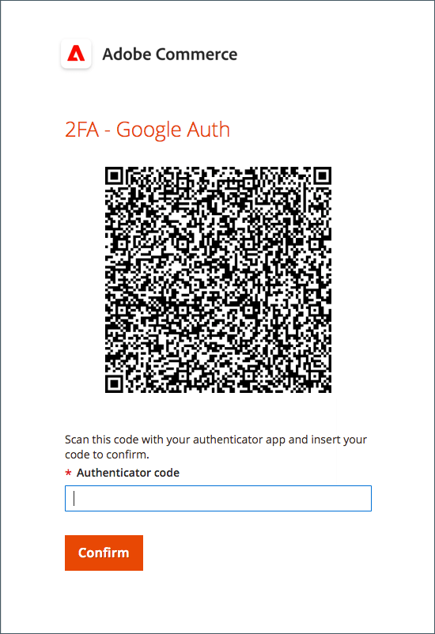
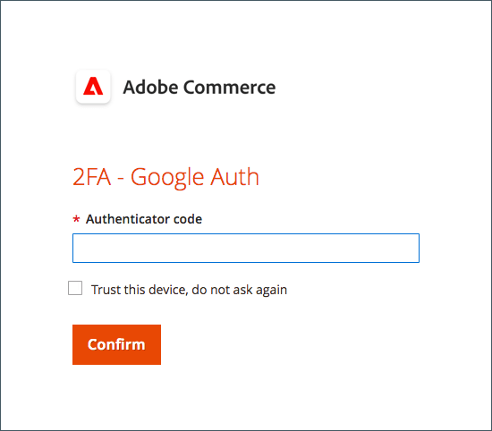
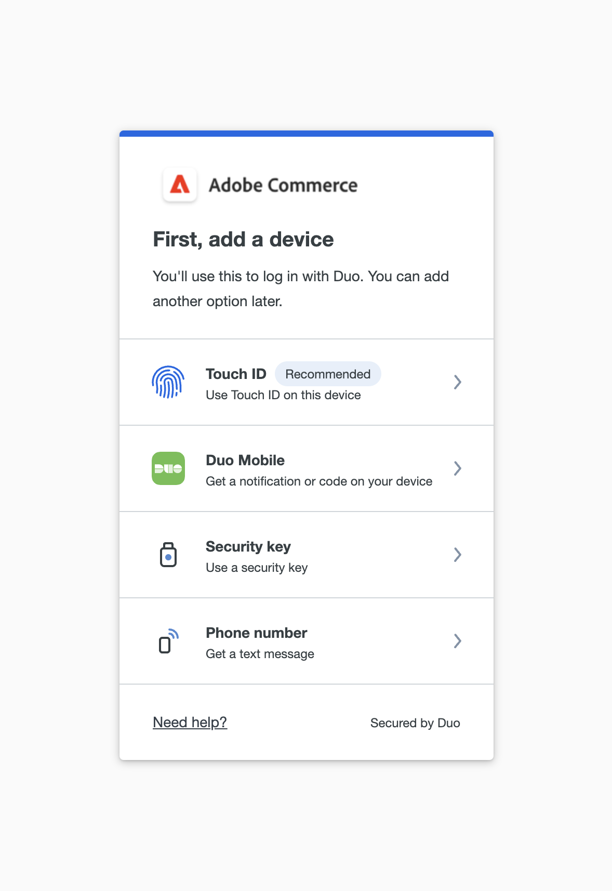
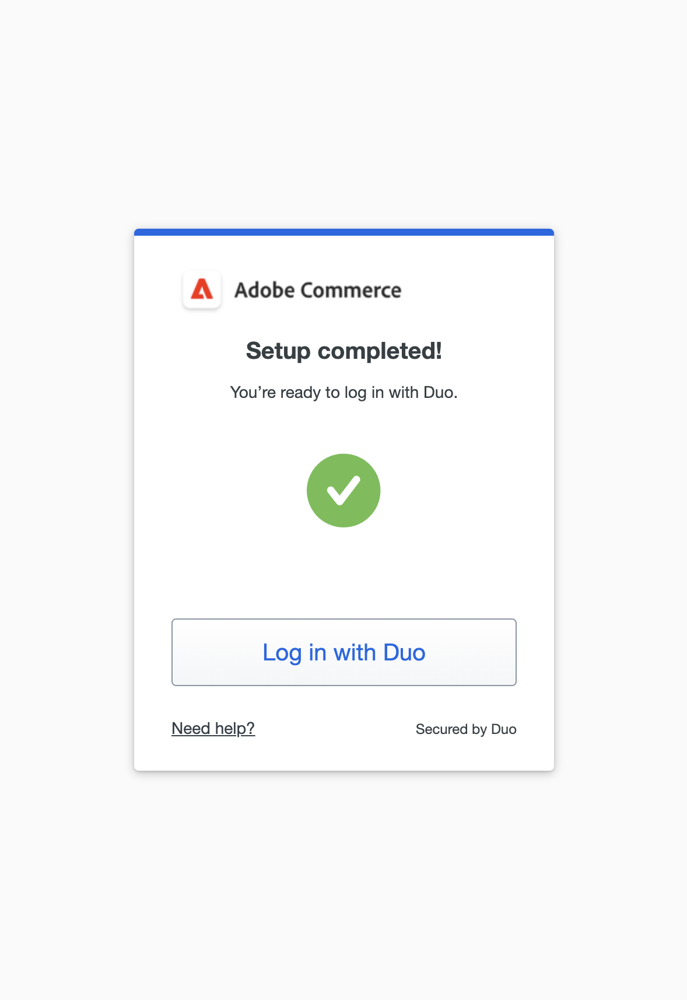
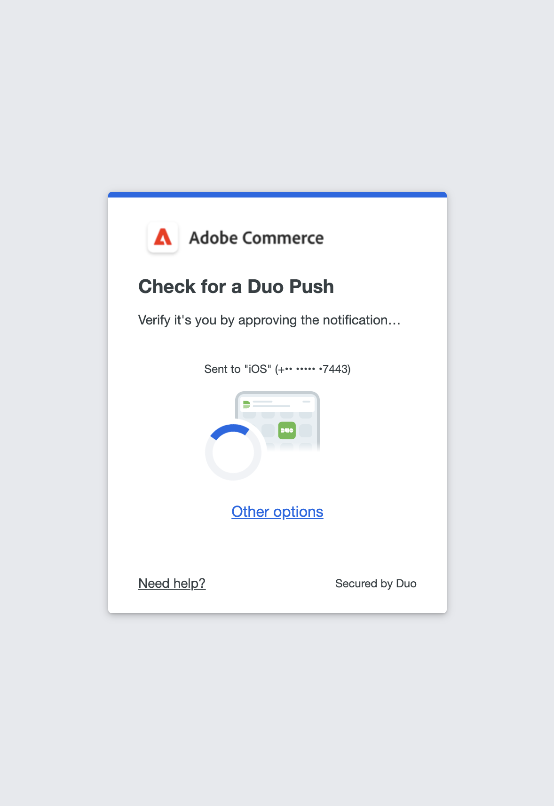
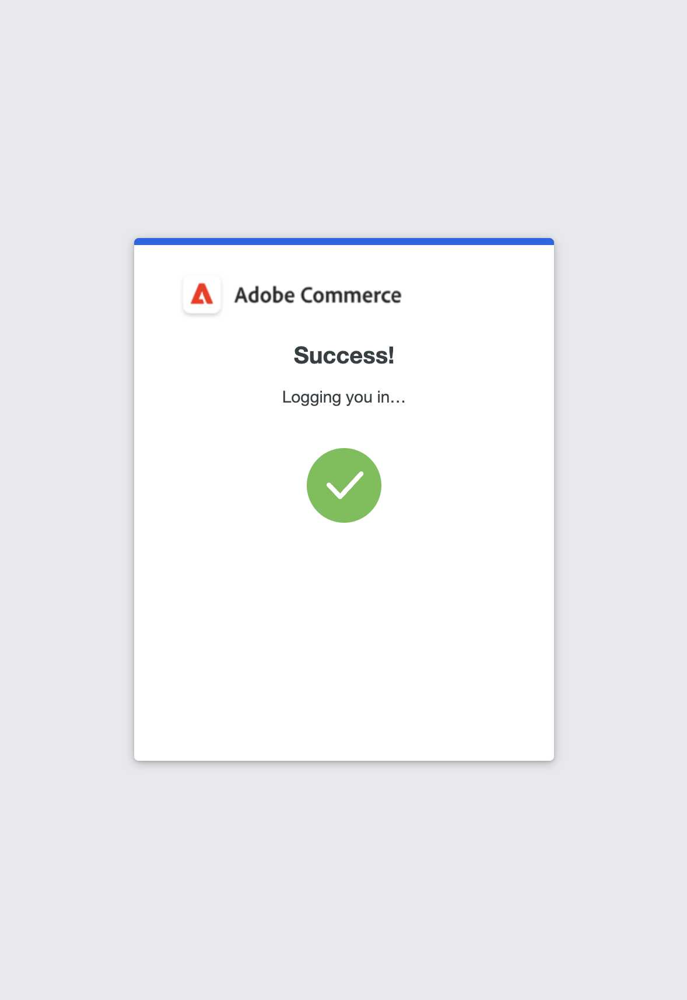
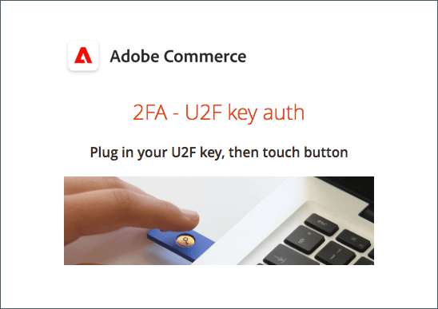

# Two-factor authentication setup for user accounts

These instructions show how to set up two-factor authentication during your initial sign in to Adobe Commerce or Magento Open Source and how to authenticate your identity using the following apps and devices.

For complete instructions, see [Admin Sign In](../getting-started/admin-signin.md).

>[!NOTE]
>
>Stores that have enabled [!DNL Adobe Identity Management Services] (IMS) authentication have native Adobe Commerce and Magento Open Source 2FA disabled. Admin users who are logged into their Commerce instance with their Adobe credentials do not need to reauthenticate for many Admin tasks. Authentication is handled by Adobe IMS when the Admin user logs into their current session. See [[!DNL Adobe Identity Management Service] (IMS) Integration Overview](../getting-started/adobe-ims-integration-overview.md).

## [!DNL Google Authenticator]

### Step 1: Set up [!DNL Google Authenticator]

1. Enter your account credentials and sign in to the _Admin_. A new authenticator screen appears with a QR code.

1. Open the **[!UICONTROL Google Authenticator]** app on your mobile device.

1. Click the plus sign ( **+** ) to add an entry and line up the red box with the QR code to scan with the camera on your smart phone.

1. When your phone recognizes the QR code and adds an entry, enter that 6-digit code in the _Admin_ **[!UICONTROL Authenticator code]** field.

1. When complete, click **[!UICONTROL Confirm]**.

   {width="300"}

### Step 2: Sign in with [!DNL Google Authenticator]

1. Enter your account credentials and sign in to the Commerce _Admin_.

   {width="300"}

1. Open [!DNL Google Authenticator] on your mobile device.

1. When prompted, enter the six-digit authentication code.

1. To save the authentication for future logins, select the **[!UICONTROL Trust this device, do not ask again]** checkbox.

1. When complete, click **[!UICONTROL Confirm]**.

## [!DNL Duo Security]

[!DNL Duo] offers a free trial, and charges according to the number of users that are associated with the account. Follow their [instructions to set up your account and download the app](https://duo.com/product/multi-factor-authentication-mfa/duo-mobile-app).

### Step 1: Set up [!DNL Duo Security]

1. Enter your account credentials and sign in to the _Admin_.

1. When the [!DNL Duo] Setup page appears, click **[!UICONTROL Get Started]** and do the following:

   {width="300"}

1. Select your option. You can choose Touch ID, Duo Mobile, Security Key, or Phone Number. This example shows the Duo Mobile or Phone Number option.

1. When prompted, enter your phone number and click **[!UICONTROL Continue]**.

   Confirm the ownership by sending and verifying the passcode on phone number.

1. When prompted to install [!DNL Duo Mobile] for your phone type, click **[!UICONTROL I have Duo Mobile]**.

1. Open [!DNL Duo Mobile] and scan the QR code to sync the authenticator with Adobe Commerce. A checkmark appears when the activation is complete.

1. You can add more devices (if necessary) or skip. Your setup is now complete and you can log in with Duo.

   {width="300"}

### Step 2: Sign in with [!DNL Duo Security]

The following example shows the options for `Ask me to choose an authenticator method`:

1. When prompted, enter your _Admin_ credentials to sign in.

   {width="300"}

1. Choose log in with Duo to get a push notification on the Duo Mobile app, log in with Touch ID, or proceed with another option that you configured during setup.

1. Approve the request from Duo app/ Touch ID/ Text message and you will be successfully logged in.

   {width="300"}

## [!DNL Authy]

[!DNL Authy] offers their app and service at no charge to users. Follow their instructions to download and set up the app for your device or browser. To learn more, see the [[!DNL Authy] documentation](https://authy.com/features/setup/).

### Step 1: Set up Authy

1. Enter your account credentials and sign in to the _Admin_.

   ![[!DNL Authy] registration](./assets/storefront-2fa-authy-auth.png){width="300"}

1. When prompted to register yourself with Authy, do the following:

   - Select your country.

   - Enter your phone number.

   - Select the **[!UICONTROL Verification method]**: `SMS` or `Call Me`

   Click **[!UICONTROL Continue]**. A message is sent to your phone through SMS text or a call.

1. Enter the verification code that you receive and click **[!UICONTROL Verify]**.

1. When complete, click **[!UICONTROL Confirm]**.

   ![[!DNL Authy] verification code](./assets/storefront-2fa-authy-verify.png){width="300"}

### Step 2: Sign in with [!DNL Authy]

1. Enter your account credentials and sign in to the _Admin_.

   ![[!DNL Authy] - signin](./assets/storefront-2fa-authy-access.png){width="300"}

1. Choose one of the following methods to authenticate:

   - `Use one touch` — Sends an alert to your [!DNL Authy] app. In the app, accept the access.
   - `Use authy token` — Prompts to enter a code from your [!DNL Authy] app.

1. If you have trouble signing in, choose the method you want to use to receive the code. Then, enter the code that you receive to access the _Admin_.

   The app includes these additional emergency methods.

   - `Send me a code via SMS` — A text SMS message is sent to the configured mobile device.
   - `Send me a code via phone call` — The user receives a phone call with a code.

   Your account is verified and opens.

## U2F ([!DNL Yubikey] and other devices)

Follow the instructions from the solution provider to configure your U2F device. For more information, see the vendor documentation, such as [[!DNL YubiKey]](https://support.yubico.com/hc/en-us/articles/360013790339-Getting-Started-with-Your-YubiKey) by [!UICONTROL Yubico].

1. Enter your account credentials and sign in to the _Admin_.

   {width="300"}

1. Press the button on the key.

   Authentication immediately triggers and opens the _Admin_.

1. Insert the **[!UICONTROL U2F key]** into a USB port on your computer.
