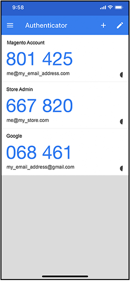
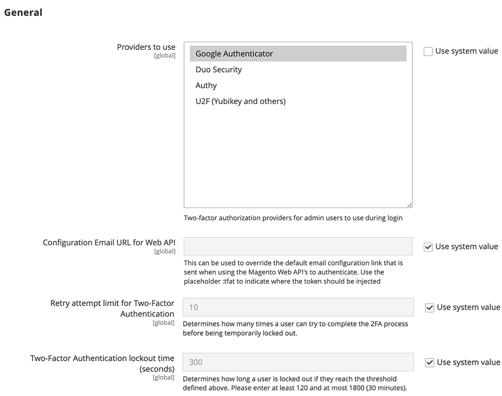
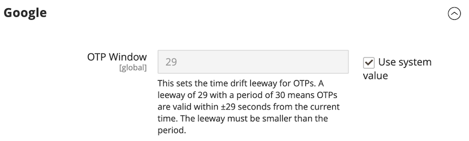
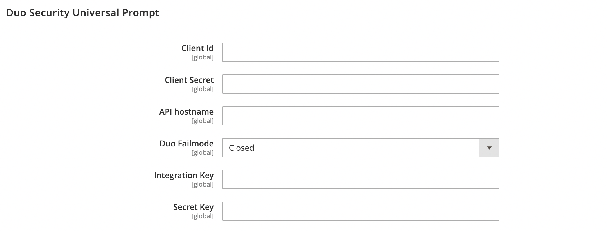

# Two-factor authentication (2FA)

The Commerce _Admin_ for your Adobe Commerce or Magento Open Source installation provides access to your store, orders, and customer data. To prevent unauthorized access to your data, all users who attempt to sign in to the _Admin_ must complete an authentication process to verify their identity.

>[!NOTE]
>
>This implementation of two-factor authentication (2FA) applies to the _Admin_ only, and is not available for customer accounts. The two-factor authentication that protects your Commerce account has a separate setup. To learn more, go to [Secure your Commerce account](../getting-started/commerce-account-secure.md).

Two-factor authentication is widely used, and it is common to generate access codes for different websites on the same app. This ensures that only you are able to log in to your user account. If you lose your password or a bot guesses it, two-factor authentication adds a layer of protection. For example, you might use Google Authenticator to generate codes for the Admin of your store, your Commerce account, and Google account.

{width="300"}

Adobe Commerce supports 2FA methods from multiple providers. Some require the installation of an app that generates a one-time password (OTP) that users enter at sign-in to verify their identity. Universal second Factor (U2F) devices resemble a key fob and generate a unique key to verify identity. Other devices verify identity when they are inserted into a USB port. As the store administrator, you can require one or more of the available 2FA methods to verify user identity. Your 2FA configuration applies to all websites and stores that are associated with the Adobe Commerce installation.

The first time a user signs in to the _Admin_, they must set up each [2FA](../configuration-reference/security/2fa.md) method that you require, and verify their identity using the associated app or device. After this initial setup, the user must authenticate with one of the configured methods each time they sign in. Each user's 2FA information is recorded in their _Admin_ account and can be [reset](security-two-factor-authentication-manage.md) if necessary. To learn more about the sign-in process, go to [_Admin_ Sign In](../getting-started/admin-signin.md).

>[!NOTE]
>
>Stores that have enabled Adobe Identity Management Services (IMS) authentication have native Adobe Commerce and Magento Open Source 2FA disabled. Admin users who are logged into their Commerce instance with their Adobe credentials do not need to reauthenticate for many Admin tasks. Authentication is handled by Adobe IMS when the Admin user logs into their current session. See [Adobe Identity Management Service (IMS) Integration Overview](https://experienceleague.adobe.com/docs/commerce-admin/start/admin/ims/adobe-ims-integration-overview.html).

You can watch this [video demo](https://video.tv.adobe.com/v/339104?quality=12&learn=on) for an overview of two-factor authentication in the Admin.

## Configure your required 2FA providers

1. On the _Admin_ sidebar, go to **[!UICONTROL Stores]** > _[!UICONTROL Settings]_ > **[!UICONTROL Configuration]**.

1. In the left panel, expand **[!UICONTROL Security]** and choose **[!UICONTROL 2FA]**.

1. In the _[!UICONTROL General]_ section, select each **[!UICONTROL Provider to use]**.

   |Provider|Function|
   |--- |--- |
   |[!UICONTROL Google Authenticator]|Generates a one-time password in the application for user authentication.|
   |[!UICONTROL Duo Security]|Provides SMS and push notification.|
   |[!UICONTROL Authy]|Generates a time-dependent six-digit code and delivers SMS or Voice Call 2FA protection or token.|
   |[!UICONTROL U2F Devices (Yubikey and others)]| Uses a physical device to authenticate, such as [[!DNL YubiKey]](https://www.yubico.com/).|

   To select multiple methods, hold down the Ctrl key (PC) or the Command key (Mac) and click each item.

1. Complete the settings for each required 2FA method.

   {width="600" zoomable="yes"}

1. When complete, click **[!UICONTROL Save Config]**.

   The first time users sign in to the _Admin_, they must set up each required 2FA method. After this initial setup, they must authenticate with one of the configured methods each time they sign in.

## 2FA Provider Settings

Complete the settings for each 2FA method that you require.

### Google

To change how long the one-time password (OTP) is available during sign-in, clear the **[!UICONTROL Use system value]** checkbox. Then, enter the number of seconds that you want the **[!UICONTROL OTP Window]** to be valid.

{width="600" zoomable="yes"}

### [!DNL Duo Security]

Enter the following credentials from your Duo Security account:

- Integration key
- Secret key
- API hostname

{width="600" zoomable="yes"}

### [!DNL Authy]

1. Enter the API key from your [!DNL Authy] account.

1. To change the default message that appears during authentication, clear the **[!UICONTROL Use system value]** checkbox. Then, enter the **[!UICONTROL OneTouch Message]** that you want to appear.

   {width="600" zoomable="yes"}

### U2F Devices ([!DNL Yubikey] and others)

The store domain is used by default during the authentication process. To use a custom domain for authentication challenges, clear the **[!UICONTROL Use system value]** checkbox. Then, enter the **[!UICONTROL WebAPi Challenge Domain]**.

{width="600" zoomable="yes"}
