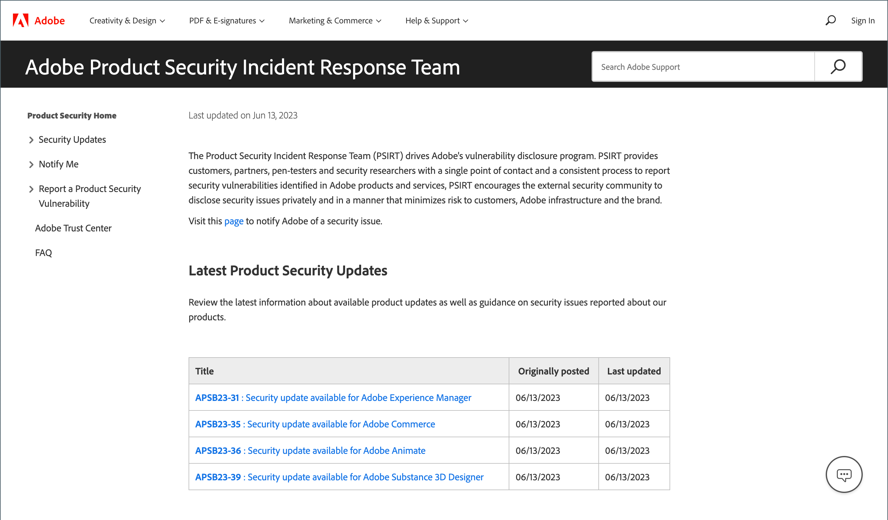

# Security

There are multiple ways to secure your store and maintain your data security:

- Set up [two-factor authentication](security-two-factor-authentication.md)
- Implement [CAPTCHA](security-captcha.md) or [reCAPTCHA](security-google-recaptcha.md)
- Set up a [Security Scan](security-scan.md) for each domain in your Adobe Commerce or Magento Open Source installation. 

Visit the [Security Center](https://helpx.adobe.com/security.html){:target="_blank"} and join the Security Alert Registry for the latest news about potential vulnerabilities and [best practices](https://www.adobe.com/content/dam/cc/en/trust-center/ungated/whitepapers/experience-cloud/adobe-commerce-best-practices-guide.pdf).

>[!NOTE]
>
>Stores that have enabled [!DNL Adobe Identity Management Services] (IMS) authentication have native Adobe Commerce and Magento Open Source 2FA disabled. Admin users who are logged into their Commerce instance with their Adobe credentials do not need to reauthenticate for many Admin tasks. Authentication is handled by Adobe IMS when the Admin user logs into their current session. See [[!DNL Adobe Identity Management Service] (IMS) Integration Overview](../getting-started/adobe-ims-integration-overview.md).

{width="700" zoomable="yes"}

## Security action plan

If you suspect that your Adobe Commerce or Magento Open Source site is compromised, follow this action plan without delay.

1. **Diagnose**: Run a scan to establish the security status of your Commerce store. Commerce [Security Scan](security-scan.md) is a free service offered by Adobe that allows you to monitor your Commerce sites for known security risks and malware, and to receive security notifications.

1. **Clean**: Hire a [qualified consultant](https://solutionpartners.adobe.com/s/directory/?partner_type=1) or online service to clean your site of all malicious code. Some Commerce community members recommend [[!DNL Sucuri Website Malware Removal]](https://sucuri.net/website-antivirus/malware-removal). Check the `/media` folder for leftover executable code. Remove all unknown Admin users and reset all Admin passwords.

1. **Protect**: Keep your Commerce installation up to date with the most current release. If you are using an older version, apply all security patches as they become available. Review and follow [Commerce Security Best Practices](https://www.adobe.com/content/dam/cc/en/trust-center/ungated/whitepapers/experience-cloud/adobe-commerce-best-practices-guide.pdf){:target="_blank"}. Subscribe to [Commerce Security Alerts](https://www.adobe.com/subscription/adbeSecurityNotifications.html).

1. **Report**: If you think that you have found a specific vulnerability in Commerce, [open an issue with Adobe](https://hackerone.com/adobe?type=team) and include technical details.

1. **Upgrade**: For the additional peace of mind that comes from 24/7 support, plan your upgrade to [Adobe Commerce on our Cloud Architecture](https://business.adobe.com/products/magento/cloud-delivery.html) now.
