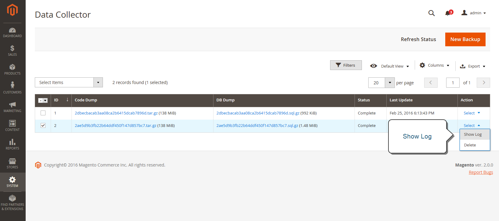
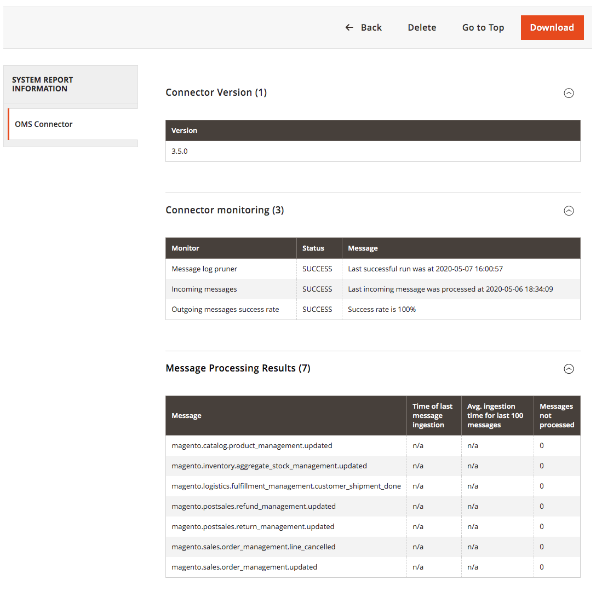
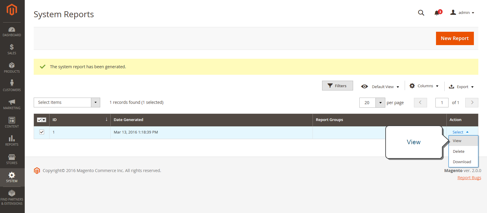

# Support tools

{{ee-feature}}

The Support Tools are designed to identify known issues in your system. They can be used as a resource during the development and optimization processes, and as a diagnostic tool to help our support team identify and resolve issues.

## Data Collector

Data Collector gathers the information about your system that is needed by our Support team to troubleshoot issues with your Adobe Commerce installation. The backup that is created takes several minutes to complete, and includes both a code and database dump. The data can be exported to a CSV or Excel XML file.

<!-- zoom -->

### Run the data collector

1. On the _Admin_ sidebar, go to **System** > _Support_ > **Data Collector**.

1. In the upper-right corner, click **New Backup**.

   It takes a few minutes to generate the backup. You can monitor the results of processing by clicking **Refresh Status**. When complete, the backup appears in the Data Collector grid.

1. To view a log with the backup details, do the following:

   - In the _Action_ column, select **Show Log**.

   - Click **Back** to return to the grid.

   <!-- zoom -->

### Export backup data

1. In the first column, select the checkbox of the backup to be exported.

1. Use the **Export** menu to choose the format of the export data.

   <!-- zoom -->

1. Access the file from the web browser download location and **Save** it.

### Download backup data

After the backup is generated, you can download the copy of Code and DB data.

1. Find the needed backup entity in the grid.

1. Make sure it has a _Complete_ status.

1. Click the entity name in _Code Dump_ or _DB Dump_ columns.

The download process should start automatically.

## Delete backup data

1. On the _Admin_ sidebar, go to **System** > _Support_ > **Data Collector**.

1. Find and select the backup data to be deleted.

1. In the _Action_ column, click **Delete**.

1. To confirm the action, click **OK**.

## System reports

The system reporting tool gives you the ability take periodic full, or partial, snapshots of the system, and save them for future reference. You can compare performance settings before and after code development cycles, or changes to server settings. The system reporting tool can dramatically reduce the time spent preparing and submitting the information required by Support to begin an investigation.

From the System Reports grid, you can view and download existing reports, delete reports, and create new reports.

### Access system reports

On the _Admin_ sidebar, go to **System** > _Support_ > **System Report**.

<!-- zoom -->

### Create a new report

1. Click **New Report**.

1. In the **Groups** list, select each set of information that you want to include in the report. By default, all groups are selected.

   <!-- zoom -->

1. In the upper-right corner, click **Create**.

   It might take a few minutes for the report to generate, depending on the number of report types selected. When the report is ready, it appears at the top of the grid with the date and time generated.

### View module info

You can find useful information about installed modules, including the [Connector](https://omsdocs.magento.com/integration/connector/), in the Admin.

To view report info for each installed module:

1. On the _Admin_ sidebar go to **System** > _Support_ > **System Report**.
1. Click **New Report**.
1. Select **Modules** from the Groups list and click **Create**.
1. After the report generates, click **Select** and then **View** to see all module versions.
1. Click **Download** to download the report.

   <!-- zoom -->

See what changes were released in each version of the Connector in the [changelog](https://magento-mcom.github.io/mcom-connector-sr/CHANGELOG.html) in [**MCOM**](https://docs.magento.com/user-guide/mcom.html) > **Change log**.

### Manage system reports

In the **Action** column of the grid, select one of the following:

- `View` - Use this function to view the details of the report.
- `Delete` - Use this function to delete the generated report from the list.
- `Download` - Use this function to save the report as an HTML file.

### View system report details

1. For the report you need, select **View** in the Actions column.

   <!-- zoom -->

1. In the left panel, expand  each section of the report to view the detail.

   <!-- zoom -->

### Available system reports

| Report group | Information included |
| ------------ | -------------------- |
| General | Adobe Commerce Version Data Count Cache Status Index Status |
| Environment | Environment Information MySQL Status |
| Data | Duplicate Categories By URL Key Duplicate Products By URL Key Duplicate Products By SKU Duplicate Orders By Increment Id Duplicate Users By Email Corrupted Categories Data |
| Modules | Custom Modules List Disabled Modules List All Modules List |
| Configuration | Configuration Data from `app/etc/env.php` Shipping Methods Payment Methods Payments Functionality Matrix |
| Logs | Log Files Top System Messages Today's Top System Messages Top Debug Messages Today's Top Debug Messages Top Exception Messages Today's Top Exception Messages |
| Attributes | User Defined Eav Attributes New Eav Attributes Entity Types All Eav Attributes Category Eav Attributes Product Eav Attributes Customer Eav Attributes Customer Address Eav Attribute RMA Item Eav Attributes |
| Events | Custom Global Events Custom Admin Events Custom Frontend Events Custom Doc Events Custom Crontab Events Custom REST Events Custom SOAP Events Core Global Events Core Admin Events Core Frontend Events Core Doc Events Core Crontab Events Core REST Events Core SOAP Events All Global Events All Admin Events All Frontend Events All Doc Events All REST Events All SOAP Events All Crontab Events |
| Cron | Cron Schedules by status code Cron Schedules by job code Errors in Cron Schedules Queue Cron Schedules List Custom Global Cron Jobs Custom Configurable Cron Jobs Core Global Cron Jobs Core Configurable Cron Jobs All Global Cron Jobs All Configurable Cron Jobs |
| Design | Adminhtml Themes List Frontend Themes List |
| Stores | Website Tree Websites List Stores List Store Views List |
OMS Connector _(visible with OMS integration)_ | Connector Version Connector monitoring Message Processing Results |

{style="table-layout:auto"}
