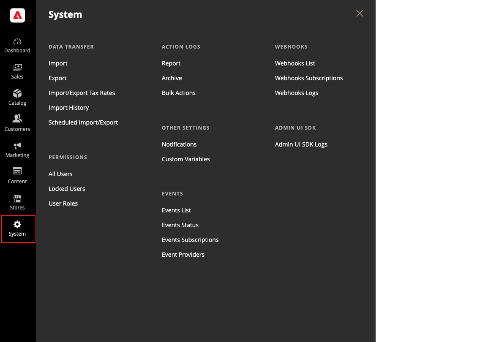

# [!UICONTROL System] menu

The [!UICONTROL System] menu includes tools to import and export data, manage system caches and indexes, manage permissions, backups, system notifications, and custom variables.

>[!BEGINTABS]

>[!TAB Adobe Commerce]

[!BADGE PaaS only]{type=Informative url="https://experienceleague.adobe.com/en/docs/commerce/user-guides/product-solutions" tooltip="Applies to Adobe Commerce on Cloud projects (Adobe-managed PaaS infrastructure) and on-premises projects only."}

{width="600" zoomable="yes"}

>[!TAB Adobe Commerce as a Cloud Service]

[!BADGE SaaS only]{type=Positive url="https://experienceleague.adobe.com/en/docs/commerce/user-guides/product-solutions" tooltip="Applies to Adobe Commerce as a Cloud Service and Adobe Commerce Optimizer projects only (Adobe-managed SaaS infrastructure)."}

{width="600" zoomable="yes"}

>[!ENDTABS]

**_To display the [!UICONTROL System] menu:_**

On the _Admin_ sidebar, click **[!UICONTROL System]**.

## [!UICONTROL Data Transfer]

These [tools](data-transfer.md) provide give you the ability to manage multiple records in a single operation. You can import new items, and also update, replace, and delete existing products and tax rates.

## [!UICONTROL Extensions]

[!BADGE PaaS only]{type=Informative url="https://experienceleague.adobe.com/en/docs/commerce/user-guides/product-solutions" tooltip="Applies to Adobe Commerce on Cloud projects (Adobe-managed PaaS infrastructure) and on-premises projects only."}

Manage [third-party integrations](integrations.md) and extensions for your store.

## [!UICONTROL Tools]

[!BADGE PaaS only]{type=Informative url="https://experienceleague.adobe.com/en/docs/commerce/user-guides/product-solutions" tooltip="Applies to Adobe Commerce on Cloud projects (Adobe-managed PaaS infrastructure) and on-premises projects only."}

Use this collection of tools to manage your system resources, including [cache](cache-management.md) and [index](index-management.md) management, [backups](backups.md), and installation settings.

## [!UICONTROL Support]

[!BADGE PaaS only]{type=Informative url="https://experienceleague.adobe.com/en/docs/commerce/user-guides/product-solutions" tooltip="Applies to Adobe Commerce on Cloud projects (Adobe-managed PaaS infrastructure) and on-premises projects only."}

 (Adobe Commerce only)

The [Support tools](support.md) can be used as a resource during the development and optimization processes, and as a diagnostic tool to help our Support team identify and resolve issues with your system.

## [!UICONTROL Permissions]

Adobe Commerce and Magento Open Source use [roles and permissions](permissions.md) to create different levels of access for Admin users. These tools give administrators the ability to grant permission on a _need to know_ basis to people who work on your site.

## [!UICONTROL Action Log]

 (Adobe Commerce only)

The [Action Log](action-log.md) tracks the activities of administrators who work in your store. For most events, the available information includes the action, the name of the user, whether it was a success or failure, and the ID of the object that was the target of the action. The Admin Actions archive lists the CSV log files that are stored on the server.

## [!UICONTROL Other Settings]

Manage the [notifications](notifications.md) in your inbox, create [custom variables](variables-custom.md), and generate a new [encryption key](encryption-key.md).
