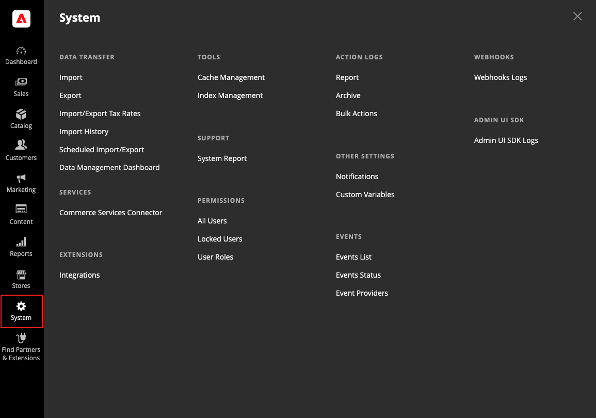

# System menu

The System menu includes tools to import and export data, manage system caches and indexes, manage permissions, backups, system notifications, and custom variables.

<!-- zoom -->

**_To display the System menu:_**

On the _Admin_ sidebar, click **System**.

## Data Transfer

These [tools](data-transfer.md) provide give you the ability to manage multiple records in a single operation. You can import new items, and also update, replace, and delete existing products and tax rates.

## Extensions

Manage [third-party integrations](integrations.md) and extensions for your store.

## Tools

Use this collection of tools to manage your system resources, including [cache](cache-management.md) and [index](index-management.md) management, [backups](backups.md), and installation settings.

## Support

 (Adobe Commerce only)

The [Support Tools](support.md) can be used as a resource during the development and optimization processes, and as a diagnostic tool to help our Support team identify and resolve issues with your system.

## Permissions

Adobe Commerce and Magento Open Source use [roles and permissions](permissions.md) to create different levels of access for Admin users, which gives you the ability to grant permission on a "need to know" basis to people who work on your site.

## Action Log

 (Adobe Commerce only)

The [Action Log](action-log.md) tracks the activities of administrators who work in your store. For most events, the available information includes the action, the name of the user who performed it, whether it was a success or failure, and the ID of the object that was the target of the action. The Admin Actions archive lists the CSV log files that are stored on the server.

## Other Settings

Manage the [notifications](notifications.md) in your inbox, create [custom variables](variables-custom.md), and generate a new [encryption key](encryption-key.md).
