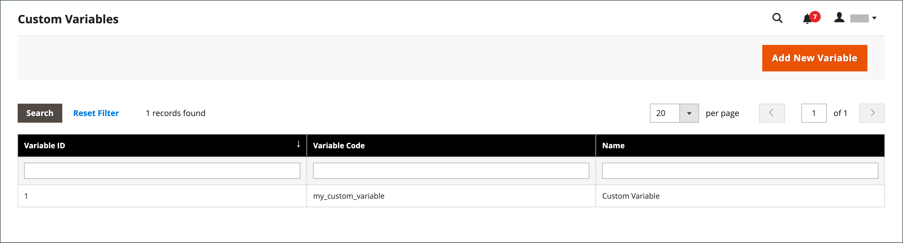
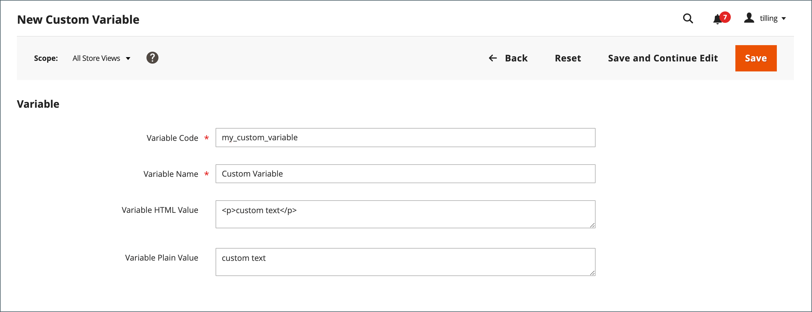
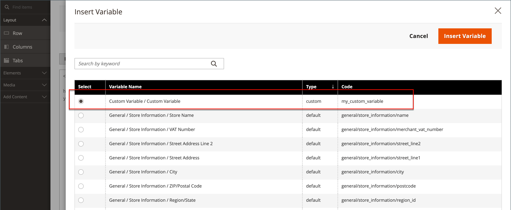
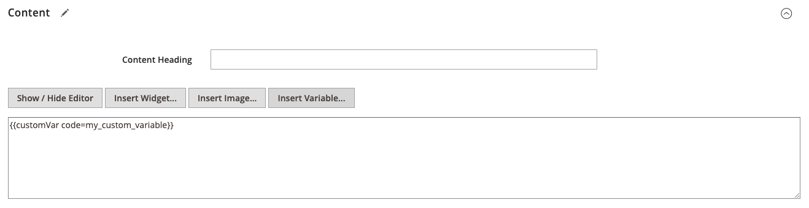
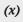
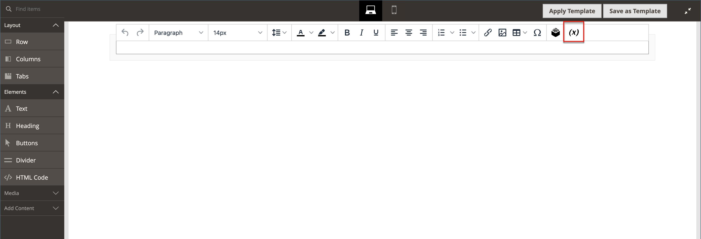
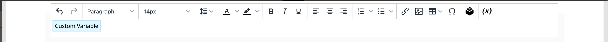

# Add custom variables

To meet the specific needs of your business, you can create custom variables and insert them into [pages](../content-design/pages.md), [blocks](../content-design/blocks.md) and [email templates](email-templates.md). The list of allowed variables that appears when you click the _Insert Variable_ button includes both [predefined](variables-predefined.md) and custom variables. As shown in the following image, the list of available variables for a specific email template is determined by the data that is associated with the template. See the [Variable Reference](variables-reference.md) for a list of frequently-used email templates and their associated variables.

>[!NOTE]
>
>Only allowed predefined or custom variables can be used in email and newsletter templates.

## Step 1: Create a custom variable

1. On the _Admin_ sidebar, go to **System** > _Other Settings_ > **Custom Variables**.

1. Click **Add New Variable**.

   <!-- zoom -->
   _Custom Variables_

1. Enter an identifier for **Variable Code**, using all lowercase characters without spaces.

   If needed, you can use an underscore character or hyphen to represent a space. For example: `my_custom_variable`

1. Enter a **Variable Name**, which is used for internal reference. For example: `My Custom Variable`

1. To enter the value that is associated with the variable, do one of the following:

   - For **Variable HTML Value**, enter the variable value formatted with simple HTML tags. For example:
      `<b>This formatted content appears in place of the variable.</b>`
   - For **Variable Plain Value**, enter the variable value as plain text without formatting. For example:
      `This unformatted content appears in place of the variable.`

   >[!NOTE]
   >
   >If you need more room, drag the lower-right corner of the text box.

   <!-- zoom -->

1. When complete, click **Save**.

## Step 2: Insert the custom variable

### Example - insert a variable into a page

 (Magento Open Source)

1. Open the CMS page or block where the variable is to appear.

1. Expand  the **Content** section and click **Show / Hide Editor** to work in HTML.

1. Position the insertion point in the editor where you want the variable to appear and click **Insert Variable**.

1. Select the option for the custom variable that you want to insert and click **Insert Variable**.

   <!-- zoom -->

   A command to insert the variable is enclosed in curly braces and added to the code at the cursor location. For example:

   `customVar code=my_custom_variable`

   <!-- zoom -->

1. When complete, click **Save**.

### Example - Use Page Builder to insert a custom variable

1. Open the page or block where the variable is to appear.

1. Expand  the **Content** section.

1. In the left panel, click **Elements** and do one of the following:

   - Click in an existing text area where you want to insert the variable.

   - Drag a new **Text** object to the stage.

1. At the far right of the editor toolbar, click (  ) to insert a variable.

   <!-- zoom -->

1. In the list, select the custom variable that you want to insert and click **Insert Variable**.

   <!-- zoom -->

   The variable identifier appears as a placeholder in the editor.

   <!-- zoom -->

1. When complete, click **Save**.
