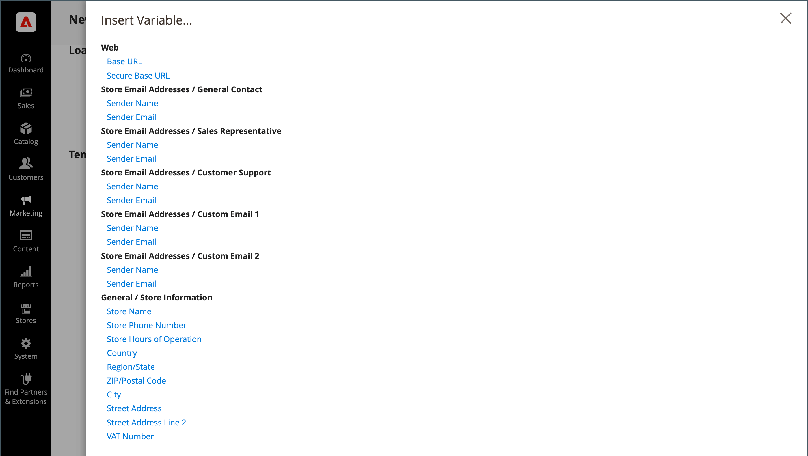
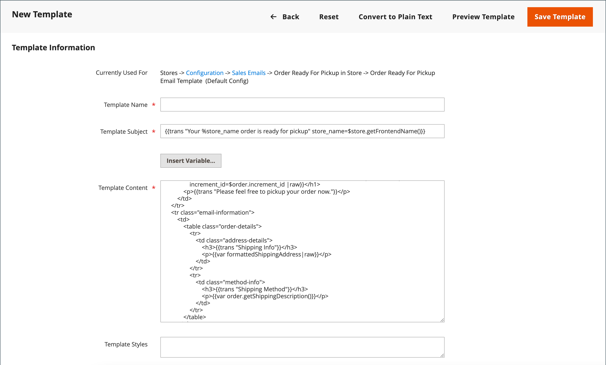
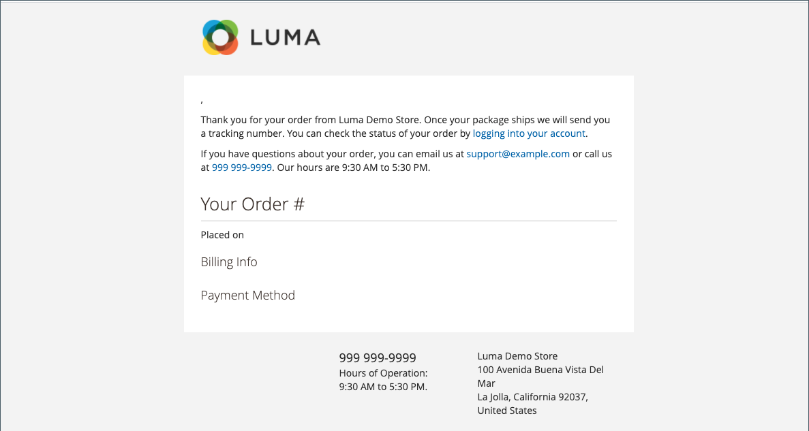

# Use predefined variables

[Predefined](variables-predefined.md) variables make it easy to personalize [email](email-templates.md) and [newsletter](../merchandising-promotions/newsletters.md) templates, and other types of content. The list of allowed [predefined](variables-predefined.md) variables appears when you click the Insert Variable button. As shown in the following image, the list of available variables for a specific email template is determined by the data that is associated with the template. See the [Variable Reference](variables-reference.md) for a list of frequently used email templates and their associated variables.

{width="700" zoomable="yes"}

## Add a variable to an email template

1. On the _Admin_ sidebar, go to **[!UICONTROL Marketing]** > _[!UICONTROL Communications]_ > **[!UICONTROL Email Templates]**.

1. Do one of the following:

   - To add the variable to an existing template, click the template in the list to open in edit mode.

   - To use the variable in a new template, click **[!UICONTROL Add New Template]** and customize the default template code. See [Message Templates](email-template-custom.md#message-templates).

1. Under _[!UICONTROL Load default template]_, choose the **[!UICONTROL Template]** that you want to customize.

1. To apply a template, click **[!UICONTROL Load Template]**.

   The _[!UICONTROL Currently used for]_ field displays the configuration path for the template. The _[!UICONTROL Template Subject]_ and _[!UICONTROL Template Content]_ are automatically generated relative to the selected template.

   - **[!UICONTROL Template Subject]** - This text is displayed in the subject line of an email.

   - **[!UICONTROL Template Content]** - This text is displayed in the full content of the sent email.

   {width="600" zoomable="yes"}

1. Enter a **[!UICONTROL Template Name]**.

1. For a list of the [predefined](variables-predefined.md) variables that can be used with this email template, click **[!UICONTROL Insert Variable]**.

   Determine which variable that you want to insert into the template. Then, click _Close_ (X) in the upper-right corner. (You return to this later.)

1. To see a mock-up of the template, click **[!UICONTROL Preview Template]** in the button bar.

   When the preview opens in a new tab, determine where you want to place the variable in relation to the other content. Then return to the original tab to continue.

   {width="600" zoomable="yes"}

1. In the **[!UICONTROL Template Content]** box, position the insertion point where you want the variable to appear and click **[!UICONTROL Insert Variable...]**.

1. In the list of available variables, click the one that you want to insert into the template.

1. When complete, click **[!UICONTROL Save Template]**.

## Convert the template to plain text

1. Open a template in edit mode.

1. At the top of the page, click **[!UICONTROL Convert to Plain Text]**.

1. When prompted to strip tags, click **[!UICONTROL OK]**.

1. To save the plain text version, click **[!UICONTROL Save Template]**.

## Restore the HTML version

1. At the top of the page, click **[!UICONTROL Return HTML Version]**.

1. To save the HTML version of the template, click **[!UICONTROL Save Template]**.
